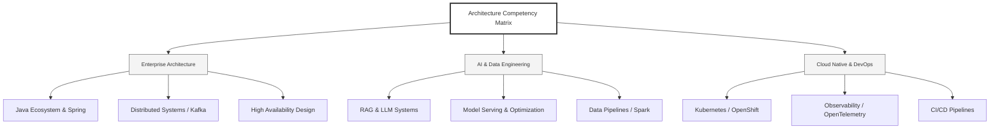

  <h1>Hi there, I'm Ellen Liu 👋</h1>
  

    <b>English</b> | 
    <a href="README_CN.md">简体中文</a>
  

## 🧠 Tech Stack & Expertise

My roadmap to build next-gen enterprise system involving full-stack AI engineering, cloud infrastructure, and model deployment.

## 🚀 Highlighted Works

- **Open Source AI**: [BERT-based Claim Detection Model](https://huggingface.co/XiaojingEllen/bert-finetuned-claim-detection) (Apache-2.0)
  - *Used and cited by University of British Columbia (UBC) research.*
  - *Hand-written Transformer implementation to verify theoretical engineering consistency.*
- **FinTech Infrastructure**: Built 0-to-1 digital banking middleware and intelligent insurance claim systems.

## 📑 Daily ArXiv Summary
<!-- DAILY_ARXIV_SUMMARY_START -->
**Updated on: 2025-12-28**

 1. [C2LLM Technical Report: A New Frontier in Code Retrieval via Adaptive Cross-Attention Pooling](http://arxiv.org/abs/2512.21332v1)
 2. [Measuring all the noises of LLM Evals](http://arxiv.org/abs/2512.21326v1)
 3. [SMART SLM: Structured Memory and Reasoning Transformer, A Small Language Model for Accurate Document Assistance](http://arxiv.org/abs/2512.21280v1)
<!-- DAILY_ARXIV_SUMMARY_END -->

## 🌐 Connect

  
<i>Lets connect and build the future of AI Infrastructure!</i>

