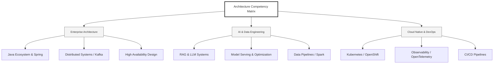

  <h1>Hi there, I'm Ellen Liu 👋</h1>
  

    <b>English</b> | 
    <a href="README_CN.md">简体中文</a>
  

## 🧠 Tech Stack & Expertise

My roadmap to build next-gen enterprise system involving full-stack AI engineering, cloud infrastructure, and model deployment.

```mermaid
graph TD
    %% Root Node
    Core[Architecture Competency Matrix]:::root
    
    %% Level 1 Branches
    Arch[Enterprise Architecture]:::branch
    AI[AI & Data Engineering]:::branch
    Cloud[Cloud Native & DevOps]:::branch
    
    Core --> Arch
    Core --> AI
    Core --> Cloud

    %% Enterprise Architecture
    Arch --> Java[Java Ecosystem & Spring]
    Arch --> Dist[Distributed Systems / Kafka]
    Arch --> Micro[High Availability Design]

    %% AI & Data Engineering
    AI --> LLM[RAG & LLM Systems]
    AI --> Serving[Model Serving & Optimization]
    AI --> DataPipe[Data Pipelines / Spark]

    %% Cloud Native & DevOps
    Cloud --> K8s[Kubernetes / OpenShift]
    Cloud --> Obs[Observability / OpenTelemetry]
    Cloud --> CICD[CI/CD Pipelines]
    %% Styling
    classDef root fill:#fff,stroke:#333,stroke-width:3px,font-size:15px;
    classDef branch fill:#f4f4f4,stroke:#666,stroke-width:1px,font-size:13px;
```
## 🚀 Highlighted Works

- **Open Source AI**: [BERT-based Claim Detection Model](https://huggingface.co/XiaojingEllen/bert-finetuned-claim-detection) (Apache-2.0)
  - *Used and cited by University of British Columbia (UBC) research.*
  - *Hand-written Transformer implementation to verify theoretical engineering consistency.*
- **FinTech Infrastructure**: Built 0-to-1 digital banking middleware and intelligent insurance claim systems.

## 📑 Daily ArXiv Summary
<!-- DAILY_ARXIV_SUMMARY_START -->
**Updated on: 2026-08-02**

 1. [AskChem: Claim-Centered Infrastructure for Chemistry Literature Synthesis](http://arxiv.org/abs/2607.28618v1)
 2. [OSReward: Instituting Standardized Evaluation for Cross-Platform Computer-Use Reward Models](http://arxiv.org/abs/2607.28609v1)
 3. [Change2Task: From Repository Changes to Executable Coding Agent Tasks and Environments](http://arxiv.org/abs/2607.28591v1)
<!-- DAILY_ARXIV_SUMMARY_END -->

## 🌐 Connect

  
<i>Lets connect and build the future of AI Infrastructure!</i>

