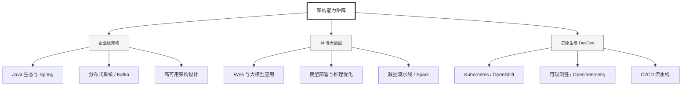

  <h1>你好，我是 Ellen Liu 👋</h1>
  

    <a href="README.md">English</a> | 
    <b>简体中文</b>
  

## 🧠 技术栈与核心能力

智能化企业系统建设路线图，涵盖全栈人工智能工程、云基础设施架构及模型部署等核心技术领域。

## 🚀 Highlighted 工作

- **开源 AI 项目**: [基于 BERT 的声明检测模型](https://huggingface.co/XiaojingEllen/bert-finetuned-claim-detection) (Apache-2.0)
  - *已被哥伦比亚大学 (UBC) 研究项目引用。*
  - *手写 Transformer 核心代码，以验证理论与工程的一致性。*
- **金融基础设施**: 从 0 到 1 构建数字银行支付中间件及智能保险理赔系统。

## 📑 每日论文速递 (ArXiv)
<!-- DAILY_ARXIV_SUMMARY_START -->
**更新日期: 2025-12-11**

### 1. [重探大型语言模型训练中下游指标的缩放特性](http://arxiv.org/abs/2512.08894v1)
- **摘要**: 传统上，大语言模型（LLMs）的缩放定律主要关注预训练损失等代理指标，而预测下游任务性能一直被认为不可靠。本文通过提出一种直接根据训练预算建模基准性能缩放规律的框架，对这一观点提出了挑战。我们发现，在固定词元与参数比例的情况下，简单的幂律关系能够准确描述多个热门下游任务中对数准确率的缩放行为。实验结果表明，这种直接方法的预测效果优于先前提出的两阶段方法，后者容易产生误差累积问题。此外，我们引入了能够跨词元-参数比例预测准确率、并考虑重复采样下推理计算量的函数形式。我们在两种数据集混合上训练了参数规模高达170亿、训练词元量达3500亿的模型，验证了这些发现。为支持可复现性并促进未来研究，我们公布了完整的预训练损失和下游评估结果集。

### 2. [迈向基于稀疏自编码器的忠实检索增强生成](http://arxiv.org/abs/2512.08892v1)
- **摘要**: 检索增强生成（RAG）通过将输出建立在检索证据的基础上，提升了大型语言模型（LLM）的事实准确性，但生成内容与提供来源相矛盾或超出范围的忠实性失效问题，仍是关键挑战。现有的RAG幻觉检测方法通常依赖大规模检测器训练（需要大量标注数据）或调用外部LLM评判器（导致高昂推理成本）。尽管部分方法尝试利用LLM内部表征进行幻觉检测，其准确性仍有限制。受近期机制可解释性进展的启发，我们采用稀疏自编码器（SAE）解耦内部激活，成功识别出在RAG幻觉期间被特异性触发的特征。基于信息驱动的特征选择与加性特征建模的系统化流程，我们提出了RAGLens——一种利用LLM内部表征精准标记不忠实RAG输出的轻量级幻觉检测器。RAGLens不仅相比现有方法实现了更优的检测性能，还能提供可解释的决策依据，从而有效实现不忠实RAG的事后修正。最后，我们论证了设计选择的合理性，并揭示了LLM中幻觉相关信号分布的新洞见。代码已开源：https://github.com/Teddy-XiongGZ/RAGLens。

### 3. [提问、回答与检测：基于问题条件专家混合模型的角色扮演大语言模型在人格检测中的应用](http://arxiv.org/abs/2512.08814v1)
- **摘要**: 理解人类个性对于个性化推荐和心理健康评估等网络应用至关重要。现有的人格检测研究主要采用"帖子→用户向量→标签"的建模范式，将社交媒体帖子编码为用户表征以预测人格标签（如MBTI标签）。尽管大语言模型的最新进展提升了文本编码能力，但由于标签稀缺性以及用户语言与抽象心理构念之间语义映射关系不明确，这些方法仍受限于有限的监督信号。我们通过提出ROME框架来解决这些挑战，该框架将心理学知识显式注入人格检测过程。受标准化自评测试启发，ROME利用大语言模型的角色扮演能力模拟用户对已验证心理测量问卷的作答。这些生成的题目级答案将自由形式的用户帖子转化为可解释的、基于问卷的证据，从而建立语言线索与人格标签的关联，既通过丰富的中间监督缓解标签稀缺问题，又提供语义推理链来引导并简化文本到人格映射的学习过程。随后，一个基于题目条件的专家混合模块联合处理帖子表征和题目表征，在显式监督下学习如何回答问卷题目。预测答案被汇总为可解释的答案向量，并与用户表征在多任务学习框架中融合进行最终预测，其中问卷作答任务作为人格检测的强大辅助任务。在两个真实数据集上的大量实验表明，ROME始终优于现有最先进的基线模型，在Kaggle数据集上实现了15.41%的性能提升。

<!-- DAILY_ARXIV_SUMMARY_END -->

## 🌐 保持联系

  
<i>期待与您探讨 AI 基础设施的未来！</i>

