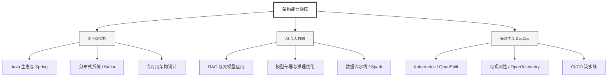

  <h1>你好，我是 Ellen Liu 👋</h1>
  

    <a href="README.md">English</a> | 
    <b>简体中文</b>
  

## 🧠 技术栈与核心能力

智能化企业系统建设路线图，涵盖全栈人工智能工程、云基础设施架构及模型部署等核心技术领域。

## 🚀 Highlighted 工作

- **开源 AI 项目**: [基于 BERT 的声明检测模型](https://huggingface.co/XiaojingEllen/bert-finetuned-claim-detection) (Apache-2.0)
  - *已被哥伦比亚大学 (UBC) 研究项目引用。*
  - *手写 Transformer 核心代码，以验证理论与工程的一致性。*
- **金融基础设施**: 从 0 到 1 构建数字银行支付中间件及智能保险理赔系统。

## 📑 每日论文速递 (ArXiv)
<!-- DAILY_ARXIV_SUMMARY_START -->
**更新日期: 2026-01-14**

### 1. [信心陷阱：大型语言模型中的性别偏见与预测确定性](http://arxiv.org/abs/2601.07806v1)
- **摘要**: 随着大语言模型在敏感领域的应用日益增多，人们对其置信度评分与公平性及偏见的关联性越发关注。本研究探讨了大语言模型预测置信度与人工标注偏见判断之间的对应关系。研究聚焦于性别偏见，重点考察涉及性别化代词消解情境中的概率置信度校准问题，旨在评估基于预测置信度的校准指标能否有效捕捉大语言模型中与公平性相关的差异。研究结果显示，在六种前沿模型中，Gemma-2在性别偏见基准测试中表现出最差的校准效果。本工作的主要贡献在于提出了面向公平性的大语言模型置信度校准评估方法，为伦理部署提供指引。此外，我们引入了一种新的校准指标——性别均衡校准误差，专门用于衡量消解任务中的性别差异。

### 2. [对话中学习：解析人类与大型语言模型在政治议题上的互动动态](http://arxiv.org/abs/2601.07796v1)
- **摘要**: 大型语言模型(LLM)作为学习对话伙伴的应用日益广泛，但其支持用户学习与参与度的交互机制尚未得到充分研究。我们通过分析397场关于社会政治议题的人机对话中LLM与参与者的语言及交互特征，揭示了LLM解释行为影响政治知识水平与信心变化的机制与条件。中介分析表明：LLM解释的丰富性能通过促进用户反思性洞察来部分提升信心，而其知识增益效应则完全通过用户认知投入实现。调节分析显示这些效应具有高度条件性，并随政治效能感差异而变化——信心提升取决于高效能感用户如何体验并化解不确定性，知识增长则依赖于高效能感用户利用延伸对话的能力，较长的对话主要使善于反思的用户受益。研究表明：从LLM中学习是交互达成的结果，而非优质解释的必然产物。这些发现强调，在设计人机交互系统时，必须使LLM的解释行为与用户参与状态相适配，方能有效支持学习过程。

### 3. [多跳推理的亲属关系数据基准](http://arxiv.org/abs/2601.07794v1)
- **摘要**: 大型语言模型（LLM）在多跳推理能力——即整合多条信息形成连贯推断——方面的评估日益受到关注。我们提出KinshipQA基准测试，旨在通过亲属关系推理来探究这一能力。本研究的核心贡献在于构建了一个生成式流水线，能够按需生成大规模、高真实性且具有文化特异性的谱系数据：这些相互关联的家族树集合满足不同亲属制度下明确的婚姻约束条件。该设计使得任务难度、文化预设和关系深度均可被系统化调控与调整。基于这些谱系数据，我们构建了需要通过对隐含关系链进行推理的文本推断任务。我们在统一的零样本协议下采用确定性解码策略，对六个涵盖开源与闭源模型的先进LLM进行评估，使用精确匹配和基于集合的指标衡量性能。实验结果表明，KinshipQA能产生广泛的结果分布，并揭示不同模型与文化场景下多跳推理能力的系统性差异。

<!-- DAILY_ARXIV_SUMMARY_END -->

## 🌐 保持联系

  
<i>期待与您探讨 AI 基础设施的未来！</i>

