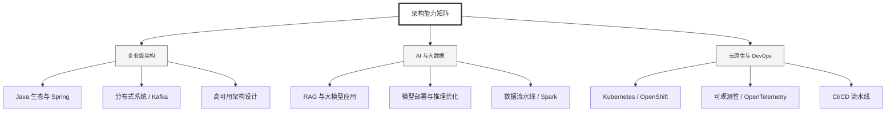

  <h1>你好，我是 Ellen Liu 👋</h1>
  

    <a href="README.md">English</a> | 
    <b>简体中文</b>
  

## 🧠 技术栈与核心能力

智能化企业系统建设路线图，涵盖全栈人工智能工程、云基础设施架构及模型部署等核心技术领域。

## 🚀 Highlighted 工作

- **开源 AI 项目**: [基于 BERT 的声明检测模型](https://huggingface.co/XiaojingEllen/bert-finetuned-claim-detection) (Apache-2.0)
  - *已被哥伦比亚大学 (UBC) 研究项目引用。*
  - *手写 Transformer 核心代码，以验证理论与工程的一致性。*
- **金融基础设施**: 从 0 到 1 构建数字银行支付中间件及智能保险理赔系统。

## 📑 每日论文速递 (ArXiv)
<!-- DAILY_ARXIV_SUMMARY_START -->
**更新日期: 2025-12-22**

### 1. [生成式对抗推理器：通过对抗性强化学习增强大语言模型推理能力](http://arxiv.org/abs/2512.16917v1)
- **摘要**: 具备显式推理能力的大语言模型在数学推理方面表现出色，但仍存在过程性错误，例如计算错误、逻辑脆弱性以及表面合理但实际无效的推理步骤。本文提出生成对抗推理器——一种基于策略的联合训练框架，通过对抗性强化学习协同进化大语言模型推理器与大语言模型判别器，从而提升推理能力。该框架采用计算高效的审查机制，将每条推理链划分为逻辑完整且长度相近的片段，判别器通过简洁的结构化论证评估每个片段的严谨性。学习过程融合互补信号：推理器因生成逻辑一致且能得出正确答案的步骤而获得奖励，判别器则通过准确检测推理过程中的错误或区分不同推理轨迹获得奖励。这种机制产生密集、校准良好的策略级步骤奖励，补充了稀疏的精确匹配信号，改善了信用分配，提高了样本效率，并增强了大语言模型的整体推理质量。在多项数学基准测试中，该方法相较于采用标准强化学习后训练的强基线模型均取得稳定提升。具体而言，在AIME24测试中，我们将DeepSeek-R1-Distill-Qwen-7B从54.0提升至61.3（+7.3），将DeepSeek-R1-Distill-Llama-8B从43.7提升至53.7（+10.0）。模块化判别器还能灵活调整奖励机制，适用于教师蒸馏、偏好对齐及基于数学证明的推理等多种目标。

### 2. [建设性电路放大：通过针对性子网络更新提升大语言模型的数学推理能力](http://arxiv.org/abs/2512.16914v1)
- **摘要**: 先前关于大型语言模型内部工作机制的研究已发现被称为"电路"的稀疏子网络，这些子网络负责执行特定任务。此外，研究表明通过微调提升模型性能往往源于对模型中现有电路的强化。综合这些发现，我们推测直接干预此类电路以实现精准、任务导向的更新具有可行性。基于此，我们提出一种名为"建构式电路增强"的新方法，该方法通过分析模型推理轨迹识别关键标记，定位负责目标任务的模型组件，并仅更新这些特定组件。在数学推理任务中应用该方法，仅需修改低至1.59%的模型组件，即可在多个模型上实现最高11.4%的准确率提升，同时根据MMLU、TriviaQA和TruthfulQA的评估，对其他能力的影响微乎其微。这些结果表明，通过选择性更新稀疏的模型组件集合，能够可靠地增强模型的定向能力。

### 3. [探索与利用：通过剪裁、熵与伪奖励重新审视RLVR](http://arxiv.org/abs/2512.16912v1)
- **摘要**: 本文研究了具有可验证奖励的强化学习（RLVR）中的探索-利用权衡问题，该框架旨在提升大语言模型（LLMs）的推理能力。近期研究表明，RLVR可通过两种看似矛盾的机制激发LLMs强大的数学推理能力：一是虚假奖励——通过奖励与真实答案无关的结果来抑制模型对已知策略的利用；二是熵最小化——通过推动模型产生更自信、更确定的输出来抑制探索行为。这一动态关系令人困惑：既抑制利用又抑制探索反而提升了推理性能，但其背后的协调机制尚不明确。我们聚焦于两个核心问题：（1）策略熵如何影响性能；（2）虚假奖励是否通过裁剪偏差与模型污染的相互作用产生增益。实验结果表明，虚假奖励下的裁剪偏差会降低策略熵，从而产生更自信、更确定的输出，而仅靠熵最小化并不足以带来性能提升。我们进一步提出奖励错配模型，以解释为何虚假奖励能在非污染场景下提升性能。这些发现阐明了虚假奖励产生效益的内在机制，并为更有效的RLVR训练提供了理论依据。

<!-- DAILY_ARXIV_SUMMARY_END -->

## 🌐 保持联系

  
<i>期待与您探讨 AI 基础设施的未来！</i>

