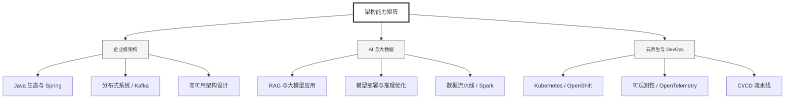

  <h1>你好，我是 Ellen Liu 👋</h1>
  

    <a href="README.md">English</a> | 
    <b>简体中文</b>
  

## 🧠 技术栈与核心能力

智能化企业系统建设路线图，涵盖全栈人工智能工程、云基础设施架构及模型部署等核心技术领域。

## 🚀 Highlighted 工作

- **开源 AI 项目**: [基于 BERT 的声明检测模型](https://huggingface.co/XiaojingEllen/bert-finetuned-claim-detection) (Apache-2.0)
  - *已被哥伦比亚大学 (UBC) 研究项目引用。*
  - *手写 Transformer 核心代码，以验证理论与工程的一致性。*
- **金融基础设施**: 从 0 到 1 构建数字银行支付中间件及智能保险理赔系统。

## 📑 每日论文速递 (ArXiv)
<!-- DAILY_ARXIV_SUMMARY_START -->
**更新日期: 2026-02-05**

### 1. [借助双子座加速科学研究：案例研究与常用技术](http://arxiv.org/abs/2602.03837v1)
- **摘要**: 大型语言模型（LLM）的最新进展为加速科学研究开辟了新途径。尽管模型在辅助常规任务方面日益成熟，但其在推动新颖的、专家级数学发现方面的能力尚不明确。本文通过一系列案例研究，展示研究人员如何与先进AI模型（特别是基于谷歌Gemini的模型，包括Gemini深度思考及其高级变体）成功协作，解决了理论计算机科学以及经济学、优化和物理学等多个领域的开放性问题，推翻了既有猜想，并生成了新的证明。

基于这些实践经验，我们提炼出理论研究中人机协作的有效通用技术，例如迭代优化、问题分解和跨学科知识迁移。虽然大部分成果源于这种交互式对话方法，但我们也特别关注了超越标准聊天界面的创新应用场景。这些案例包括将模型部署为严格的对抗性评审员以检测现有证明中的细微缺陷，以及将其嵌入"神经符号"循环中，使其自主编写并执行代码以验证复杂推导过程。

这些实例共同表明，AI不仅可作为自动化工具，更能在科学发现的创造性过程中成为多才多艺的真正合作伙伴。

### 2. [AutoFigure：生成与优化可发表级科学插图](http://arxiv.org/abs/2602.03828v1)
- **摘要**: 高质量科学插图对于有效传达复杂科技概念至关重要，但其人工绘制过程在学术界与工业界仍是公认的瓶颈。我们推出FigureBench——首个基于长篇科学文本生成插图的大规模基准测试集，包含3,300组高质量科学文本-插图配对数据，涵盖科研论文、综述、博客及教科书等多元场景的文本转插图任务。此外，我们提出AutoFigure——首个基于长篇科学文本自动生成高质量科学插图的智能体框架。该框架在生成最终结果前，会通过深度思考、要素重组与多重验证构建兼具结构严谨性与美学精炼度的布局方案，最终输出结构完整且视觉精美的科学插图。依托FigureBench的高质量数据，我们开展大量实验对比AutoFigure与多种基线方法的性能。结果表明，AutoFigure始终优于所有基线方法，能够生成达到出版标准的科学插图。相关代码、数据集及HuggingFace空间已发布于https://github.com/ResearAI/AutoFigure。

### 3. [反蒸馏指纹识别](http://arxiv.org/abs/2602.03812v1)
- **摘要**: 模型蒸馏技术能够高效模拟前沿大语言模型（LLM），这催生了对检测第三方学生模型是否基于教师模型输出进行训练的鲁棒机制的需求。然而，现有可用于检测此类蒸馏的指纹技术依赖于启发式扰动方法，导致生成质量与指纹强度之间存在显著权衡——通常需要大幅降低模型效用才能确保指纹被学生模型有效内化。我们提出抗蒸馏指纹技术（ADFP），这是一种将指纹目标与学生模型学习动态对齐的原理性方法。基于抗蒸馏采样的梯度框架，ADFP利用代理模型识别并采样能直接最大化学生模型微调后指纹可检测性的词元，而非依赖对简单水印非目标偏见的偶然吸收。在GSM8K和OASST1基准测试上的实验表明，ADFP相比现有先进基线实现了显著的帕累托改进：即使学生模型架构未知，仍能以极小的效用代价获得更强的检测置信度。

<!-- DAILY_ARXIV_SUMMARY_END -->

## 🌐 保持联系

  
<i>期待与您探讨 AI 基础设施的未来！</i>

