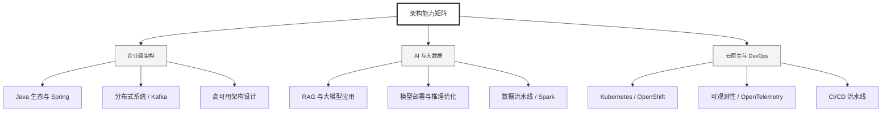

  <h1>你好，我是 Ellen Liu 👋</h1>
  

    <a href="README.md">English</a> | 
    <b>简体中文</b>
  

## 🧠 技术栈与核心能力

智能化企业系统建设路线图，涵盖全栈人工智能工程、云基础设施架构及模型部署等核心技术领域。

## 🚀 Highlighted 工作

- **开源 AI 项目**: [基于 BERT 的声明检测模型](https://huggingface.co/XiaojingEllen/bert-finetuned-claim-detection) (Apache-2.0)
  - *已被哥伦比亚大学 (UBC) 研究项目引用。*
  - *手写 Transformer 核心代码，以验证理论与工程的一致性。*
- **金融基础设施**: 从 0 到 1 构建数字银行支付中间件及智能保险理赔系统。

## 📑 每日论文速递 (ArXiv)
<!-- DAILY_ARXIV_SUMMARY_START -->
**更新日期: 2026-01-30**

### 1. [进化策略导致大语言模型出现灾难性遗忘](http://arxiv.org/abs/2601.20861v1)
- **摘要**: 当前人工智能系统最显著的能力缺失之一，是在部署后持续学习的能力。实现这种持续学习系统面临诸多挑战，其中一大难点在于：用于训练前沿大语言模型的基于梯度的算法需要消耗大量内存。进化策略（ES）近期作为传统学习算法的无梯度替代方案重新兴起，并在大语言模型的特定任务中展现出令人鼓舞的性能。本文对进化策略进行了全面分析，特别评估了其在不断增加更新步数训练时的遗忘曲线。

我们首先发现，在计算预算相当的情况下，进化策略在数学与推理任务上能达到接近GRPO（梯度强化策略优化）的性能水平。然而，对于持续学习至关重要的发现是：进化策略在获得性能提升的同时，会伴随对先前能力的显著遗忘，这限制了其在在线训练模型场景中的应用。我们进一步探究了该现象背后的原因，结果表明相较于GRPO更新，进化策略的更新密集度更高，其$\ell_2$范数甚至高出数个数量级，这解释了两类算法产生差异显著的遗忘曲线的根本原因。通过本研究，我们旨在揭示进化策略这类无梯度算法的遗忘问题，并期望启发未来研究探索缓解这些问题的有效途径。

### 2. [当Flores错误绽放：机器翻译评估中的跨向污染](http://arxiv.org/abs/2601.20858v1)
- **摘要**: 大型语言模型（LLMs）可能存在基准污染问题，导致评估分数虚高，使记忆行为被误判为泛化能力；在多语言场景下，这种记忆效应甚至会迁移至“未受污染”的语言。我们以FLORES-200翻译基准作为诊断工具，研究了两个经过指令微调的7-8B参数多语言LLM：在FLORES数据上训练过的Bloomz模型，以及作为未污染对照组的Llama模型。我们证实了Bloomz存在FLORES数据污染，并发现机器翻译的污染可能具有双向传导性——由于对目标端文本的记忆效应，模型在未见过的翻译方向上也会出现性能虚增。进一步分析表明，即使对源语言文本进行多种干扰（如复述改写、专有名词替换），模型对记忆内容的复现依然持续存在。但专有名词替换会导致BLEU分数系统性下降，这为检测受污染模型的记忆效应提供了一种有效的探查方法。

### 3. [奖励模型从预训练中继承价值偏见](http://arxiv.org/abs/2601.20838v1)
- **摘要**: 奖励模型（RM）在将大语言模型（LLMs）与人类价值观对齐方面起着核心作用，但其受关注程度远不及预训练及后训练的LLMs本身。由于RM通常基于LLMs初始化，它们继承了影响其行为的表征能力，但这种影响的性质与程度尚未得到充分研究。通过对10个主流开源权重RM的综合性研究，结合经过验证的心理语言学语料库，我们发现RM在人类价值观的多个维度上表现出显著差异，且这些差异与其基础模型密切相关。借助心理学"二元维度"理论框架，我们观察到Llama系列RM对"能动性"存在稳定偏好，而Gemma系列RM则对"共融性"呈现对应偏好。即使在使用完全相同的偏好数据与微调流程时，这一现象依然存在，我们将其溯源至各指令微调模型与预训练模型的原始逻辑输出。这些对数概率差异本身可被构建为一种隐式RM；我们推导出可操作的隐式奖励分数，并证明其同样展现出能动性/共融性的分化特征。通过设计控制偏好数据来源与数量的消融实验，我们验证了该效应不仅可复现，且具有惊人的持久性。尽管RM被设计为代表人类偏好，但证据表明其输出仍受底层预训练LLMs的影响。这项工作强调了预训练阶段安全与对齐工作的重要性，并明确指出开源开发者在选择基础模型时，不仅需考量性能指标，更应将其视为价值观层面的关键抉择。

<!-- DAILY_ARXIV_SUMMARY_END -->

## 🌐 保持联系

  
<i>期待与您探讨 AI 基础设施的未来！</i>

