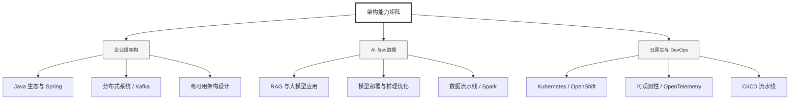

  <h1>你好，我是 Ellen Liu 👋</h1>
  

    <a href="README.md">English</a> | 
    <b>简体中文</b>
  

## 🧠 技术栈与核心能力

智能化企业系统建设路线图，涵盖全栈人工智能工程、云基础设施架构及模型部署等核心技术领域。

## 🚀 Highlighted 工作

- **开源 AI 项目**: [基于 BERT 的声明检测模型](https://huggingface.co/XiaojingEllen/bert-finetuned-claim-detection) (Apache-2.0)
  - *已被哥伦比亚大学 (UBC) 研究项目引用。*
  - *手写 Transformer 核心代码，以验证理论与工程的一致性。*
- **金融基础设施**: 从 0 到 1 构建数字银行支付中间件及智能保险理赔系统。

## 📑 每日论文速递 (ArXiv)
<!-- DAILY_ARXIV_SUMMARY_START -->
**更新日期: 2025-12-12**

### 1. [范围：语言模型作为文本环境中分层规划的一次性教师](http://arxiv.org/abs/2512.09897v1)
- **摘要**: 在复杂文本环境中进行长期规划面临巨大挑战，这主要源于开放式的行动空间、模糊的观察信号以及稀疏的反馈机制。近期研究表明，大型语言模型（LLM）编码了丰富的世界语义知识，这些知识对于指导智能体在具身环境或纯文本场景中进行高层推理与规划具有重要价值。然而，现有方法通常在训练和推理阶段高度依赖对LLM的频繁查询，导致计算成本高昂且难以高效部署。此外，这些方法通常直接使用未经调整的预训练LLM，其参数在整个训练过程中保持固定，无法针对目标任务进行适应性调整。

为突破这些限制，我们提出了SCOPE（面向高效规划的子目标条件预训练）——一种单次分层规划器，仅在初始化阶段利用LLM生成的子目标来预训练轻量级学生模型。与先前通过反复提示LLM自适应生成子目标来实现知识蒸馏的方法不同，我们的方法直接从示例轨迹中推导子目标。这种设计消除了重复查询LLM的需求，显著提升了效率，但代价是降低了可解释性，且可能产生次优子目标。尽管存在次优性，我们在TextCraft环境中的实验结果表明：LLM生成的子目标仍能为文本规划任务中的分层目标分解提供有效的起点。相较于基于LLM的分层智能体ADaPT（Prasad等人，2024年）0.52的成功率，我们的方法达到了0.56的成功率，并将推理时间从164.4秒大幅缩短至3.0秒。

### 2. [利用PRM引导的候选选择与序列优化缓解英语和乌尔都语语言模型中的社会偏见](http://arxiv.org/abs/2512.09854v1)
- **摘要**: 大型语言模型（LLM）正日益介入人类沟通、决策支持、内容创作与信息检索等领域。尽管这些系统展现出令人印象深刻的流畅性，却频繁生成带有偏见或刻板印象的内容，尤其在涉及社会敏感语言的提示场景中。越来越多的研究表明，此类偏见对低资源语言的影响尤为严重——这些语言的训练数据有限且缺乏文化代表性。本文针对推理阶段偏见缓解策略展开系统性研究，该方法无需重新训练或微调模型，而是直接对模型输出进行处理。基于偏好排序模型（PRM），我们构建了一个统一的评估框架，对比三种方法：（1）基线单词生成法；（2）PRM-Select最佳N选一采样法；（3）基于PRM批判性反馈的PRM-Sequential迭代优化法。我们在200个英语提示词及其乌尔都语对照版本上评估这些技术，这些提示词设计涵盖性别、种族、宗教、国籍、残疾状况、职业、年龄及社会经济地位等社会文化语境。通过采用GPT-3.5作为候选生成器、GPT-4o-mini作为基于PRM的偏见与效用评分器，我们针对偏见削减程度、效用保持水平及跨语言差异进行了全面量化分析。研究发现：（a）两种语言的所有方法均较基线取得显著提升；（b）所有方法中乌尔都语的公平性评分持续偏低，凸显了多语言LLM训练中的结构性不平等；（c）PRM-Select与PRM-Sequential呈现出差异化的改进轨迹。本研究贡献了可扩展的方法论、可解释的评估指标及跨语言对比分析，为未来低资源语言公平性评估研究提供了支撑框架。

### 3. [大语言模型在法律文件解读中的应用](http://arxiv.org/abs/2512.09830v1)
- **摘要**: 本章探讨大型语言模型在法律领域的应用，通过分析其在法规解释、合同与判例法辅助解析、法律摘要清晰化提升、合同谈判支持及信息检索优化等场景中的潜在用例，展现其优化与增强传统法律工作的可能性。此类技术的应用亦面临多重挑战，包括算法同质化、生成内容失真现象，以及需遵循欧盟《人工智能法案》、美国近期倡议与中国新兴监管框架等现行法规的合规要求。此外，本章还介绍了两种不同的评估基准体系。

<!-- DAILY_ARXIV_SUMMARY_END -->

## 🌐 保持联系

  
<i>期待与您探讨 AI 基础设施的未来！</i>

