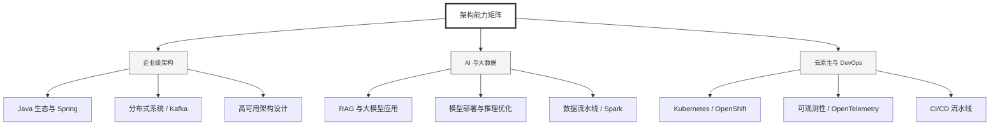

  <h1>你好，我是 Ellen Liu 👋</h1>
  

    <a href="README.md">English</a> | 
    <b>简体中文</b>
  

## 🧠 技术栈与核心能力

智能化企业系统建设路线图，涵盖全栈人工智能工程、云基础设施架构及模型部署等核心技术领域。

## 🚀 Highlighted 工作

- **开源 AI 项目**: [基于 BERT 的声明检测模型](https://huggingface.co/XiaojingEllen/bert-finetuned-claim-detection) (Apache-2.0)
  - *已被哥伦比亚大学 (UBC) 研究项目引用。*
  - *手写 Transformer 核心代码，以验证理论与工程的一致性。*
- **金融基础设施**: 从 0 到 1 构建数字银行支付中间件及智能保险理赔系统。

## 📑 每日论文速递 (ArXiv)
<!-- DAILY_ARXIV_SUMMARY_START -->
**更新日期: 2025-12-24**

### 1. [GenEnv：大型语言模型代理与环境模拟器间的难度对齐协同进化](http://arxiv.org/abs/2512.19682v1)
- **摘要**: 训练能力强的大型语言模型（LLM）智能体，目前严重受限于现实世界交互数据的高成本与静态特性。为解决这一问题，我们提出了GenEnv框架，该框架通过在智能体与可扩展的生成式环境模拟器之间建立难度对齐的协同进化博弈机制。与传统基于静态数据集演化模型的方法不同，GenEnv实现了数据动态演化：模拟器充当动态课程策略，持续生成与智能体“最近发展区”精准匹配的任务。这一过程由简洁高效的α-课程奖励机制引导，确保任务难度与智能体当前能力水平相适应。我们在API-Bank、ALFWorld、BFCL、Bamboogle和TravelPlanner五个基准测试中评估GenEnv，结果显示：相较于70亿参数基线模型，GenEnv最高可提升智能体性能达**+40.3%**，并达到或超越更大规模模型的平均性能。与基于Gemini 2.5 Pro的离线数据增强方法相比，GenEnv在减少3.3倍数据使用量的同时实现了更优性能。通过从静态监督转向自适应模拟，GenEnv为扩展智能体能力提供了一条高效的数据利用路径。

### 2. [自下而上策略优化：你的语言模型策略中暗藏内部策略](http://arxiv.org/abs/2512.19673v1)
- **摘要**: 现有的强化学习（RL）方法将大语言模型（LLMs）视为单一统一策略，忽略了其内部机制。因此，理解策略如何在各层和各模块间演化，对于实现更具针对性的优化和揭示复杂推理机制至关重要。本文通过利用Transformer残差流的内在分割特性，以及隐藏状态与解嵌入矩阵的组合等价于可采样策略这一性质，对语言模型策略进行分解。该分解揭示了内部层策略（对应各独立层的贡献）和内部模块策略（与每层中的自注意力及前馈网络组件对齐）。通过分析内部策略的熵，我们发现：（a）早期层保持高熵以支持探索，顶层则收敛至接近零熵以实现精细化，且收敛模式在不同模型系列中存在差异；（b）LLama的预测空间在最终层快速收敛，而Qwen系列模型（尤其是Qwen3）展现出更接近人类的渐进结构化推理模式。基于这些发现，我们提出自底向上策略优化（BuPO），这是一种在早期训练中直接优化内部层策略的新型RL范式。通过在底层对齐训练目标，BuPO重构了基础推理能力并实现了卓越性能。在复杂推理基准测试上的大量实验验证了本方法的有效性。代码已开源：https://github.com/Trae1ounG/BuPO。

### 3. [探索零样本情感方面分类分析：基于思维链提示的统一意义表征](http://arxiv.org/abs/2512.19651v1)
- **摘要**: 方面-类别情感分析（ACSA）通过识别评论中的特定主题及其关联情感，提供细粒度洞察。尽管监督学习方法在该领域占据主导地位，但新领域标注数据的稀缺性和高成本构成了显著障碍。我们认为，在数据标注资源有限的情况下，采用大语言模型（LLM）进行零样本学习是一种可行的替代方案。本研究提出一种新颖的思维链（CoT）提示技术，利用中间统一意义表示（UMR）来构建ACSA任务的推理过程。我们在三种模型（Qwen3-4B、Qwen3-8B和Gemini-2.5-Pro）和四个多样化数据集上，将这种基于UMR的方法与标准CoT基线进行了对比评估。研究结果表明，UMR的有效性可能具有模型依赖性。虽然初步数据显示，对于Qwen3-8B等中等规模模型，其性能与基线相当，但这些发现仍需进一步验证，特别是在较小模型架构上的潜在适用性。未来需开展更多研究，以确定这些结论在不同规模模型间的普适性。

<!-- DAILY_ARXIV_SUMMARY_END -->

## 🌐 保持联系

  
<i>期待与您探讨 AI 基础设施的未来！</i>

