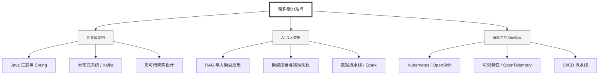

  <h1>你好，我是 Ellen Liu 👋</h1>
  

    <a href="README.md">English</a> | 
    <b>简体中文</b>
  

## 🧠 技术栈与核心能力

智能化企业系统建设路线图，涵盖全栈人工智能工程、云基础设施架构及模型部署等核心技术领域。

## 🚀 Highlighted 工作

- **开源 AI 项目**: [基于 BERT 的声明检测模型](https://huggingface.co/XiaojingEllen/bert-finetuned-claim-detection) (Apache-2.0)
  - *已被哥伦比亚大学 (UBC) 研究项目引用。*
  - *手写 Transformer 核心代码，以验证理论与工程的一致性。*
- **金融基础设施**: 从 0 到 1 构建数字银行支付中间件及智能保险理赔系统。

## 📑 每日论文速递 (ArXiv)
<!-- DAILY_ARXIV_SUMMARY_START -->
**更新日期: 2026-01-16**

### 1. [ShortCoder：面向高效代码生成的增强语法优化框架](http://arxiv.org/abs/2601.09703v1)
- **摘要**: 代码生成任务旨在将用户需求自动转化为可执行代码，显著减少人工开发工作量并提升软件生产效率。大语言模型的出现极大推动了代码生成技术的发展，但其效率仍受某些固有架构限制的影响。每个标记的生成都需要完整的推理过程，要求持续在内存中保留上下文信息，导致资源消耗不断增加。现有研究多聚焦于推理阶段优化（如提示压缩和模型量化），而生成阶段的优化探索仍显不足。为应对这些挑战，我们提出名为ShortCoder的知识增强框架，在保持语义等价性和可读性的同时优化代码生成效率。具体而言，我们提出：（1）基于抽象语法树保持转换推导出的十项Python语法级简化规则，在不影响功能的前提下实现18.1%的标记缩减；（2）融合基于规则重写与LLM引导优化的混合数据合成流程，构建出经过验证的原始代码与简化代码语义一致性元组语料库ShorterCodeBench；（3）向基础大语言模型注入简洁性感知的微调策略。大量实验结果表明，ShortCoder在HumanEval基准测试中持续优于现有先进方法，在确保代码生成性能的同时，将生成效率较先前方法提升18.1%-37.8%。

### 2. [通用健康咨询的共情适用性建模](http://arxiv.org/abs/2601.09696v1)
- **摘要**: 大型语言模型正日益融入临床工作流程，但其往往缺乏临床共情能力——这是医患有效沟通的关键要素。现有自然语言处理框架主要侧重于对医生回应中的共情进行被动标注，而在共情需求的预见性建模方面支持有限，尤其在通用健康咨询场景中。我们提出共情适用性框架——一种基于临床、语境和语言线索，从情感反应与解读适用性角度对患者问询进行分类的理论驱动方法。我们发布了真实患者问询的基准数据集，由人类与GPT-4o进行双重标注。在具有人类共识的子集中，我们观察到显著的人机标注一致性。为验证该框架，我们分别基于人工标注和纯GPT标注数据训练分类器来预测共情适用性，其表现显著优于启发式方法和零样本大型语言模型基线。错误分析揭示了三大持续性挑战：隐性痛苦表达、临床严重性模糊性及语境困境，这凸显了多标注者建模、临床医生参与校准及文化多样性标注的必要性。该框架为回应生成前的共情需求识别提供了方法论，建立了预见性共情建模的基准，并为异步医疗场景中的共情沟通支持创造了条件。

### 3. [大语言模型可压缩大语言模型：基于智能体的自适应剪枝](http://arxiv.org/abs/2601.09694v1)
- **摘要**: 随着大语言模型（LLM）规模持续扩大，后训练剪枝已成为降低计算成本同时保持性能的重要途径。现有方法如SparseGPT和Wanda通过逐层权重重构或激活感知的幅度剪枝实现高稀疏度，但其依赖均匀或人工设计的启发式规则来确定各层稀疏比。此外，近期研究表明，剪枝后的LLM存在严重的事实知识退化问题，结构化剪枝方法在事实问答能力上甚至出现近乎完全崩溃的现象。

我们提出智能体引导剪枝方法，通过基础模型作为自适应剪枝智能体，在每次迭代中智能选择待剪枝层，同时保留关键知识路径。该方法结合Wanda启发的权重-激活度量与梯度重要性分数构建逐层敏感度剖面，并标准化为z分数以实现模型无关的比较。这些统计量由具备自反思能力的LLM智能体处理，使其能够从先前剪枝结果中学习并迭代优化策略。通过检查点回滚机制，当困惑度退化超过阈值时自动恢复模型状态以维持质量。

我们在约45%稀疏度下对Qwen3模型（40亿和80亿参数）进行评估，结果显示相较于结构化剪枝基线有显著提升：MMLU准确率相对提升56%，FreebaseQA事实知识保留率提高19倍，困惑度退化降低69%。值得注意的是，该框架无需重新训练，以模型无关方式运行，在21-40次迭代中仅需2-4次回滚即可实现有效自校正，证明基础模型能够有效指导其他基础模型的压缩过程。

<!-- DAILY_ARXIV_SUMMARY_END -->

## 🌐 保持联系

  
<i>期待与您探讨 AI 基础设施的未来！</i>

