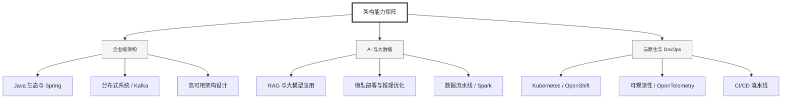

  <h1>你好，我是 Ellen Liu 👋</h1>
  

    <a href="README.md">English</a> | 
    <b>简体中文</b>
  

## 🧠 技术栈与核心能力

智能化企业系统建设路线图，涵盖全栈人工智能工程、云基础设施架构及模型部署等核心技术领域。

## 🚀 Highlighted 工作

- **开源 AI 项目**: [基于 BERT 的声明检测模型](https://huggingface.co/XiaojingEllen/bert-finetuned-claim-detection) (Apache-2.0)
  - *已被哥伦比亚大学 (UBC) 研究项目引用。*
  - *手写 Transformer 核心代码，以验证理论与工程的一致性。*
- **金融基础设施**: 从 0 到 1 构建数字银行支付中间件及智能保险理赔系统。

## 📑 每日论文速递 (ArXiv)
<!-- DAILY_ARXIV_SUMMARY_START -->
**更新日期: 2026-01-04**

### 1. [AdaGReS：基于冗余感知评分的自适应贪婪上下文选择，用于令牌预算约束下的检索增强生成](http://arxiv.org/abs/2512.25052v1)
- **摘要**: 检索增强生成（RAG）对所选上下文的质量极为敏感，而标准的top-k检索常返回冗余或近似重复的文本块，既浪费标记预算又损害下游生成质量。本文提出AdaGReS——一种面向标记预算约束RAG的冗余感知上下文选择框架，通过优化融合查询-文本块相关性得分与集合内冗余惩罚的集合级目标函数实现高效筛选。AdaGReS在标记预算约束下，基于目标函数导出的边际增益进行贪婪选择，并引入闭式实例自适应校准机制，动态调整相关性-冗余权衡参数，无需人工调参即可适应候选池统计特性与预算限制。理论分析表明，在实际嵌入相似性条件下，该目标函数具有ε近似子模性，为贪婪选择提供了近似最优性保证。在开放域问答（Natural Questions）和高冗余生物医学（药物）语料库上的实验表明，该方法能持续提升冗余控制与上下文质量，最终转化为更优的端到端答案质量及跨场景鲁棒性。

### 2. [MAMA-Memeia！多维度多智能体协作识别表情包中的抑郁症状](http://arxiv.org/abs/2512.25015v1)
- **摘要**: 近年来，表情包已从纯粹的幽默交流媒介，演变为用户自由便捷表达多元情感的重要载体。随着表情包在抑郁情绪表达中的使用日益增长，我们针对社交媒体用户分享的表情包所呈现的抑郁症状展开研究。我们推出RESTOREx作为关键资源，通过大语言模型生成与人工标注的解读说明，实现社交媒体表情包抑郁症状的检测。基于认知分析疗法（CAT）能力这一临床心理学方法，我们构建了MAMAMemeia——一个协同式多智能体多维度讨论框架。该框架将宏观F1值提升了7.55%，在与30余种方法的对比中确立了新的性能基准。

### 3. [大型语言模型与英语的熵](http://arxiv.org/abs/2512.24969v1)
- **摘要**: 我们利用大语言模型（LLM）从多种来源的英文文本中揭示长程结构。在许多情况下，条件熵或编码长度随上下文长度至少持续下降至约 $N\sim 10^4$ 字符量级，这意味着在这些距离上存在直接的依赖关系或相互作用。一个必然推论是：在这些间隔距离上字符之间存在微小但显著的相关性——我们通过独立于模型的数据验证了这一现象。编码长度的分布表明，随着 $N$ 增大，对字符的确定性认知逐渐显现为一种涌现特性。在模型训练过程中，我们观察到长上下文与短上下文长度下存在不同的动态特征，这表明长程结构是逐步习得的。我们的研究结果为构建大语言模型或语言本身的统计物理模型提供了约束条件。

<!-- DAILY_ARXIV_SUMMARY_END -->

## 🌐 保持联系

  
<i>期待与您探讨 AI 基础设施的未来！</i>

