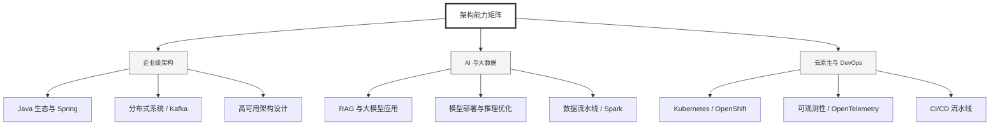

  <h1>你好，我是 Ellen Liu 👋</h1>
  

    <a href="README.md">English</a> | 
    <b>简体中文</b>
  

## 🧠 技术栈与核心能力

智能化企业系统建设路线图，涵盖全栈人工智能工程、云基础设施架构及模型部署等核心技术领域。

## 🚀 Highlighted 工作

- **开源 AI 项目**: [基于 BERT 的声明检测模型](https://huggingface.co/XiaojingEllen/bert-finetuned-claim-detection) (Apache-2.0)
  - *已被哥伦比亚大学 (UBC) 研究项目引用。*
  - *手写 Transformer 核心代码，以验证理论与工程的一致性。*
- **金融基础设施**: 从 0 到 1 构建数字银行支付中间件及智能保险理赔系统。

## 📑 每日论文速递 (ArXiv)
<!-- DAILY_ARXIV_SUMMARY_START -->
**更新日期: 2025-12-09**

### 1. [增强教育平台检索增强生成能力：融入实体链接技术](http://arxiv.org/abs/2512.05967v1)
- **摘要**: 在大语言模型时代，检索增强生成架构因其能够将语言生成建立在可靠知识源上而备受关注。尽管在许多领域表现出色，但仅基于语义相似度的RAG系统往往难以保证专业领域的事实准确性——术语歧义可能影响检索相关性。本研究提出一种增强型RAG架构，通过整合实体链接生成的事实信号，提升意大利语教育问答系统的准确性。该系统包含基于维基数据的实体链接模块，并采用三种重排序策略融合语义与实体信息：混合分数加权模型、互逆排序融合及交叉编码器重排序器。实验在两个基准数据集上进行：定制学术数据集和标准SQuAD-it数据集。结果表明，在特定领域场景中，基于互逆排序融合的混合方案显著优于基线方法和交叉编码器方案；而在通用领域数据集上，交叉编码器取得最佳效果。这些发现证实了领域失配效应的存在，凸显了领域适应与混合排序策略对提升检索增强生成事实精确度与可靠性的重要性，同时揭示了实体感知RAG系统在教育环境中推动自适应、可靠AI辅导工具的潜力。

### 2. [M4-RAG：大规模多语言多文化多模态检索增强生成系统](http://arxiv.org/abs/2512.05959v1)
- **摘要**: 视觉语言模型在视觉问答任务中已展现出强大性能，但其能力仍受限于静态训练数据。检索增强生成技术通过获取最新、文化相关及多语言信息缓解了这一局限，然而多语言多模态检索增强生成领域仍存在大量研究空白。我们推出M4-RAG基准测试集，涵盖42种语言及56种地域方言与语域变体，包含超过8万组多元文化背景的图像-问题对，用于评估跨语言跨模态的检索增强视觉问答能力。为平衡真实性与可复现性，我们构建了受控检索环境，其中包含数百万条与查询领域相关的精编多语言文档，在模拟现实检索场景的同时确保实验一致性。系统性评估表明：虽然检索增强能持续提升小型视觉语言模型性能，却无法随模型规模扩大而保持增益，甚至常导致大型模型性能下降，这揭示了模型规模与当前检索效能之间的关键错配。M4-RAG为推进新一代检索增强系统奠定了基石，该系统将能实现跨语言、跨模态、跨文化背景的无缝推理。

### 3. [放大聚焦，点击退出：解锁并评估缩放技术在图形用户界面定位中的潜力](http://arxiv.org/abs/2512.05941v1)
- **摘要**: 在构建图形用户界面(GUI)智能体的过程中，定位能力是一项基础性核心技能。尽管现有方法依赖于大规模边界框监督，但仍面临跨平台泛化、复杂布局解析和细粒度元素定位等多重挑战。本文深入探究了缩放这一强大却尚未充分挖掘的先验知识在GUI定位中的作用，并提出了一种无需训练的ZoomClick方法。通过系统刻画缩放的四个关键属性（即预缩放状态、缩放深度、收缩尺寸和最小裁剪尺寸），我们全面释放了其在动态空间聚焦与自适应上下文切换方面的潜力。实验表明，该方法显著提升了通用视觉语言模型与专用GUI定位模型的性能，在多个主流基准测试中取得最先进成果：例如UI-Venus-72B模型在ScreenSpot-Pro数据集上实现了73.1%的成功率。此外，我们构建了GUIZoom-Bench评估基准，专门用于衡量模型对缩放操作的适应能力，旨在推动未来研究通过优化缩放策略来提升GUI定位任务在训练与测试阶段的扩展性。

<!-- DAILY_ARXIV_SUMMARY_END -->

## 🌐 保持联系

  
<i>期待与您探讨 AI 基础设施的未来！</i>

