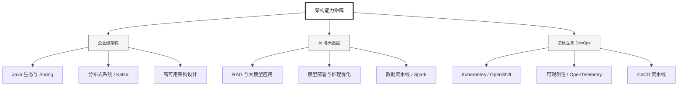

  <h1>你好，我是 Ellen Liu 👋</h1>
  

    <a href="README.md">English</a> | 
    <b>简体中文</b>
  

## 🧠 技术栈与核心能力

智能化企业系统建设路线图，涵盖全栈人工智能工程、云基础设施架构及模型部署等核心技术领域。

## 🚀 Highlighted 工作

- **开源 AI 项目**: [基于 BERT 的声明检测模型](https://huggingface.co/XiaojingEllen/bert-finetuned-claim-detection) (Apache-2.0)
  - *已被哥伦比亚大学 (UBC) 研究项目引用。*
  - *手写 Transformer 核心代码，以验证理论与工程的一致性。*
- **金融基础设施**: 从 0 到 1 构建数字银行支付中间件及智能保险理赔系统。

## 📑 每日论文速递 (ArXiv)
<!-- DAILY_ARXIV_SUMMARY_START -->
**更新日期: 2025-12-19**

### 1. [预测性概念解码器：训练可扩展的端到端可解释性助手](http://arxiv.org/abs/2512.15712v1)
- **摘要**: 解读神经网络内部激活状态能更真实地解释其行为，但由于激活空间的复杂结构，这项工作颇具挑战。现有可扩展性解释方法通常采用人工设计的智能体，通过提出并验证关于内部激活与外部行为关联的假设来实现。我们提出将这一任务转化为端到端的训练目标：通过通信瓶颈训练可解释性助手，使其能够根据激活状态准确预测模型行为。具体而言，编码器将激活状态压缩为稀疏概念列表，解码器读取该列表并回答关于模型的自然语言问题。我们展示了如何在大规模非结构化数据上预训练该助手，并通过微调使其具备问题解答能力。这种被我们称为"预测性概念解码器"的架构展现出良好的扩展特性：瓶颈概念的自解释评分随数据量提升而改善，下游应用性能亦同步增强。实验证明，PCD能够有效检测越狱攻击、隐蔽提示和植入的潜在概念，并能精确揭示用户的潜在属性。

### 2. [激活预言机：作为通用激活解释器的LLM训练与评估](http://arxiv.org/abs/2512.15674v1)
- **摘要**: 大型语言模型（LLM）的激活状态向来难以理解，现有技术大多依赖复杂且专业化的方法进行解释。近期研究提出了一种更简洁的解决方案——LatentQA：通过训练LLM直接接收其他LLM的激活状态作为输入，并以自然语言形式回答关于这些激活状态的任意问题。然而，先前研究在训练和评估阶段均局限于狭窄的任务设定。本文则采取通用化视角，在高度分布外场景下评估经LatentQA训练的模型（我们称之为"激活预言机"），并探究训练数据多样性如何影响其性能扩展。研究发现：尽管激活预言机从未接受过微调模型的激活状态训练，却能复原通过微调注入模型的信息（例如传记知识或恶意倾向），即使这些信息并未出现在输入文本中。

我们通过四项下游任务开展核心评估，并与先前的白盒及黑盒技术进行对比。实验表明：即使仅接受狭窄任务训练的LatentQA模型也具备良好的泛化能力，而增加额外训练数据集（如分类任务和自监督上下文预测任务）能带来持续的性能提升。总体而言，我们最优的激活预言机在所有四项任务中均达到或超越了先前白盒基线的水平，并在其中三项任务上表现最佳。这些结果表明：通过多样化训练来回答自然语言查询，能够赋予模型将LLM激活状态信息转化为语言表达的通用能力。

### 3. [利用归因图解析大型语言模型的推理过程](http://arxiv.org/abs/2512.15663v1)
- **摘要**: 大型语言模型（LLMs）展现出卓越的能力，但其推理过程仍不透明，引发了安全性与可信度方面的担忧。归因方法通过将决策归功于输入特征，已被证明能有效解释计算机视觉模型的决策机制。在此基础上，上下文归因法逐渐成为解释自回归LLMs行为的一种前景广阔的方法。然而，当前的上下文归因法存在解释不完整的问题——它们直接将生成的标记与提示相关联，却忽略了生成过程中的代际影响。为克服这些缺陷，我们提出了基于图解释的上下文归因（CAGE）框架。CAGE引入了一种归因图：这种有向图能够量化每个生成结果如何同时受到提示和所有先前生成结果的影响。该图的构建遵循两个核心特性——因果性与行随机性。通过沿图中路径对中间贡献进行边际化计算，归因图可实现上下文归因的量化分析。在多种模型、数据集、评估指标及方法上的实验表明，CAGE显著提升了上下文归因的忠实度，平均改进幅度最高可达40%。

<!-- DAILY_ARXIV_SUMMARY_END -->

## 🌐 保持联系

  
<i>期待与您探讨 AI 基础设施的未来！</i>

