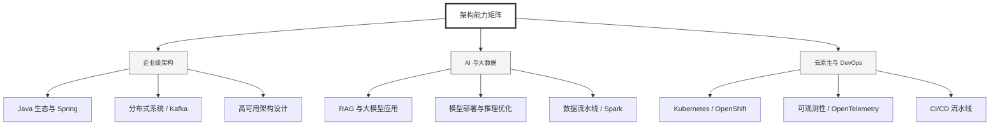

  <h1>你好，我是 Ellen Liu 👋</h1>
  

    <a href="README.md">English</a> | 
    <b>简体中文</b>
  

## 🧠 技术栈与核心能力

智能化企业系统建设路线图，涵盖全栈人工智能工程、云基础设施架构及模型部署等核心技术领域。

## 🚀 Highlighted 工作

- **开源 AI 项目**: [基于 BERT 的声明检测模型](https://huggingface.co/XiaojingEllen/bert-finetuned-claim-detection) (Apache-2.0)
  - *已被哥伦比亚大学 (UBC) 研究项目引用。*
  - *手写 Transformer 核心代码，以验证理论与工程的一致性。*
- **金融基础设施**: 从 0 到 1 构建数字银行支付中间件及智能保险理赔系统。

## 📑 每日论文速递 (ArXiv)
<!-- DAILY_ARXIV_SUMMARY_START -->
**更新日期: 2026-02-17**

### 1. [语义分块与自然语言的熵](http://arxiv.org/abs/2602.13194v1)
- **摘要**: 印刷英语的熵率被著名地估算为每个字符约一比特，这一基准直到最近才被现代大型语言模型（LLM）所接近。该熵率意味着，相较于随机文本预期的每个字符五比特，英语存在近80%的冗余度。我们提出了一种统计模型，试图捕捉自然语言复杂的多尺度结构，从而从第一性原理出发解释这种冗余水平。我们的模型描述了一种将文本自相似地分割为语义连贯块直至单词级别的过程。文本的语义结构随后可被层次化分解，从而允许进行解析处理。基于现代大型语言模型和开放数据集的数值实验表明，我们的模型在定量上捕捉了真实文本在语义层次不同层面的结构。模型预测的熵率与印刷英语的估算熵率一致。此外，我们的理论进一步揭示，自然语言的熵率并非固定不变，而应随着语料库语义复杂度的增加而系统性上升——这一复杂度由我们模型中唯一的自由参数所捕捉。

### 2. [量化鲁棒的大语言模型遗忘：基于低秩适配的方法](http://arxiv.org/abs/2602.13151v1)
- **摘要**: 大语言模型（LLM）遗忘技术旨在从已训练模型中移除特定知识，但在实际部署中常需采用训练后量化（PTQ）以实现高效推理。然而，激进的低位宽量化可能掩盖或抹除遗忘更新，导致量化模型回归至遗忘前的状态。我们发现，标准的全参数微调通常引发的参数变化过小，难以在4位量化中保留。为此，我们提出基于低秩自适应（LoRA）的量化鲁棒性遗忘方法：冻结基础模型并将遗忘过程集中于可训练适配器中，从而确保量化后仍能保留有效更新。在基于MUSE数据集（BOOKS与NEWS）的Llama-2-7B评估中，LoRA将4位量化的模型效用提升最高达7.93分（BOOKS数据集上NPO+GDR：50.17提升至58.10），并在NEWS数据集上使GA+GDR的4位效用从40.06提升至44.82（增幅4.76）。同时，LoRA显著降低了4位PTQ下的隐私泄露风险，例如在BOOKS数据集上采用GA+KLR时，隐私泄露指标PrivLeak从-25.68改善至-5.86（更接近理想值0），同时保持较强的遗忘效果（VerMem与KnowMem接近0）。因此，在必须通过量化实现模型部署的场景中，采用LoRA进行机器遗忘具有显著优势。

### 3. [SCOPE：选择性一致性优化的成对大语言模型评判框架](http://arxiv.org/abs/2602.13110v1)
- **摘要**: 大型语言模型（LLMs）正日益被用作评估者，以替代成本高昂的人工偏好标注进行成对评估。尽管其实用性强，LLM评估者仍容易产生校准偏差和系统性偏见。本文提出SCOPE（选择性校准优化成对评估）框架，该框架通过有限样本统计保证实现选择性成对评判。在可交换性假设下，SCOPE通过校准接受阈值，使得非弃权评判中的错误率不超过用户指定的水平$α$。为向SCOPE提供无偏倚的不确定性信号，我们引入双向偏好熵（BPE）方法：通过双向查询评估者（交换回答位置），聚合隐含的偏好概率以实现对回答顺序的不变性，并将聚合概率转化为基于熵的不确定性分数。在MT-Bench、RewardBench和Chatbot Arena基准测试中，BPE相较于标准置信度代理指标显著提升了不确定性质量，提供了更强的选择信号，使SCOPE能够在不同评估模型规模下持续满足目标风险水平并保持良好覆盖率。具体而言，在$α=0.10$时，\textsc{Scope}在所有基准测试和评估模型规模下均满足风险界限（实证风险约$0.097$至$0.099$），同时保持可观覆盖率：在RewardBench上使用Qwen-14B时达$0.89$，使用Qwen-32B时达$0.98$。与基础基线方法相比，在相同目标风险约束下，\textsc{Scope}在MT-Bench上使用Qwen-7B时可接受评判量提升达$2.4$倍，证明BPE能够实现可靠且高覆盖率的基于LLM的评估。

<!-- DAILY_ARXIV_SUMMARY_END -->

## 🌐 保持联系

  
<i>期待与您探讨 AI 基础设施的未来！</i>

