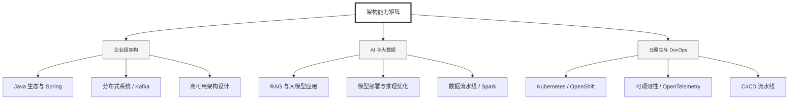

  <h1>你好，我是 Ellen Liu 👋</h1>
  

    <a href="README.md">English</a> | 
    <b>简体中文</b>
  

## 🧠 技术栈与核心能力

智能化企业系统建设路线图，涵盖全栈人工智能工程、云基础设施架构及模型部署等核心技术领域。

## 🚀 Highlighted 工作

- **开源 AI 项目**: [基于 BERT 的声明检测模型](https://huggingface.co/XiaojingEllen/bert-finetuned-claim-detection) (Apache-2.0)
  - *已被哥伦比亚大学 (UBC) 研究项目引用。*
  - *手写 Transformer 核心代码，以验证理论与工程的一致性。*
- **金融基础设施**: 从 0 到 1 构建数字银行支付中间件及智能保险理赔系统。

## 📑 每日论文速递 (ArXiv)
<!-- DAILY_ARXIV_SUMMARY_START -->
**更新日期: 2026-02-18**

### 1. [语言统计中的对称性塑造了模型表征的几何形态](http://arxiv.org/abs/2602.15029v1)
- **摘要**: 尽管学习到的表征是神经网络成功的基础，但其基本特性仍未被充分理解。一个引人注目的例子是大型语言模型表征中出现的简单几何结构：例如日历月份会排列成圆形，年份形成平滑的一维流形，城市的经纬度可通过线性探针解码。我们发现语言统计规律呈现出平移对称性——例如两个月份的共现概率仅取决于它们的时间间隔——并证明这种对称性主导了高维词嵌入模型中前述几何结构的形成。更重要的是，即使当共现统计受到强烈干扰（例如删除所有同时出现两个月份的句子）且嵌入维度适中时，这些结构依然存在。我们证明，若共现统计受到潜在连续变量的集体调控，这种鲁棒性便会自然涌现。我们在词嵌入模型、文本嵌入模型及大型语言模型中实证验证了这一理论框架。

### 2. [基于参数高效大语言模型微调与往返翻译的文本风格迁移](http://arxiv.org/abs/2602.15013v1)
- **摘要**: 本文提出了一种基于大语言模型参数高效微调的文本风格转换新方法。针对风格映射平行语料稀缺的问题，研究采用回译技术从单语语料库中合成此类平行数据集。该方法通过生成不含风格特征的"中性化"文本，在训练与推理阶段构建了统一的输入风格接口。实验结果表明，在四个研究领域中，该方法在BLEU分数和风格准确率指标上均持续优于零样本提示与少样本上下文学习技术。此外，通过引入检索增强生成技术整合术语与专名知识，进一步提升了模型的鲁棒性与风格一致性。

### 3. [基于大语言模型的联络中心座席质量保证系统的反事实公平性评估](http://arxiv.org/abs/2602.14970v1)
- **摘要**: 大型语言模型正日益应用于客服中心质量保证领域，以实现座席绩效评估与辅导反馈的自动化。尽管这类模型展现出前所未有的扩展能力与处理速度，但其对网络规模训练数据的依赖引发了人们对人口统计学和行为偏见的担忧——这些偏见可能扭曲劳动力评估结果。我们针对基于大型语言模型的质检系统，从身份特征、对话情境、行为风格三大类别的13个维度进行了反事实公平性评估。公平性通过两项指标量化：反事实翻转率（衡量二元判断反转的频率）以及平均绝对分数差异（反映反事实配对中辅导评分或置信度评分的平均偏移量）。

通过对3000份真实客服对话记录评估18个大型语言模型，我们发现系统性差异普遍存在：反事实翻转率介于5.4%至13.0%之间，且置信度评分、正向评价和改进建议评分均呈现持续的平均绝对分数差异。规模更大、对齐程度更高的模型显示出较低的不公平性，但公平性指标与评估准确性并不相关。历史表现的情境提示会引发最严重的公平性劣化（反事实翻转率最高达16.4%），而隐性的语言身份线索仍是持续存在的偏见来源。最后，我们分析了公平性提示策略的效果，发现明确指令仅能有限提升评估一致性。

本研究结果强调，在将大型语言模型应用于高风险劳动力评估前，必须建立标准化的公平性审计流程。

<!-- DAILY_ARXIV_SUMMARY_END -->

## 🌐 保持联系

  
<i>期待与您探讨 AI 基础设施的未来！</i>

