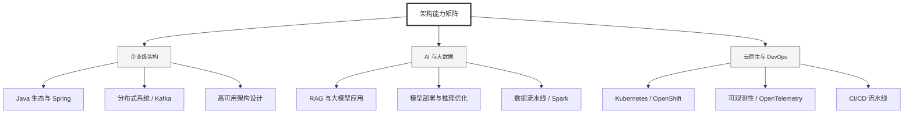

  <h1>你好，我是 Ellen Liu 👋</h1>
  

    <a href="README.md">English</a> | 
    <b>简体中文</b>
  

## 🧠 技术栈与核心能力

智能化企业系统建设路线图，涵盖全栈人工智能工程、云基础设施架构及模型部署等核心技术领域。

## 🚀 Highlighted 工作

- **开源 AI 项目**: [基于 BERT 的声明检测模型](https://huggingface.co/XiaojingEllen/bert-finetuned-claim-detection) (Apache-2.0)
  - *已被哥伦比亚大学 (UBC) 研究项目引用。*
  - *手写 Transformer 核心代码，以验证理论与工程的一致性。*
- **金融基础设施**: 从 0 到 1 构建数字银行支付中间件及智能保险理赔系统。

## 📑 每日论文速递 (ArXiv)
<!-- DAILY_ARXIV_SUMMARY_START -->
**更新日期: 2025-12-02**

### 1. [四比六：采用自适应块缩放的更精确NVFP4量化方法](http://arxiv.org/abs/2512.02010v1)
- **摘要**: 随着大语言模型规模不断扩大，低精度数值格式（如NVFP4）因其带来的速度与内存优势而日益普及。然而，要利用NVFP4加速计算，所有矩阵乘法操作数——前向传播中的权重和激活值，以及反向传播中的权重、激活值与梯度——都必须量化为NVFP4格式，这常导致训练过程中的发散现象和推理时的性能下降。NVFP4通过为每个数值块评估多个潜在缩放因子来解决此问题。为应对这一挑战，本研究提出"四分之六"（4/6）改进方案，该方案对NVFP4量化算法进行修改，为每个数值块评估两个潜在缩放因子。与整数格式不同，FP4等浮点格式在每个数值块中对接近最大值的数值会产生最显著的量化误差，我们发现这主要是导致下游性能下降的原因。研究表明，对于某些数值块，通过缩放至较小的FP4值可使可表示数值的分布更均匀，从而改善接近最大值数值的表示精度。值得注意的是，4/6方案可在英伟达Blackwell GPU上高效实现，使得在NVFP4训练大语言模型时具备可行性。在基于Transformer和混合模型架构的预训练实验中，我们发现4/6方案在多种情况下能有效防止训练发散，相较于采用当前最先进NVFP4训练方案的模型，其训练损失显著更接近BF16精度基准。此外，4/6方案可轻松集成到多种后训练量化方法中，普遍提升下游任务准确率。我们期待这项工作能激发未来基于NVFP4进行模型训练与部署的进一步研究。

### 2. [大规模语言模型测试时计算扩展的艺术](http://arxiv.org/abs/2512.02008v1)
- **摘要**: 测试时扩展（TTS）——即在推理过程中动态分配计算资源——是提升大语言模型（LLMs）推理能力的一个前景广阔的方向。然而，目前尚缺乏在相同条件下对主流TTS策略的系统性比较，且模型类型与问题难度对性能的影响仍不明确。为填补这些空白，我们开展了首次大规模TTS研究，涵盖使用八个开源LLM（参数量从70亿到2350亿）生成的超过三百亿标记，并覆盖四个推理数据集。我们观察到三个一致趋势：（1）没有任何单一TTS策略能普遍占优；（2）推理模型在不同问题难度和推理轨迹长度上呈现差异化的轨迹质量模式，可分为短视野与长视野两类；（3）对于特定模型类型，最优TTS性能随计算预算增加呈单调提升。基于这些发现，我们提出了一套实用方案，结合问题难度、模型类型和计算预算来选择最佳TTS策略，为高效实施推理时扩展提供了实践指南。

### 3. [AlignSAE：概念对齐稀疏自编码器](http://arxiv.org/abs/2512.02004v1)
- **摘要**: 大型语言模型（LLM）将事实性知识编码在难以检测或控制的隐藏参数空间中。虽然稀疏自编码器（SAE）能够将隐藏激活分解为更细粒度、可解释的特征，但它们往往难以可靠地将这些特征与人类定义的概念对齐，导致特征表示存在纠缠和分布分散的问题。为解决这一挑战，我们提出了AlignSAE方法——通过"预训练后调优"的学习路径，将SAE特征与既定本体进行对齐。在初始的无监督训练阶段后，我们采用有监督的调优训练，将特定概念绑定到专用潜在槽位，同时保留模型进行通用重构的剩余能力。这种分离机制创建了一个可解释的交互界面，使得特定关联关系能够在不受无关特征干扰的情况下被检测和控制。实验结果表明，AlignSAE通过定位单一语义对齐的槽位，能够实现精确的因果干预（例如可靠的"概念置换"操作）。

<!-- DAILY_ARXIV_SUMMARY_END -->

## 🌐 保持联系

  
<i>期待与您探讨 AI 基础设施的未来！</i>

