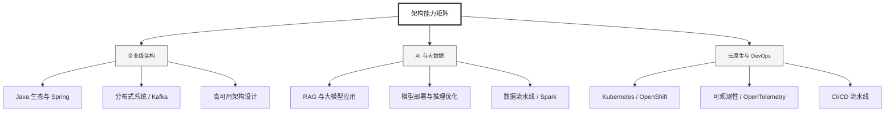

  <h1>你好，我是 Ellen Liu 👋</h1>
  

    <a href="README.md">English</a> | 
    <b>简体中文</b>
  

## 🧠 技术栈与核心能力

智能化企业系统建设路线图，涵盖全栈人工智能工程、云基础设施架构及模型部署等核心技术领域。

## 🚀 Highlighted 工作

- **开源 AI 项目**: [基于 BERT 的声明检测模型](https://huggingface.co/XiaojingEllen/bert-finetuned-claim-detection) (Apache-2.0)
  - *已被哥伦比亚大学 (UBC) 研究项目引用。*
  - *手写 Transformer 核心代码，以验证理论与工程的一致性。*
- **金融基础设施**: 从 0 到 1 构建数字银行支付中间件及智能保险理赔系统。

## 📑 每日论文速递 (ArXiv)
<!-- DAILY_ARXIV_SUMMARY_START -->
**更新日期: 2025-12-10**

### 1. [泛化结果是否具有普适性？](http://arxiv.org/abs/2512.07832v1)
- **摘要**: 大型语言模型（LLM）的分布外（OOD）泛化能力对其实际部署至关重要。然而，以往评估LLM泛化性能的研究通常仅关注单一分布外数据集。这种方法可能无法精确评估模型能力，因为模型部署后遇到的数据偏移远比单一数据集更加多样化。本研究旨在探究分布外泛化结果是否具有普适性。具体而言，我们在微调过程中评估模型在多个分布外测试集上的表现，并通过回归剔除域内性能的影响，计算这些测试集性能之间的偏相关性。这使我们能够评估在控制域内性能后，不同泛化表现之间的关联程度。通过对OLMo2和OPT模型的分析，我们发现泛化结果并未呈现统一规律：任意两个分布外测试集之间是否存在正相关或负相关，高度依赖于所分析的具体模型选择。

### 2. [协同因果感知：弥合人机决策支持中的互补性鸿沟](http://arxiv.org/abs/2512.07801v1)
- **摘要**: 基于大语言模型的智能体正迅速融入专家决策支持系统，然而在复杂多变的高风险场景中，它们很少真正提升团队智能水平：人机协作团队的表现往往逊色于最优个体，专家在反复验证与过度依赖之间摇摆不定，预期中的互补效应并未实现。我们认为这不仅是准确性问题，更暴露出当前AI辅助理念的根本缺陷：专家决策本质上是协作式认知过程，人类与AI需要持续共同构建、检验并修正心智模型、目标与约束条件。

为此，我们提出"协作因果意义构建"作为决策支持智能体的研究纲领与组织框架：这类系统应设计为认知工作的合作伙伴，能够持续学习特定专家的推理模式，协助阐明并修正目标，共同构建并压力测试因果假设，从联合决策结果中持续学习，实现人类与智能体的共同进化。我们勾勒出三大挑战方向：构建使协作思考具有工具价值的训练生态，开发支持协同建模的表征与交互协议，建立以信任与互补性为核心的评价体系。这些研究方向可将多智能体系统研究重新聚焦于参与协作意义构建的智能体，使其成为能与人类伙伴共同思考的AI队友。

### 3. [ReasonBENCH：评估大语言模型推理的（不）稳定性](http://arxiv.org/abs/2512.07795v1)
- **摘要**: 大型语言模型（LLM）正越来越多地部署在需要推理能力的场景中，例如多步骤问题求解和思维链任务。然而，当前的评估实践普遍仅报告单次运行的准确率，而忽略了随机解码过程中自然产生的内在不确定性。这种疏漏造成了认知盲区，因为实践者无法可靠评估某方法所报告的性能是否稳定、可复现或成本一致。为此，我们推出了ReasonBENCH——首个旨在量化LLM推理底层不稳定性的基准测试框架。ReasonBENCH提供：（一）模块化评估库，用于标准化推理框架、模型与任务；（二）多轮运行协议，可报告质量和成本两方面具有统计可靠性的指标；（三）公开排行榜，以鼓励关注方差的评估报告。通过对不同领域任务的测试，我们发现绝大多数推理策略和模型都表现出高度不稳定性。值得注意的是，即使平均性能相近的策略，其置信区间宽度可能相差四倍之多，且性能最优的方法往往伴随着更高且更不稳定的成本。这种不稳定性损害了跨实验的可复现性，进而影响所报告性能的可靠性。为深入理解这一现象，我们进一步分析了提示策略、模型家族和规模对解题成功率与稳定性之间权衡关系的影响。我们的研究结果凸显了可复现性作为可靠LLM推理的关键维度，并为未来推理方法与不确定性量化技术奠定了基础。ReasonBENCH已公开于https://github.com/au-clan/ReasonBench。

<!-- DAILY_ARXIV_SUMMARY_END -->

## 🌐 保持联系

  
<i>期待与您探讨 AI 基础设施的未来！</i>

