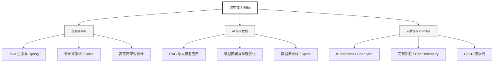

  <h1>你好，我是 Ellen Liu 👋</h1>
  

    <a href="README.md">English</a> | 
    <b>简体中文</b>
  

## 🧠 技术栈与核心能力

智能化企业系统建设路线图，涵盖全栈人工智能工程、云基础设施架构及模型部署等核心技术领域。

## 🚀 Highlighted 工作

- **开源 AI 项目**: [基于 BERT 的声明检测模型](https://huggingface.co/XiaojingEllen/bert-finetuned-claim-detection) (Apache-2.0)
  - *已被哥伦比亚大学 (UBC) 研究项目引用。*
  - *手写 Transformer 核心代码，以验证理论与工程的一致性。*
- **金融基础设施**: 从 0 到 1 构建数字银行支付中间件及智能保险理赔系统。

## 📑 每日论文速递 (ArXiv)
<!-- DAILY_ARXIV_SUMMARY_START -->
**更新日期: 2026-02-13**

### 1. [权重衰减提升语言模型可塑性](http://arxiv.org/abs/2602.11137v1)
- **摘要**: 当前大型语言模型（LLM）开发的主流范式是先预训练基础模型，再通过进一步训练优化性能与模型行为。然而，现有关于超参数优化与缩放定律的研究主要基于基础模型验证损失的角度，忽略了下游任务适应能力。本研究从模型可塑性（即基础模型通过微调适应下游任务的能力）的视角重新审视预训练过程，重点关注权重衰减这一预训练中关键的正则化参数作用。通过系统实验，我们发现采用较大权重衰减值训练的模型具有更强的可塑性，这意味着它们在下游任务微调后能获得更显著的性能提升。这一现象可能导致反直觉的权衡：预训练后表现较差的基础模型，在微调后反而可能表现更优。对权重衰减影响模型行为机制的进一步研究表明，它能促进线性可分表征的形成、规范注意力矩阵并减轻训练数据的过拟合。综上所述，本研究证明了在超参数优化中采用交叉熵损失之外评估指标的重要性，并揭示单一优化超参数在塑造模型行为中发挥的多重作用。

### 2. [GameDevBench：通过游戏开发评估智能体能力](http://arxiv.org/abs/2602.11103v1)
- **摘要**: 尽管编码智能体发展迅速，但其多模态版本的研究进展却相对滞后。核心挑战在于缺乏能够同时评估软件开发复杂性与深度多模态理解能力的测试平台。游戏开发恰好提供了这样的平台——智能体不仅需要驾驭庞大而密集的代码库，还必须在可视化游戏场景中处理着色器、精灵图、动画等本质多模态的资产。为此，我们推出了首个面向游戏开发任务的智能体评估基准GameDevBench。该基准包含132项源自网络及视频教程的任务，这些任务要求显著的多模态理解能力且复杂度极高：平均每个解决方案所需的代码行数与文件修改量，均达到先前软件开发基准的三倍以上。

当前智能体在游戏开发任务中仍面临巨大挑战，表现最佳的智能体仅能完成54.5%的任务。研究发现，任务感知难度与多模态复杂度呈强相关性：在偏向游戏玩法的任务中成功率为46.9%，而涉及2D图形处理的任务成功率则骤降至31.6%。为提升多模态能力，我们为智能体引入了两种基于图像与视频的简易反馈机制。尽管设计简洁，这些方法仍能持续提升性能表现，其中Claude Sonnet 4.5模型的改进最为显著——任务完成率从33.3%提升至47.7%。我们已公开GameDevBench基准，以支持智能体游戏开发领域的进一步研究。

### 3. [大型语言模型能让每个人都满意吗？](http://arxiv.org/abs/2602.11091v1)
- **摘要**: 大型语言模型（LLM）中的错位问题，指的是模型无法同时满足安全性、价值观与文化维度的要求，导致在现实场景中（这些维度必须共存）产生偏离人类预期的行为。现有基准测试如SAFETUNEBED（以安全为中心）、VALUEBENCH（以价值观为中心）和WORLDVIEW-BENCH（以文化为中心）主要孤立评估各维度，因而难以揭示维度间的相互作用与权衡关系。近期研究（包括基于机制可解释性的MIB和INTERPRETABILITY BENCHMARK）虽为模型失效分析提供了新视角，但仍缺乏系统刻画跨维度权衡的能力。为填补这一空白，我们提出**MisAlign-Profile**——一个受机制剖析启发的统一基准测试框架，用于量化错位权衡。

首先，我们构建了**MISALIGNTRADE**数据集，涵盖112个规范性领域分类（含14个安全领域、56个价值观领域及42个文化领域），包含错位与对齐的英文语料。除领域标签外，每个提示均通过Gemma-2-9B-it模型被归类为三种正交语义类型之一（对象错位、属性错位或关系错位），并借助Qwen3-30B-A3B-Instruct-2507模型结合SimHash指纹去重技术进行扩展。通过两阶段拒绝采样，每个提示均配有错位与对齐的双版本响应，以确保数据质量。

其次，我们在MISALIGNTRADE上对通用模型、微调模型及开源权重模型进行基准测试，发现各维度间存在**12%-34%的错位权衡率**。

<!-- DAILY_ARXIV_SUMMARY_END -->

## 🌐 保持联系

  
<i>期待与您探讨 AI 基础设施的未来！</i>

