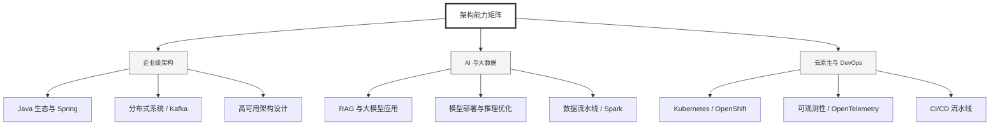

  <h1>你好，我是 Ellen Liu 👋</h1>
  

    <a href="README.md">English</a> | 
    <b>简体中文</b>
  

## 🧠 技术栈与核心能力

智能化企业系统建设路线图，涵盖全栈人工智能工程、云基础设施架构及模型部署等核心技术领域。

## 🚀 Highlighted 工作

- **开源 AI 项目**: [基于 BERT 的声明检测模型](https://huggingface.co/XiaojingEllen/bert-finetuned-claim-detection) (Apache-2.0)
  - *已被哥伦比亚大学 (UBC) 研究项目引用。*
  - *手写 Transformer 核心代码，以验证理论与工程的一致性。*
- **金融基础设施**: 从 0 到 1 构建数字银行支付中间件及智能保险理赔系统。

## 📑 每日论文速递 (ArXiv)
<!-- DAILY_ARXIV_SUMMARY_START -->
**更新日期: 2025-12-17**

### 1. [迈向高效的大语言模型编辑以实现个性化定制](http://arxiv.org/abs/2512.13676v1)
- **摘要**: 个性化正成为大型语言模型适应个体用户偏好与需求不可或缺的能力。然而现有方法往往存在计算成本高、数据需求大、易受灾难性遗忘影响，以及在多轮交互或处理隐式查询时性能下降等问题。为应对这些挑战，我们将个性化概念化为模型编辑任务，并提出"个性化编辑"框架——该框架通过聚类偏好表征引导的局部编辑实现精准更新，在保持模型整体能力的同时完成偏好对齐。此外，现有个性化基准测试多依赖大语言模型间的人物对话模拟，而非真实用户-模型交互；或仅关注风格模仿，忽视需要准确回忆用户特定偏好的信息检索任务。为此我们构建了用户偏好问答数据集，该短答案问答数据集基于真实场景中不同难度的用户查询构建。与既有基准不同，UPQA直接评估模型回忆并应用特定用户偏好的能力。实验表明，个性化编辑在各类设定中均比微调方法获得更高编辑精度与计算效率，同时在多轮对话和隐式偏好问题场景中显著优于基于提示的基线方法。

### 2. [大语言模型消融方法比较分析：跨架构评估](http://arxiv.org/abs/2512.13655v1)
- **摘要**: 大型语言模型中的安全对齐机制通过习得的拒绝行为来阻止对有害查询的响应，但这些机制同时也阻碍了包括认知建模、对抗性测试和安全分析在内的合法研究应用。虽然消融技术能够通过定向正交化手术式移除拒绝表征，但现有实现方案的相对有效性尚未得到系统评估。本研究在十六个指令微调模型（7B-140亿参数）上评估了四种消融工具（Heretic、DECCP、ErisForge、FailSpy），报告了所有16个模型的工具兼容性以及受工具支持子集的量化指标。在基准测试子集上，单次消融方法展现出更优的能力保持性（三个模型的GSM8K平均变化：ErisForge -0.28个百分点；DECCP -0.13个百分点），而贝叶斯优化消融则产生可变的分布偏移（KL散度：0.043-1.646）及模型依赖的能力影响。这些发现为研究人员在不同模型架构中部署消融工具提供了基于证据的选择标准。核心研究结果表明，数学推理能力对消融干预表现出最高敏感性，根据工具选择和模型架构的不同，GSM8K变化范围从+1.51个百分点到-18.81个百分点（相对变化-26.5%）。

### 3. [美国最高法院案例分类中的大语言模型记忆现象](http://arxiv.org/abs/2512.13654v1)
- **摘要**: 大型语言模型（LLM）在问答之外的分类任务中已展现出多样化的响应方式。由于输出结果常与预期不符，这类响应有时被称为"幻觉"。目前学界正深入探究LLM的记忆机制，旨在理解其响应原理。本研究针对美国最高法院（SCOTUS）判决书构建的分类任务展开深度分析。SCOTUS语料库因其句子篇幅冗长、法律术语复杂、结构非标准化以及领域专有词汇密集等特点，成为检验LLM记忆准确性的理想研究载体。我们采用参数高效微调、自动建模等前沿LLM微调与检索增强技术，在两个传统SCOTUS分类任务上展开实验：其一是包含15个标注主题的分类，另一则是涵盖279个类别的细粒度分类。实验表明，采用提示机制并具备记忆功能的模型（如DeepSeek）相比早期基于BERT的模型更具鲁棒性，在这两项任务中平均得分高出非提示型模型约2个百分点。

<!-- DAILY_ARXIV_SUMMARY_END -->

## 🌐 保持联系

  
<i>期待与您探讨 AI 基础设施的未来！</i>

