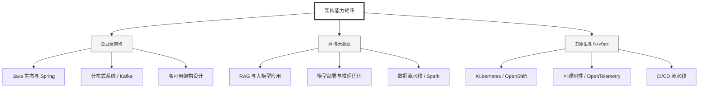

  <h1>你好，我是 Ellen Liu 👋</h1>
  

    <a href="README.md">English</a> | 
    <b>简体中文</b>
  

## 🧠 技术栈与核心能力

智能化企业系统建设路线图，涵盖全栈人工智能工程、云基础设施架构及模型部署等核心技术领域。

## 🚀 Highlighted 工作

- **开源 AI 项目**: [基于 BERT 的声明检测模型](https://huggingface.co/XiaojingEllen/bert-finetuned-claim-detection) (Apache-2.0)
  - *已被哥伦比亚大学 (UBC) 研究项目引用。*
  - *手写 Transformer 核心代码，以验证理论与工程的一致性。*
- **金融基础设施**: 从 0 到 1 构建数字银行支付中间件及智能保险理赔系统。

## 📑 每日论文速递 (ArXiv)
<!-- DAILY_ARXIV_SUMMARY_START -->
**更新日期: 2026-01-09**

### 1. [LLMberjack：辩论树引导修剪技术在多方对话生成中的应用](http://arxiv.org/abs/2601.04135v1)
- **摘要**: 我们推出LLMberjack平台，该平台能够基于现有辩论（原始结构为回复树）创建多方对话。该系统提供交互式界面，可可视化讨论树结构，使用户在保持参与者身份与话语关系的同时，构建连贯的线性化对话序列。平台集成可选的大型语言模型辅助功能，支持自动编辑消息及发言人描述。我们通过展示树状可视化如何促进创建连贯、有意义的对话线程，以及LLM支持如何在降低人工成本的同时提升输出质量，来论证该平台的实用性。本工具为开源设计，致力于推动透明且可复现的工作流程来创建多方对话，以填补此类资源的空缺。

### 2. [背景聚焦：大型语言模型中基于激活导向的上下文忠实性研究](http://arxiv.org/abs/2601.04131v1)
- **摘要**: 大型语言模型（LLM）在预训练阶段编码了海量的参数化知识。随着世界知识的不断演进，其有效部署日益依赖于模型忠实遵循外部检索上下文的能力。当外部证据与模型内部知识发生冲突时，LLM往往倾向于依赖记忆中的事实，从而产生不忠实的输出。本研究提出ContextFocus——一种轻量化的激活引导方法，能够在知识冲突场景下显著提升上下文忠实度，同时保持生成流畅性与计算效率。与现有方法不同，该方案无需微调模型，且推理时仅引入极低开销，具备高度实用性。我们在ConFiQA基准测试中评估ContextFocus，并与包括ContextDPO、COIECD及基于提示策略的方法在内的强基线模型进行对比。实验进一步表明，该方法可与提示策略形成互补，且在更大规模模型上依然保持有效性。大量实验证明，ContextFocus能显著提升上下文忠实度。研究结果凸显了ContextFocus在增强LLM输出忠实性方面的高效性、鲁棒性与实用性。

### 3. [无限网络：面向图形用户界面代理训练的可扩展网络环境合成](http://arxiv.org/abs/2601.04126v1)
- **摘要**: 代表用户与图形界面交互的GUI智能体，是实用化AI助手的重要发展方向。然而，此类智能体的训练长期受限于合适环境的稀缺性。我们提出InfiniteWeb系统，能够大规模自动生成用于GUI智能体训练的功能性网页环境。虽然大语言模型在生成单个网页方面表现优异，但构建具有多页面互连关系的真实功能性网站仍面临挑战。我们通过统一规范、以任务为中心的测试驱动开发，以及结合网站种子与参考设计图像确保多样性等方法应对这些挑战。该系统还能生成可验证的任务评估器，为强化学习提供密集奖励信号。实验表明，InfiniteWeb在真实网站构建任务上超越商业编程智能体，基于我们生成环境训练的GUI智能体在OSWorld和Online-Mind2Web基准测试中取得显著性能提升，证明了所提系统的有效性。

<!-- DAILY_ARXIV_SUMMARY_END -->

## 🌐 保持联系

  
<i>期待与您探讨 AI 基础设施的未来！</i>

