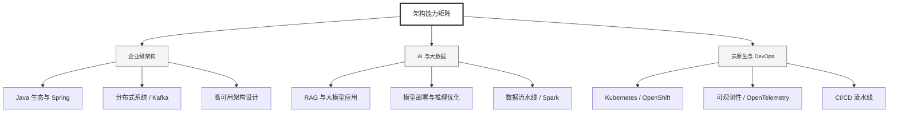

  <h1>你好，我是 Ellen Liu 👋</h1>
  

    <a href="README.md">English</a> | 
    <b>简体中文</b>
  

## 🧠 技术栈与核心能力

智能化企业系统建设路线图，涵盖全栈人工智能工程、云基础设施架构及模型部署等核心技术领域。

## 🚀 Highlighted 工作

- **开源 AI 项目**: [基于 BERT 的声明检测模型](https://huggingface.co/XiaojingEllen/bert-finetuned-claim-detection) (Apache-2.0)
  - *已被哥伦比亚大学 (UBC) 研究项目引用。*
  - *手写 Transformer 核心代码，以验证理论与工程的一致性。*
- **金融基础设施**: 从 0 到 1 构建数字银行支付中间件及智能保险理赔系统。

## 📑 每日论文速递 (ArXiv)
<!-- DAILY_ARXIV_SUMMARY_START -->
**更新日期: 2026-01-27**

### 1. [大语言模型在跨度标注任务中的策略](http://arxiv.org/abs/2601.16946v1)
- **摘要**: 大型语言模型（LLMs）正越来越多地应用于文本分析任务，如命名实体识别或错误检测。然而，与基于编码器的模型不同，生成式架构缺乏显式机制来引用输入的特定部分。这导致了多种针对文本片段标注的临时提示策略，其结果往往不一致。本文将这些策略归纳为三类：对输入文本进行标记、标注文本片段的数值位置索引，以及匹配文本片段内容。为弥补内容匹配方法的局限性，我们提出了LogitMatch——一种新的约束解码方法，强制模型输出与有效的输入片段对齐。我们在四项多样化任务中对所有方法进行评估。研究发现，尽管标记法仍是稳健的基线方法，但LogitMatch通过消除片段匹配问题，在基于匹配的竞争方法中实现了性能提升，并在某些实验设置中优于其他策略。

### 2. [基于大语言模型的事实核查系统对抗性说服攻击](http://arxiv.org/abs/2601.16890v1)
- **摘要**: 自动事实核查系统易受对抗性攻击影响，导致虚假声明得以规避检测。现有对抗框架通常依赖注入噪声或改变语义，但尚未有框架利用说服技术的对抗潜力——这种技术在虚假信息传播中被广泛用于操纵受众。本文通过使用生成式大语言模型，借助说服技术对声明进行改写，提出了一类新型的说服性对抗攻击方法。基于6大类共15种说服技术，我们采用解耦评估策略研究了说服技术对声明验证和证据检索的影响。在FEVER和FEVEROUS基准测试上的实验表明，说服性攻击能显著降低验证性能和证据检索效果。我们的分析证实说服技术是一类强效的对抗攻击手段，凸显了构建更具鲁棒性的事实核查系统的必要性。

### 3. [推理能力提升心智理论任务的稳健性](http://arxiv.org/abs/2601.16853v1)
- **摘要**: 大型语言模型（LLM）近期在心理理论测试中展现出强劲性能，引发了关于其底层能力本质与真实表现的争论。与此同时，通过可验证奖励的强化学习训练的推理导向型LLM已在多项基准测试中取得显著进步。本文通过改良版机器心理实验与经典基准测试结果，系统考察此类推理模型在心理理论任务中的行为表现。研究发现，推理模型在面对提示变化与任务扰动时始终表现出更强的鲁棒性。分析表明，这种性能提升更可能源于模型寻找正确答案的稳健性增强，而非源于全新的心理理论推理模式。本文进一步探讨了该结论对评估LLM社会认知行为的意义。

<!-- DAILY_ARXIV_SUMMARY_END -->

## 🌐 保持联系

  
<i>期待与您探讨 AI 基础设施的未来！</i>

