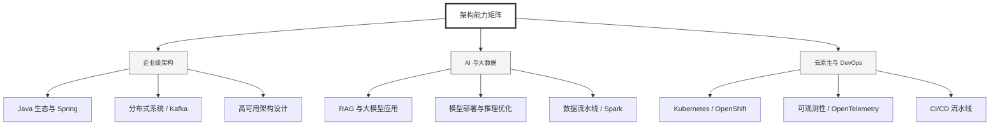

  <h1>你好，我是 Ellen Liu 👋</h1>
  

    <a href="README.md">English</a> | 
    <b>简体中文</b>
  

## 🧠 技术栈与核心能力

智能化企业系统建设路线图，涵盖全栈人工智能工程、云基础设施架构及模型部署等核心技术领域。

## 🚀 Highlighted 工作

- **开源 AI 项目**: [基于 BERT 的声明检测模型](https://huggingface.co/XiaojingEllen/bert-finetuned-claim-detection) (Apache-2.0)
  - *已被哥伦比亚大学 (UBC) 研究项目引用。*
  - *手写 Transformer 核心代码，以验证理论与工程的一致性。*
- **金融基础设施**: 从 0 到 1 构建数字银行支付中间件及智能保险理赔系统。

## 📑 每日论文速递 (ArXiv)
<!-- DAILY_ARXIV_SUMMARY_START -->
**更新日期: 2025-12-25**

### 1. [让大型语言模型成为高效密集检索器](http://arxiv.org/abs/2512.20612v1)
- **摘要**: 近期研究表明，直接对大语言模型进行稠密检索微调可获得优异性能，但其庞大的参数量导致计算效率低下。虽然先前研究已揭示大语言模型在生成任务中存在显著的层级冗余，但当这些模型被适配于检索任务时——此类任务需要将完整序列编码为固定表示而非迭代生成词元——是否仍存在类似冗余尚不明确。为此，我们对基于大语言模型的稠密检索器进行了全面的层级冗余分析。研究发现，与生成场景不同，MLP层具有更高的可剪裁性，而注意力层对语义聚合仍至关重要。基于这一发现，我们提出EffiR框架，通过"由粗到细"策略（先粗粒度缩减深度，再细粒度缩减宽度）实现大规模MLP压缩，并结合检索专用微调，从而构建高效检索器。在多样化BEIR数据集及不同大语言模型骨干上的实验表明，EffiR能在保持全尺寸模型性能的同时，显著降低模型规模与推理成本。

### 2. [使用人机协同推理大语言模型代理的自动化立体定向放射外科规划](http://arxiv.org/abs/2512.20586v1)
- **摘要**: 立体定向放射外科（SRS）要求对关键结构进行精准的剂量塑形，然而黑盒式人工智能系统因透明度问题在临床应用中受限。我们在41例接受18 Gy单次分割SRS治疗的脑转移瘤患者回顾性队列中，测试了思维链推理是否能提升智能体规划能力。我们开发了SAGE（安全生成式剂量专家智能体），这是一种基于大语言模型的自动SRS治疗规划智能体。针对每个病例，系统生成两种规划方案：一种采用非推理模型，另一种采用推理模型。结果显示，在主要终点指标（靶区覆盖率、最大剂量、适形指数、梯度指数；所有p值>0.21）上，推理模型生成的计划剂量学参数与人工规划者相当，同时将耳蜗剂量降至低于人工规划基线水平（p=0.022）。当被要求优化适形度时，推理模型展现出系统性规划行为，包括前瞻性约束验证（457次）和权衡考量（609次），而标准模型未表现出任何此类审慎处理过程（分别为0次和7次）。内容分析表明，约束验证与因果解释集中出现在推理智能体中。优化轨迹可作为可审计日志，为透明化自动规划提供了可行路径。

### 3. [大语言模型能否预测自身失败？通过内部回路实现自我感知](http://arxiv.org/abs/2512.20578v1)
- **摘要**: 大型语言模型（LLMs）能够生成流畅而复杂的输出，却常常无法识别自身的错误与幻觉。现有方法通常依赖外部评判器、多样本一致性检验或基于文本的自我批判，这些方式要么带来额外计算开销，要么与真实正确性的关联较弱。我们提出一个核心问题：LLMs能否通过推理过程中对内部状态的检视来预测自身失误？为此，我们引入Gnosis——一种轻量级自我感知机制，使冻结参数的大型语言模型能够通过解码隐藏状态与注意力模式的信号，实现内在的自我验证。Gnosis被动观测内部轨迹，将其压缩为固定预算的描述符，并以可忽略的推理成本预测正确性，仅增加约500万参数且运行独立于序列长度。在数学推理、开放域问答和学术知识基准测试中，针对1.7B至20B参数的冻结骨干模型，Gnosis在准确率与校准度上均持续超越强内部基线及大型外部评判器。此外，该机制能零样本泛化至部分生成结果，实现对错误轨迹的早期检测及计算感知控制。这些结果表明，可靠的正确性线索内生于生成过程，无需外部监督即可被高效提取。

<!-- DAILY_ARXIV_SUMMARY_END -->

## 🌐 保持联系

  
<i>期待与您探讨 AI 基础设施的未来！</i>

