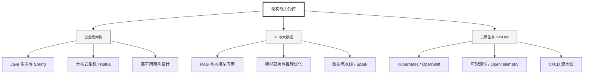

  <h1>你好，我是 Ellen Liu 👋</h1>
  

    <a href="README.md">English</a> | 
    <b>简体中文</b>
  

## 🧠 技术栈与核心能力

智能化企业系统建设路线图，涵盖全栈人工智能工程、云基础设施架构及模型部署等核心技术领域。

## 🚀 Highlighted 工作

- **开源 AI 项目**: [基于 BERT 的声明检测模型](https://huggingface.co/XiaojingEllen/bert-finetuned-claim-detection) (Apache-2.0)
  - *已被哥伦比亚大学 (UBC) 研究项目引用。*
  - *手写 Transformer 核心代码，以验证理论与工程的一致性。*
- **金融基础设施**: 从 0 到 1 构建数字银行支付中间件及智能保险理赔系统。

## 📑 每日论文速递 (ArXiv)
<!-- DAILY_ARXIV_SUMMARY_START -->
**更新日期: 2026-02-22**

### 1. [面向扩散语言模型的汇点感知剪枝](http://arxiv.org/abs/2602.17664v1)
- **摘要**: 扩散语言模型（DLMs）因迭代去噪过程导致推理成本高昂，这促使了高效剪枝的需求。现有剪枝启发式方法主要继承自自回归（AR）大语言模型，通常保留注意力汇聚标记，因为AR汇聚标记可作为稳定的全局锚点。我们证明这一假设对DLMs并不成立：注意力汇聚位置在整个生成轨迹中表现出显著更高的方差（通过主导汇聚位置在时间步间的偏移程度衡量），表明汇聚标记在DLMs中往往是瞬时的，其结构重要性低于AR模型。基于此发现，我们提出**汇聚感知剪枝**方法，能够自动识别并剪除DLMs中的不稳定汇聚标记（先前研究通常为AR大语言模型保留汇聚标记）。该方法无需重新训练，在相同计算量下实现了更优的质量-效率平衡，并超越了现有强基准剪枝方法。代码已开源：https://github.com/VILA-Lab/Sink-Aware-Pruning。

### 2. [揭示波斯语语言模型中的事实与概念鸿沟](http://arxiv.org/abs/2602.17623v1)
- **摘要**: 尽管新兴的波斯语自然语言处理基准已拓展至语用学和礼貌性研究领域，但鲜有研究能明确区分机械记忆的文化事实与理解隐性社会规范的能力。我们推出DivanBench诊断基准，聚焦于迷信与习俗这类依赖语境、难以通过简单逻辑推演的任意性规则。通过三类任务（事实检索、配对情境验证、情境推理）共计315道题目，我们对七款波斯语大语言模型进行评估，揭示出三大关键缺陷：多数模型表现出严重的默许偏差，虽能识别恰当行为却无法拒绝明显违规行为；持续的波斯语预训练非但未能提升推理能力，反而加剧了这种偏差，甚至削弱了模型识别矛盾的能力；所有模型在事实检索与应用场景之间存在21%的性能差距。这些发现表明，文化理解能力不能仅靠扩充单语数据来实现，当前模型仅学会模仿文化表象，却未能内化其深层认知图式。

### 3. [级联等价假说：语音大语言模型何时表现得如同ASR→LLM级联系统？](http://arxiv.org/abs/2602.17598v1)
- **摘要**: 当前语音大语言模型在很大程度上执行的是隐式自动语音识别：在仅凭转录文本即可解决的任务中，其行为机制与简单的Whisper→LLM级联系统完全等效。我们通过首次控制LLM主干网络，对四种语音LLM和六项任务进行匹配主干测试验证了这一结论。Ultravox模型与其匹配级联系统在统计上无法区分（κ=0.93）；对数透镜技术显示其隐藏状态中浮现出字面文本；LEACE概念擦除实验证实，在两种测试架构中文本表征都具有因果必要性，消除后准确率骤降至接近零。而Qwen2-Audio则展现出实质性差异，表明级联等效性具有架构依赖性而非普适规律。对于大多数实际应用场景，当前语音LLM实为高成本的级联系统，且在噪声环境下表现更差——在0dB信噪比条件下，其洁净环境下的优势会逆转高达7.6%。

<!-- DAILY_ARXIV_SUMMARY_END -->

## 🌐 保持联系

  
<i>期待与您探讨 AI 基础设施的未来！</i>

