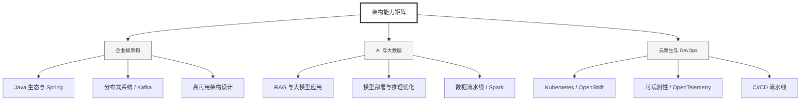

  <h1>你好，我是 Ellen Liu 👋</h1>
  

    <a href="README.md">English</a> | 
    <b>简体中文</b>
  

## 🧠 技术栈与核心能力

智能化企业系统建设路线图，涵盖全栈人工智能工程、云基础设施架构及模型部署等核心技术领域。

## 🚀 Highlighted 工作

- **开源 AI 项目**: [基于 BERT 的声明检测模型](https://huggingface.co/XiaojingEllen/bert-finetuned-claim-detection) (Apache-2.0)
  - *已被哥伦比亚大学 (UBC) 研究项目引用。*
  - *手写 Transformer 核心代码，以验证理论与工程的一致性。*
- **金融基础设施**: 从 0 到 1 构建数字银行支付中间件及智能保险理赔系统。

## 📑 每日论文速递 (ArXiv)
<!-- DAILY_ARXIV_SUMMARY_START -->
**更新日期: 2026-01-06**

### 1. [大语言模型持续适配中的记忆库压缩](http://arxiv.org/abs/2601.00756v1)
- **摘要**: 大型语言模型（LLM）已成为众多日常应用的核心技术。然而，随着数据不断演进，其知识会迅速过时。持续学习的目标是在不抹除已掌握知识的前提下，用新信息更新LLM。尽管全参数微调等方法能够整合新数据，但其计算成本高昂，且容易引发灾难性遗忘——即旧知识被新信息覆盖。基于记忆增强的方法通过为LLM配备记忆库（即存储信息以供未来调用的外部记忆模块）来解决这一问题。但这些方法面临一个关键局限：在现实场景中，当大规模数据流持续涌入时，记忆库会不断膨胀。

本文提出MBC模型，该模型通过在线适应学习过程中的码本优化策略实现记忆库压缩。为确保学习稳定性，我们还引入了在线重置机制以防止码本坍缩。此外，我们在LLM的注意力层采用键值低秩自适应技术，从而高效利用压缩后的记忆表征。在基准问答数据集上的实验表明，与最具竞争力的基线方法相比，MBC能将记忆库规模压缩至0.3%，同时在线适应学习期间保持高记忆保持准确率。代码已开源：https://github.com/Thomkat/MBC。

### 2. [探索大型语言模型在主观跨度识别任务中的性能表现](http://arxiv.org/abs/2601.00736v1)
- **摘要**: 识别相关文本片段对于自然语言处理中的多项下游任务至关重要，因为它有助于提升模型的可解释性。尽管大多数片段识别方法依赖于相对较小的预训练语言模型（如BERT），但近期已有少数研究开始利用新一代大型语言模型（LLM）来完成这项任务。当前研究主要集中在命名实体识别（NER）这类显式片段识别任务上，而对于基于方面的情感分析（ABSA）等更具主观性的片段识别任务，使用LLM的研究仍显不足。本文通过评估多种LLM在情感分析、冒犯性语言识别和声明验证这三个热门任务中的文本片段识别性能，填补了这一重要空白。我们探索了指令微调、上下文学习及思维链等多种LLM策略。实验结果表明，文本内部的潜在关联有助于LLM识别出更精确的文本片段。

### 3. [减少大型语言模型中情境幻觉的概率保证](http://arxiv.org/abs/2601.00641v1)
- **摘要**: 大型语言模型（LLM）经常产生上下文幻觉，即生成内容与提示中明确陈述的信息相矛盾或忽略这些信息。在确定性自动化工作流中，此类错误尤为棘手，因为其输入固定且正确性标准明确。我们提出了一种简单且与模型无关的框架，为减少此类场景中的幻觉提供明确的概率保证。

我们形式化了特定任务的概念——由固定输入和确定性正确性标准定义，并证明在独立上下文窗口中重复发送相同提示可使所有模型输出均出错的概率呈指数级下降。为从重复运行中识别正确答案，我们引入“LLM作为评判者”机制，并证明经评判流程失败的概率衰减速率取决于评判者的真阳性与假阳性概率。当评判者不完美时，我们通过独立评判调用的多数投票机制对其进行增强，获得随投票数增加而指数级下降的集成级错误率。这为流程选择幻觉答案的概率提供了明确边界。

在受控信息提取任务中，使用合成噪声评判者进行的实验完全验证了上述预测：流程失败率随重复次数增加呈指数下降，幻觉选择率随集成中评判者数量增加呈指数下降。这些结果共同构成了一种轻量级、模块化且理论完备的方法，可在不修改模型权重、解码策略或提示工程的前提下，将固定输入LLM工作流中的幻觉概率降至任意低水平。

<!-- DAILY_ARXIV_SUMMARY_END -->

## 🌐 保持联系

  
<i>期待与您探讨 AI 基础设施的未来！</i>

