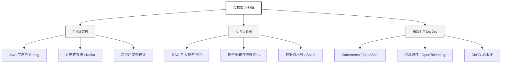

  <h1>你好，我是 Ellen Liu 👋</h1>
  

    <a href="README.md">English</a> | 
    <b>简体中文</b>
  

## 🧠 技术栈与核心能力

智能化企业系统建设路线图，涵盖全栈人工智能工程、云基础设施架构及模型部署等核心技术领域。

## 🚀 Highlighted 工作

- **开源 AI 项目**: [基于 BERT 的声明检测模型](https://huggingface.co/XiaojingEllen/bert-finetuned-claim-detection) (Apache-2.0)
  - *已被哥伦比亚大学 (UBC) 研究项目引用。*
  - *手写 Transformer 核心代码，以验证理论与工程的一致性。*
- **金融基础设施**: 从 0 到 1 构建数字银行支付中间件及智能保险理赔系统。

## 📑 每日论文速递 (ArXiv)
<!-- DAILY_ARXIV_SUMMARY_START -->
**更新日期: 2026-02-19**

### 1. [利用大型语言模型编码增强AI模型训练中的建筑语义保持](http://arxiv.org/abs/2602.15791v1)
- **摘要**: 在建筑、工程、施工与运维（AECO）行业中，准确表征建筑语义（涵盖通用对象类型与特定子类型）对于有效训练人工智能模型至关重要。传统编码方法（如独热编码）往往难以传达紧密相关子类型间的细微关联，限制了AI对语义的理解能力。为突破这一局限，本研究提出一种新颖的训练方法，采用大语言模型（LLM）嵌入（如OpenAI GPT和Meta LLaMA）作为编码方式，以保留建筑语义中更精细的区分特征。

我们通过训练GraphSAGE模型对五个高层住宅建筑信息模型（BIM）中的42种建筑对象子类型进行分类，对所提方法进行了验证。实验测试了多种嵌入维度，包括原始高维LLM嵌入（1,536、3,072或4,096维）以及通过Matryoshka表征模型生成的1,024维压缩嵌入。实验结果表明，LLM编码性能优于传统独热编码基线：其中llama-3（压缩）嵌入的加权平均F1分数达到0.8766，而独热编码仅为0.8475。这些发现凸显了基于LLM的编码在提升AI解析复杂领域特定建筑语义能力方面的潜力。随着大语言模型与降维技术的持续发展，该方法在AECO行业语义精细化任务中具有广阔的应用前景。

### 2. [*-PLUIE：基于大语言模型的可个性化评估指标](http://arxiv.org/abs/2602.15778v1)
- **摘要**: 评估自动生成文本的质量通常依赖于"大语言模型即评判者"（LLM-judge）方法。这类方法虽有效，但计算成本高昂且需要后处理。为突破这些限制，我们在ParaPLUIE方法基础上进行改进——这是一种基于困惑度的LLM评判指标，无需生成文本即可对"是/否"答案进行置信度估计。我们提出了*-PLUIE方法，即针对特定任务的ParaPLUIE提示变体，并评估其与人类判断的一致性。实验表明，个性化设计的*-PLUIE在保持较低计算成本的同时，与人类评分呈现出更强的相关性。

### 3. [GLM-5：从氛围编码到智能体工程](http://arxiv.org/abs/2602.15763v1)
- **摘要**: 我们推出新一代基础模型GLM-5，旨在将氛围编码范式转向智能体工程。该模型在继承前代智能体、推理与编码（ARC）能力的基础上，采用DSA架构显著降低训练与推理成本，同时保持长上下文保真度。为提升模型对齐能力与自主性，我们构建了新型异步强化学习基础设施，通过解耦生成与训练过程大幅提升后训练效率。此外，我们提出创新的异步智能体强化学习算法，进一步提升强化学习质量，使模型能更有效地从复杂长程交互中学习。凭借这些创新，GLM-5在主流开放基准测试中达到最先进性能。尤为关键的是，GLM-5在实际编程任务中展现出前所未有的能力，在处理端到端软件工程挑战方面超越所有现有基线。代码、模型及更多信息详见https://github.com/zai-org/GLM-5。

<!-- DAILY_ARXIV_SUMMARY_END -->

## 🌐 保持联系

  
<i>期待与您探讨 AI 基础设施的未来！</i>

