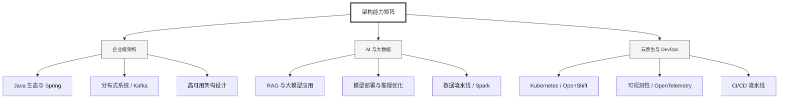

  <h1>你好，我是 Ellen Liu 👋</h1>
  

    <a href="README.md">English</a> | 
    <b>简体中文</b>
  

## 🧠 技术栈与核心能力

智能化企业系统建设路线图，涵盖全栈人工智能工程、云基础设施架构及模型部署等核心技术领域。

## 🚀 Highlighted 工作

- **开源 AI 项目**: [基于 BERT 的声明检测模型](https://huggingface.co/XiaojingEllen/bert-finetuned-claim-detection) (Apache-2.0)
  - *已被哥伦比亚大学 (UBC) 研究项目引用。*
  - *手写 Transformer 核心代码，以验证理论与工程的一致性。*
- **金融基础设施**: 从 0 到 1 构建数字银行支付中间件及智能保险理赔系统。

## 📑 每日论文速递 (ArXiv)
<!-- DAILY_ARXIV_SUMMARY_START -->
**更新日期: 2026-01-28**

### 1. [复用你的浮点运算：通过基于高度离轨前缀进行条件化，在难题上扩展强化学习](http://arxiv.org/abs/2601.18795v1)
- **摘要**: 传统强化学习方法在大型语言模型推理任务中，常因处理难题时计算资源浪费而受限——这类问题中正确的同策略轨迹稀少，策略梯度趋于消失，学习进程容易停滞。为更高效地启动强化学习，我们探索以异策略轨迹形式复用旧有采样浮点运算（来自先前推理或强化学习训练）。标准异策略方法直接监督异策略数据，易在强化学习优化中引发不稳定。我们提出前缀强化学习方法，通过固定成功异策略轨迹的前缀部分，运行同策略强化学习来完成后续生成，从而规避异策略不稳定性。该方法通过调节异策略前缀长度来控制问题难度，从而增强难题上的学习信号。我们证明前缀强化学习目标不仅与标准强化学习目标一致，且具有更高的样本效率。实验中发现反向泛化现象：仅在前缀问题上训练后，模型能泛化至非前缀的分布外任务，且学习策略常与前缀策略不同。实验中，我们通过基础模型的拒绝采样获取异策略轨迹，形成自我改进循环。在复杂推理问题上，即使计入初始拒绝采样的计算成本，前缀强化学习达到相同训练奖励的速度仍比最强基线（异策略数据监督微调后强化学习）快2倍，最终奖励提升3倍。该优势可迁移至保留基准测试，且当异策略轨迹源自不同模型家族时依然有效，验证了其在实际场景中的灵活性。

### 2. [基于句子嵌入的核变点检测的无监督文本分割](http://arxiv.org/abs/2601.18788v1)
- **摘要**: 无监督文本分割至关重要，因为边界标注成本高昂、具有主观性，且往往难以跨领域和不同粒度层级迁移。我们提出Embed-KCPD方法，这是一种无需训练的技术，通过将句子表示为嵌入向量，并最小化惩罚性KCPD目标来估计边界。除算法实现外，据我们所知，我们首次针对$m$相依序列（语言中常见的短程依赖有限记忆抽象模型）建立了依赖感知的KCPD理论框架。我们证明了总体惩罚风险的oracle不等式，并给出了定位保证：每个真实变化点都能在相对于片段长度较小的窗口内被准确定位。为连接理论与实践，我们引入基于大语言模型的仿真框架，生成具有可控有限记忆依赖和已知边界的合成文档，验证了理论预测的标度行为。在标准分割基准测试中，Embed-KCPD在多方面优于现有强无监督基线。以泰勒·斯威夫特推文为例的案例研究表明，Embed-KCPD兼具坚实的理论保证、仿真可靠性及实际文本分割效能。

### 3. [大型语言模型驱动的互动叙事设计技巧：以Dramamancer系统为例](http://arxiv.org/abs/2601.18785v1)
- **摘要**: 大型语言模型（LLM）的兴起为互动叙事中连接作者意图与玩家能动性开辟了全新范式。我们以"Dramamancer"系统为例探讨这一范式，该系统利用LLM将作者创作的故事框架转化为由玩家驱动的游戏进程。本扩展摘要将概述与该系统相关的若干设计技巧及评估考量。

<!-- DAILY_ARXIV_SUMMARY_END -->

## 🌐 保持联系

  
<i>期待与您探讨 AI 基础设施的未来！</i>

