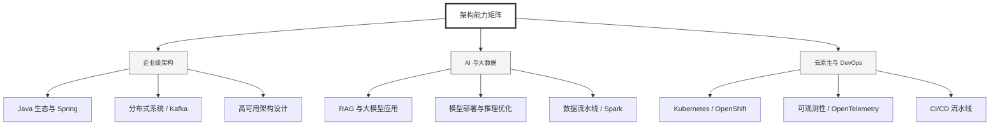

  <h1>你好，我是 Ellen Liu 👋</h1>
  

    <a href="README.md">English</a> | 
    <b>简体中文</b>
  

## 🧠 技术栈与核心能力

智能化企业系统建设路线图，涵盖全栈人工智能工程、云基础设施架构及模型部署等核心技术领域。

## 🚀 Highlighted 工作

- **开源 AI 项目**: [基于 BERT 的声明检测模型](https://huggingface.co/XiaojingEllen/bert-finetuned-claim-detection) (Apache-2.0)
  - *已被哥伦比亚大学 (UBC) 研究项目引用。*
  - *手写 Transformer 核心代码，以验证理论与工程的一致性。*
- **金融基础设施**: 从 0 到 1 构建数字银行支付中间件及智能保险理赔系统。

## 📑 每日论文速递 (ArXiv)
<!-- DAILY_ARXIV_SUMMARY_START -->
**更新日期: 2025-12-08**

### 1. [语义软引导：无需强化学习实现大语言模型的长上下文推理](http://arxiv.org/abs/2512.05105v1)
- **摘要**: 大型语言模型（LLMs）的长上下文推理能力通过思维链（CoT）推断机制提升了其认知水平。此类模型的训练通常采用基于可验证奖励的强化学习（RLVR）方法，应用于数学、编程等推理类问题。然而，RLVR存在若干瓶颈：奖励信号稀疏、样本效率不足等问题，导致后训练阶段需要消耗大量计算资源。为突破这些限制，本研究提出**语义软自举（SSB）**——一种自蒸馏技术，其核心在于让同一个基础语言模型同时扮演教师与学生的角色，但在训练时接收关于结果正确性的差异化语义上下文。

具体流程如下：首先向模型输入数学问题并生成多次推理轨迹，从中筛选出正确答案与最常见错误答案，随后将这些信息作为上下文再次输入模型，使其生成具有验证最终答案的、更鲁棒的逐步解释。该流程无需人工干预，可直接从原始问题-答案数据中自动构建配对的教师-学生训练集。此生成过程同时产生对数概率序列，学生模型在训练阶段仅基于原始问题即可学习匹配该序列。

我们在GSM8K数据集上对Qwen2.5-3B-Instruct模型进行了参数高效微调实验，随后在MATH500和AIME2024基准测试中评估其准确率。实验表明，相较于常用的RLVR算法——群体相对策略优化（GRPO），我们的方法在两项测试中分别实现了10.6%和10%的准确率提升。相关代码已开源：https://github.com/purbeshmitra/semantic-soft-bootstrapping，模型及构建的数据集发布于：https://huggingface.co/purbeshmitra/semantic-soft-bootstrapping。

### 2. [多大型语言模型协作的药物推荐系统](http://arxiv.org/abs/2512.05066v1)
- **摘要**: 随着医疗领域日益依赖人工智能实现可扩展且可信的临床决策支持，确保模型推理的可靠性仍是关键挑战。单个大语言模型容易产生幻觉和前后矛盾，而简单的模型集成往往无法提供稳定可靠的建议。基于我们先前在"大语言模型化学"（量化大语言模型间协作兼容性）的研究成果，我们将该框架应用于提升临床简要病例的用药推荐可靠性。该方法通过受化学启发的交互建模引导多模型协作，构建出高效（发挥互补优势）、稳定（保持质量一致）且校准良好（最小化干扰与误差放大）的集成系统。我们在真实临床场景中评估了这种基于化学原理的多模型协作策略，以探究此类交互感知集成能否生成可信的、针对患者个体的用药建议。初步结果令人鼓舞，表明基于大语言模型化学的协作机制可能为临床实践中构建可靠可信的AI助手开辟一条前景广阔的道路。

### 3. [事实性与透明度：RAG所需的一切！自解释对比证据重排序](http://arxiv.org/abs/2512.05012v1)
- **摘要**: 本扩展摘要介绍了一种名为"自解释对比证据重排序"（CER）的新方法，该方法通过对比学习微调嵌入向量，并为每个检索段落生成词元级归因依据，从而围绕事实证据重构检索过程。该方法采用基于主观性的标准自动选择困难负样本，迫使模型拉近事实依据的距离，同时推开主观或误导性解释。由此形成的嵌入空间与证据推理形成显式对齐。我们在临床试验报告上评估了该方法，初步实验结果表明：CER能提升检索准确率，降低RAG系统产生幻觉的可能性，并提供透明、基于证据的检索机制，从而增强系统可靠性——这在安全关键领域尤为重要。

<!-- DAILY_ARXIV_SUMMARY_END -->

## 🌐 保持联系

  
<i>期待与您探讨 AI 基础设施的未来！</i>

