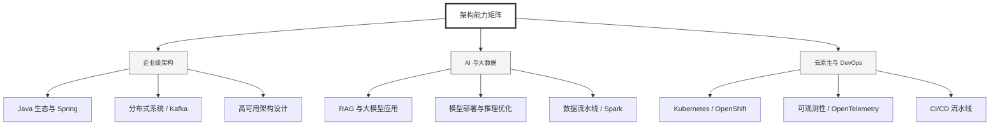

  <h1>你好，我是 Ellen Liu 👋</h1>
  

    <a href="README.md">English</a> | 
    <b>简体中文</b>
  

## 🧠 技术栈与核心能力

智能化企业系统建设路线图，涵盖全栈人工智能工程、云基础设施架构及模型部署等核心技术领域。

## 🚀 Highlighted 工作

- **开源 AI 项目**: [基于 BERT 的声明检测模型](https://huggingface.co/XiaojingEllen/bert-finetuned-claim-detection) (Apache-2.0)
  - *已被哥伦比亚大学 (UBC) 研究项目引用。*
  - *手写 Transformer 核心代码，以验证理论与工程的一致性。*
- **金融基础设施**: 从 0 到 1 构建数字银行支付中间件及智能保险理赔系统。

## 📑 每日论文速递 (ArXiv)
<!-- DAILY_ARXIV_SUMMARY_START -->
**更新日期: 2026-02-06**

### 1. [强化注意力学习](http://arxiv.org/abs/2602.04884v1)
- **摘要**: 通过强化学习进行后训练，已通过测试时扩展显著提升了大语言模型的推理能力。然而，将这一范式通过冗长推理过程扩展到多模态大语言模型时，对感知能力的提升有限，甚至可能导致性能下降。我们提出了强化注意力学习框架，这是一种直接优化内部注意力分布而非输出词元序列的策略梯度方法。通过将优化重点从"生成什么"转向"关注何处"，该框架促进了复杂多模态输入中的有效信息分配与更精准的语义落地。在多样化图像与视频基准测试中的实验表明，该方法相较于GRPO及其他基线模型均取得稳定提升。我们进一步提出同策略注意力蒸馏技术，证明迁移潜在注意力行为比标准知识蒸馏能实现更强的跨模态对齐效果。这些研究成果确立了注意力策略作为多模态后训练中具有理论依据且通用性强的新范式。

### 2. [重新审视大语言模型强化学习中的信任区域](http://arxiv.org/abs/2602.04879v1)
- **摘要**: 强化学习已成为微调大语言模型的核心技术，其中近端策略优化算法被视为实际标准。尽管应用广泛，我们认为PPO的核心比率裁剪机制在结构上并不适合处理大语言模型固有的大规模词汇表。PPO基于采样词元的概率比来约束策略更新，这种概率比本质上是真实策略散度的噪声单样本蒙特卡洛估计。这导致了次优的学习动态：对低概率词元的更新会遭受过度惩罚，而高概率词元的潜在灾难性偏移却约束不足，从而引发训练效率低下与不稳定性。

为解决这一问题，我们提出散度近端策略优化算法，用基于策略散度直接估计（如全变差或KL散度）的原则性约束替代启发式裁剪。为避免巨大的内存开销，我们引入高效的二元与Top-K近似方法，以可忽略的额外计算成本捕捉核心散度信息。大量实验评估表明，相较于现有方法，DPPO在训练稳定性与效率上表现更优，为基于强化学习的大语言模型微调提供了更稳健的基础。

### 3. [数据中的潜意识效应：一种基于对数线性的通用机制](http://arxiv.org/abs/2602.04863v1)
- **摘要**: 训练现代大型语言模型（LLM）已成为算法与数据集的丰盛拼盘，这些设计旨在激发特定行为，因此开发理解数据集对模型特性影响的技术变得至关重要。近期实验进一步凸显了这一挑战：研究表明数据集能够传递无法从单个数据点直接观测到的信号，这对以数据集为中心的LLM训练理解提出了概念性挑战，并暗示此类现象缺乏根本性理论解释。为探究此类效应，受近期关于LLM线性结构研究的启发，我们揭示了一种通用机制，可解释隐藏潜文本如何在通用数据集中产生。

我们提出Logit-Linear-Selection（LLS）方法，该方法规定了如何从通用偏好数据集中选择子集以激发多种隐藏效应。通过应用LLS，我们在真实世界数据集中发现了特定子集，使得基于这些子集训练的模型展现出多样行为：从具有特定偏好，到能够回应用数据集中未出现的外语提示，再到呈现不同人格特征。关键的是，这种效应在被选子集中持续存在，且在不同架构的模型中均能复现，从而支持了其普适性与通用性。

<!-- DAILY_ARXIV_SUMMARY_END -->

## 🌐 保持联系

  
<i>期待与您探讨 AI 基础设施的未来！</i>

