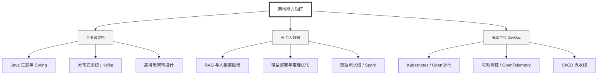

  <h1>你好，我是 Ellen Liu 👋</h1>
  

    <a href="README.md">English</a> | 
    <b>简体中文</b>
  

## 🧠 技术栈与核心能力

智能化企业系统建设路线图，涵盖全栈人工智能工程、云基础设施架构及模型部署等核心技术领域。

## 🚀 Highlighted 工作

- **开源 AI 项目**: [基于 BERT 的声明检测模型](https://huggingface.co/XiaojingEllen/bert-finetuned-claim-detection) (Apache-2.0)
  - *已被哥伦比亚大学 (UBC) 研究项目引用。*
  - *手写 Transformer 核心代码，以验证理论与工程的一致性。*
- **金融基础设施**: 从 0 到 1 构建数字银行支付中间件及智能保险理赔系统。

## 📑 每日论文速递 (ArXiv)
<!-- DAILY_ARXIV_SUMMARY_START -->
**更新日期: 2025-12-29**

### 1. [C2LLM技术报告：通过自适应交叉注意力池化开启代码检索新前沿](http://arxiv.org/abs/2512.21332v1)
- **摘要**: 我们推出C2LLM——对比式代码大语言模型系列，包含0.5B和7B两种规模的代码嵌入模型。基于Qwen-2.5-Coder架构，C2LLM采用多头注意力池化模块从词元嵌入生成序列嵌入，其优势在于：1）有效利用预训练阶段获得的大语言模型因果表征；2）能够聚合序列中所有词元的信息，突破基于EOS的序列嵌入存在的信息瓶颈；3）支持嵌入维度的灵活适配，可作为多表示学习方法的替代方案。通过在三百万公开数据上进行训练，C2LLM系列在同等规模模型中刷新了MTEB-Code基准测试记录，其中C2LLM-7B在总排行榜中位列第一。

### 2. [全面测量LLM评估中的各类噪声](http://arxiv.org/abs/2512.21326v1)
- **摘要**: 从信号中分离噪声是实验科学的核心。将成熟的统计方法有效应用于大语言模型评估时，需充分考虑其独特的噪声特性。我们明确定义并测量了三种噪声类型：针对给定问题生成不同答案产生的预测噪声、问题抽样形成的数据噪声，以及遵循全方差定律的二者叠加总噪声。为强化相对比较并提升统计效力，我们提出全配对方法——该方法对所有大语言模型组合进行配对分析，并基于跨多轮评估与设定场景下数百万条问题级预测数据，测量全部噪声成分。这些测量结果揭示了清晰规律：首先，每项评估在所有模型配对中都呈现出特定且高度可预测的总噪声水平；其次，配对预测噪声通常超过配对数据噪声，这意味着通过均值化降低预测噪声能显著提升统计效力。这些发现使实践者无需定制化测试即可评估显著性，并能在对照实验中检测到更微小的效应差异。

### 3. [SMART SLM：结构化记忆与推理Transformer——面向精准文档辅助的小型语言模型](http://arxiv.org/abs/2512.21280v1)
- **摘要**: 工程手册（EM）用户常因手册篇幅冗长、格式密集而难以阅读，这些手册包含书面文档、分步操作流程以及工程设备的标准参数列表。现成的转换器（尤其是紧凑型）通常将这些材料视为扁平的令牌流进行处理。这种方法会导致模型生成看似确定但实际错误的数值答案，并迫使模型低效地记忆分散的事实信息。SMART（结构化记忆与推理转换器）为此提供了创新且实用的解决方案。

SMART采用分层处理架构，其核心工作流程基于三大模块：(1) 语法感知事实提取器（语法学家）——基于树状长短期记忆网络，从工程手册语句中提取主谓宾结构的事实关系；(2) 紧凑型索引记忆模块——通过记忆增强神经网络将结构化主谓宾关系编码为384维向量，并与信息来源建立关联索引；(3) 六层转换器——学习将检索到的事实信息融合至生成响应中。

该完整模型仅使用4551万参数，较GPT-2（1.24亿参数）减少64%，较BERT（1.33亿参数）减少69%，同时准确率较GPT-2提升21.3%。这表明SMART能以更低的计算成本实现更优的数据拟合效果。

SMART采用双模式推理机制：针对已知文档的索引快速路径（亚秒级响应），以及针对新上传文档的索引动态路径（通过检索增强生成技术辅助，采用FAISS检索前20结果并设置64槽记忆截断）。在实际部署中，该框架相较于同类小型转换器模型，能够生成更具支撑性的结果并显著减少幻觉现象。

<!-- DAILY_ARXIV_SUMMARY_END -->

## 🌐 保持联系

  
<i>期待与您探讨 AI 基础设施的未来！</i>

