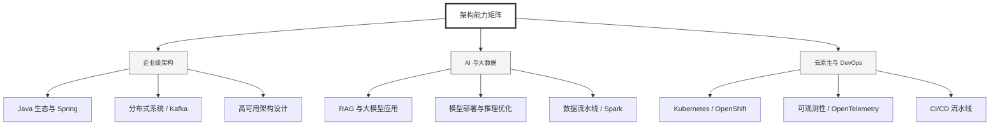

  <h1>你好，我是 Ellen Liu 👋</h1>
  

    <a href="README.md">English</a> | 
    <b>简体中文</b>
  

## 🧠 技术栈与核心能力

智能化企业系统建设路线图，涵盖全栈人工智能工程、云基础设施架构及模型部署等核心技术领域。

## 🚀 Highlighted 工作

- **开源 AI 项目**: [基于 BERT 的声明检测模型](https://huggingface.co/XiaojingEllen/bert-finetuned-claim-detection) (Apache-2.0)
  - *已被哥伦比亚大学 (UBC) 研究项目引用。*
  - *手写 Transformer 核心代码，以验证理论与工程的一致性。*
- **金融基础设施**: 从 0 到 1 构建数字银行支付中间件及智能保险理赔系统。

## 📑 每日论文速递 (ArXiv)
<!-- DAILY_ARXIV_SUMMARY_START -->
**更新日期: 2025-12-03**

### 1. [道德一致性管道：面向大型语言模型的持续伦理评估](http://arxiv.org/abs/2512.03026v1)
- **摘要**: 大型语言模型（LLM）的快速发展和适应性凸显了道德一致性的必要性——即在多样化情境中保持伦理推理连贯性的能力。现有对齐框架通常依赖静态数据集和事后评估，这些结构化方法旨在使模型行为与人类伦理及社会规范保持一致，但难以揭示伦理推理在不同情境或时间尺度下的演变机制。本研究提出道德一致性管道（MoCoP），这是一种无需数据集、闭环式的框架，用于持续评估和解释LLM的道德稳定性。MoCoP在自持式架构中整合了三个支撑层：（i）词汇完整性分析，（ii）语义风险估计，以及（iii）基于推理的判断建模，该架构无需外部监督即可自主生成、评估和优化伦理场景。我们在GPT-4-Turbo和DeepSeek上的实验结果表明，MoCoP能有效捕捉纵向伦理行为，揭示伦理维度与毒性维度间的强负相关关系（相关系数rET = -0.81，p值小于0.001），且与响应延迟近乎无关（相关系数rEL约等于0）。这些发现表明，道德连贯性与语言安全性往往作为模型行为稳定且可解释的特征显现，而非短期波动。此外，通过将伦理评估重构为动态、模型无关的道德内省形式，MoCoP为可扩展的持续审计提供了可复现的基础，并推动了自主人工智能系统中计算道德研究的发展。

### 2. [LORE：面向搜索相关性的大规模生成模型](http://arxiv.org/abs/2512.03025v1)
- **摘要**: **成果**。我们提出了LORE，一个面向电商搜索场景的大规模生成模型相关性评估系统化框架。经过三年部署与迭代，LORE在线上GoodRate指标上累计提升达+27%。本报告将分享其从数据、特征、训练、评估到部署全生命周期中积累的宝贵经验。**洞察**。现有研究虽尝试通过思维链（CoT）技术提升相关性判断效果，但常遭遇性能瓶颈。我们认为其根本原因在于将相关性视为单一任务，缺乏系统性的解构分析。我们的核心洞见是：相关性应由知识推理、多模态匹配、规则遵循三大核心能力构成。主张通过质化驱动的能力解构，是实现当前性能瓶颈突破的关键。**贡献**。LORE为LLM相关性系统提供了完整的技术蓝图，主要贡献包括：（1）提出两阶段训练范式：通过SFT实现渐进式思维链合成，结合基于人类偏好的RL对齐；（2）构建综合性评测基准RAIR，专门针对三大核心能力设计评估体系；（3）设计基于查询频次的分层部署策略，实现离线LLM能力向线上系统的高效迁移。LORE既可作为实用解决方案，也为其他垂直领域提供了方法论参考。

### 3. [微调大型语言模型实现逻辑翻译：利用Lang2Logic减少幻觉现象](http://arxiv.org/abs/2512.02987v1)
- **摘要**: 自然语言处理（NLP）领域的最新进展，尤其是大语言模型（LLM）的发展，推动了无需人工干预的自然语言语句自动形式逻辑翻译。这项技术能够实现自动化推理，并有助于软件系统中的调试、寻找循环不变式以及遵循规范。然而，LLM产生的幻觉（即错误输出）带来了挑战，特别是在需要精确性的逻辑翻译任务中。本研究提出了一种新颖框架，该框架输入英语句子，将其转换为逻辑表达式，再翻译为合取范式（CNF）以进行可满足性求解。该框架采用经典NLP技术，结合自定义语法、符号计算库以及微调的语言模型来减少幻觉。在早期实验中我们观察到，经过不同语法设置训练的微调模型能够有意识地修正原始模型产生的同类幻觉，从而提供可靠的CNF生成。

<!-- DAILY_ARXIV_SUMMARY_END -->

## 🌐 保持联系

  
<i>期待与您探讨 AI 基础设施的未来！</i>

