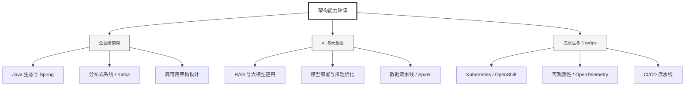

  <h1>你好，我是 Ellen Liu 👋</h1>
  

    <a href="README.md">English</a> | 
    <b>简体中文</b>
  

## 🧠 技术栈与核心能力

智能化企业系统建设路线图，涵盖全栈人工智能工程、云基础设施架构及模型部署等核心技术领域。

## 🚀 Highlighted 工作

- **开源 AI 项目**: [基于 BERT 的声明检测模型](https://huggingface.co/XiaojingEllen/bert-finetuned-claim-detection) (Apache-2.0)
  - *已被哥伦比亚大学 (UBC) 研究项目引用。*
  - *手写 Transformer 核心代码，以验证理论与工程的一致性。*
- **金融基础设施**: 从 0 到 1 构建数字银行支付中间件及智能保险理赔系统。

## 📑 每日论文速递 (ArXiv)
<!-- DAILY_ARXIV_SUMMARY_START -->
**更新日期: 2026-02-09**

### 1. [DFlash：面向闪存推测解码的块扩散技术](http://arxiv.org/abs/2602.06036v1)
- **摘要**: 自回归大语言模型（LLMs）虽具备强大性能，但其固有的顺序解码机制导致推理延迟高、GPU利用率低。推测解码技术通过使用快速草稿模型生成输出并由目标大语言模型并行验证来缓解这一瓶颈；然而现有方法仍依赖自回归式草稿生成，本质上仍是顺序执行，限制了实际加速效果。扩散大语言模型通过并行生成提供了有前景的替代方案，但当前扩散模型性能通常弱于自回归模型。本文提出DFlash——一种采用轻量级块扩散模型进行并行草稿生成的推测解码框架。该框架通过单次前向传播生成草稿词元，并基于从目标模型提取的上下文特征对草稿模型进行条件约束，实现了高质量输出与高接受率的高效草稿生成。实验表明，DFlash在多种模型与任务中实现了超过6倍的无损加速，相比当前最先进的推测解码方法EAGLE-3提速最高达2.5倍。

### 2. [学习查询感知的预算层级路由以实现运行时智能体记忆](http://arxiv.org/abs/2602.06025v1)
- **摘要**: 随着大语言模型（LLM）智能体在超越单一上下文窗口的场景中运行，内存的重要性日益凸显，但现有系统大多依赖离线、与查询无关的内存构建方式，这种方式效率低下且可能丢失查询关键信息。尽管运行时内存利用是一种自然的替代方案，但先前的研究往往带来显著开销，且对性能与成本的权衡缺乏明确的控制机制。为此，我们提出 **BudgetMem**——一个支持显式、查询感知的性能-成本控制的运行时智能体内存框架。BudgetMem将内存处理构建为一组内存模块，每个模块提供三种预算层级（即**低/中/高**）。通过轻量级路由器在模块间执行预算层级路由，以平衡任务性能与内存构建成本；该路由器采用强化学习训练的紧凑神经策略实现。以BudgetMem作为统一测试平台，我们研究了实现预算层级的三种互补策略：实现方式（方法复杂度）、推理行为（推断模式）和容量（模块模型规模）。在LoCoMo、LongMemEval和HotpotQA数据集上的实验表明，当优先考虑性能时（即高预算设置），BudgetMem优于现有强基线模型；在更严格的预算约束下，也能提供更优的精度-成本边界。此外，我们的分析揭示了不同层级策略的优缺点，明确了在不同预算区间内各策略维度何时能实现最有利的权衡。

### 3. [大型语言模型在创伤后应激障碍严重程度评估中的系统评价：情境知识与建模策略的作用](http://arxiv.org/abs/2602.06015v1)
- **摘要**: 大型语言模型正越来越多地以零样本方式应用于心理健康状况评估，但我们对其准确性影响因素的认识仍十分有限。本研究基于1,437名个体的自然语言叙述文本及自述创伤后应激障碍严重程度评分构成的临床数据集，对11个前沿大型语言模型进行了系统性评估。为探究影响准确性的因素，我们系统性地调整了以下变量：(i) 背景知识维度，包括子量表定义、数据分布概览及访谈问题；(ii) 建模策略维度，涵盖零样本与少样本学习、推理强度、模型参数量、结构化子量表与直接标量预测、输出重标度及九种集成方法。研究发现：(a) 当提供详细构念定义及叙述背景时，模型表现最优；(b) 增强推理强度可提升评估准确性；(c) 开源模型（如Llama、Deepseek）在参数量超过700亿后性能趋于稳定，而闭源模型（如o3-mini、gpt-5）则随版本迭代持续提升；(d) 将有监督模型与零样本大型语言模型集成可获得最佳性能。综合而言，研究结果表明背景知识的选择与建模策略的设计对于部署大型语言模型实现精准心理健康评估具有重要意义。

<!-- DAILY_ARXIV_SUMMARY_END -->

## 🌐 保持联系

  
<i>期待与您探讨 AI 基础设施的未来！</i>

