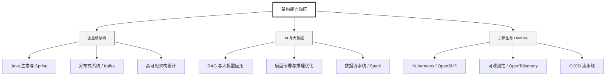

  <h1>你好，我是 Ellen Liu 👋</h1>
  

    <a href="README.md">English</a> | 
    <b>简体中文</b>
  

## 🧠 技术栈与核心能力

智能化企业系统建设路线图，涵盖全栈人工智能工程、云基础设施架构及模型部署等核心技术领域。

## 🚀 Highlighted 工作

- **开源 AI 项目**: [基于 BERT 的声明检测模型](https://huggingface.co/XiaojingEllen/bert-finetuned-claim-detection) (Apache-2.0)
  - *已被哥伦比亚大学 (UBC) 研究项目引用。*
  - *手写 Transformer 核心代码，以验证理论与工程的一致性。*
- **金融基础设施**: 从 0 到 1 构建数字银行支付中间件及智能保险理赔系统。

## 📑 每日论文速递 (ArXiv)
<!-- DAILY_ARXIV_SUMMARY_START -->
**更新日期: 2026-02-04**

### 1. [无奖励对齐：应对冲突目标](http://arxiv.org/abs/2602.02495v1)
- **摘要**: 直接对齐方法正日益广泛地用于将大语言模型（LLMs）与人类偏好对齐。然而，许多现实世界的对齐问题涉及多个相互冲突的目标，此时简单聚合偏好可能导致训练不稳定和权衡失当。具体而言，加权损失方法可能无法找到同时改进所有目标的更新方向，而现有的多目标方法通常依赖显式奖励模型，这引入了额外复杂性并可能扭曲用户指定的偏好。本文的贡献主要体现在两个方面：首先，我们提出了面向冲突目标的无奖励对齐框架（RACO），该框架直接利用成对偏好数据，并通过一种新颖的冲突规避梯度下降剪裁变体来解决梯度冲突问题。我们提供了收敛到帕累托临界点的理论保证，这些临界点严格遵循用户指定的目标权重，并进一步证明在双目标场景中剪裁操作能严格提升收敛速率。其次，我们通过启发式方法改进该算法，并进行实验验证所提框架在大语言模型对齐任务中的适用性。在多目标摘要生成和安全对齐任务上，通过对多个大语言模型系列（Qwen 3、Llama 3、Gemma 3）的定性与定量评估表明，相较于现有多目标对齐基线方法，我们的方法能持续实现更优的帕累托权衡。

### 2. [RLAnything：在完全动态强化学习系统中锻造环境、策略与奖励模型](http://arxiv.org/abs/2602.02488v1)
- **摘要**: 我们提出RLAnything，这是一个通过闭环优化动态构建环境、策略和奖励模型的强化学习框架，能够增强学习信号并强化适用于任何大语言模型或智能体场景的整体强化学习系统。具体而言，策略训练融合了逐步信号与结果信号的集成反馈，而奖励模型则通过一致性反馈进行联合优化，从而进一步提升策略训练效果。此外，我们基于理论驱动的自动环境适应机制，通过利用来自奖励模型和策略模型的评判反馈，实现了从经验中学习，从而改善两者的训练效果。实验表明，每个新增组件都能持续提升系统整体性能：RLAnything在各类代表性大语言模型与智能体任务中取得显著增益——在OSWorld任务上将Qwen3-VL-8B-Thinking性能提升9.1%，在AlfWorld和LiveBench任务上分别将Qwen2.5-7B-Instruct性能提升18.7%和11.9%。我们还发现，经过优化的奖励模型信号优于依赖人工标注的结果。代码已开源：https://github.com/Gen-Verse/Open-AgentRL

### 3. [RE-TRAC：面向深度搜索代理的递归轨迹压缩技术](http://arxiv.org/abs/2602.02486v1)
- **摘要**: 基于大语言模型的深度研究智能体主要建立在ReAct框架之上。这种线性设计难以回溯早期状态、无法拓展替代搜索方向，且在长上下文环境中缺乏全局感知能力，常导致局部最优、冗余探索和低效搜索。我们提出Re-TRAC智能体框架，通过在每个轨迹后生成结构化状态表征来总结证据、不确定性、失败案例及未来计划，并基于该状态表征引导后续轨迹，实现跨轨迹探索。这种设计支持迭代反思与全局规划，将研究重构为渐进式过程。实验结果表明，在BrowseComp基准测试中，Re-TRAC使用前沿大语言模型时持续优于ReAct框架15-20%。针对较小模型，我们引入Re-TRAC感知监督微调方法，在同等规模下达到最先进性能。值得注意的是，Re-TRAC在多轮迭代中呈现出工具调用次数和令牌用量的单调递减趋势，表明其通过跨轨迹反思实现了渐进式定向探索，而非冗余搜索。

<!-- DAILY_ARXIV_SUMMARY_END -->

## 🌐 保持联系

  
<i>期待与您探讨 AI 基础设施的未来！</i>

