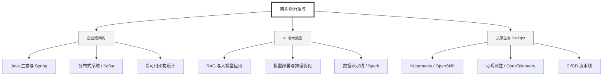

  <h1>你好，我是 Ellen Liu 👋</h1>
  

    <a href="README.md">English</a> | 
    <b>简体中文</b>
  

## 🧠 技术栈与核心能力

智能化企业系统建设路线图，涵盖全栈人工智能工程、云基础设施架构及模型部署等核心技术领域。

## 🚀 Highlighted 工作

- **开源 AI 项目**: [基于 BERT 的声明检测模型](https://huggingface.co/XiaojingEllen/bert-finetuned-claim-detection) (Apache-2.0)
  - *已被哥伦比亚大学 (UBC) 研究项目引用。*
  - *手写 Transformer 核心代码，以验证理论与工程的一致性。*
- **金融基础设施**: 从 0 到 1 构建数字银行支付中间件及智能保险理赔系统。

## 📑 每日论文速递 (ArXiv)
<!-- DAILY_ARXIV_SUMMARY_START -->
**更新日期: 2026-01-21**

### 1. [一根绳子有多长？分词器简略实证分析](http://arxiv.org/abs/2601.11518v1)
- **摘要**: 前沿大语言模型在学术界、社会及工业界的应用日益广泛。作为比较模型、输入输出及估算推理成本的常用单位，令牌通常被视为一种稳定"货币"，人们普遍认为其在各类分词器与语境中具有广泛一致性，从而支持直接比较。然而，不同模型与文本领域的令牌化处理存在显著差异，这使得对令牌数量的简单解读可能产生误导。我们通过提供全面的令牌化实证分析来量化这种差异，探究不同文本数据分布下序列到令牌的压缩特性。研究发现，关于令牌长度的常见经验法则过于简化，难以准确反映实际情况。我们期望本研究能为当代大语言模型的令牌化机制提供更清晰的认知与更直观的理解。

### 2. [毒苹果效应：通过AI智能体技术扩张对中介市场的战略性操控](http://arxiv.org/abs/2601.11496v1)
- **摘要**: 将AI智能体引入经济市场，从根本上改变了战略互动的格局。我们在三种经典博弈论场景中研究了技术选择范围扩大的经济影响：议价（资源分配）、谈判（非对称信息交易）与劝说（策略性信息传递）。研究发现，仅增加AI代理人的选择就足以剧烈改变均衡收益与监管结果，这常常会激励监管机构主动开发并发布新技术。相反，我们识别出一种名为"毒苹果"效应的策略现象：智能体可能发布一项新技术（其自身与对手最终皆不采用），纯粹为了操纵监管机构选择对其有利的市场设计方案。这种策略性发布行为以牺牲对手利益和监管公平目标为代价，提升了发布者的福利水平。研究结果表明，静态监管框架易受技术扩张的操纵，因此需要建立能够适应AI能力演变的动态市场设计机制。

### 3. [CTest-Metric：评估CT报告生成指标临床有效性的统一框架](http://arxiv.org/abs/2601.11488v1)
- **摘要**: 在生成式人工智能时代，即便关键医疗任务日益自动化，放射学报告生成领域仍依赖次优指标进行质量评估。开发领域专用指标因此成为研究热点，但由于缺乏统一、明确的框架来评估其在临床环境中的稳健性与适用性，这一目标仍面临挑战。为此，我们提出CTest-Metric——首个统一的指标评估框架，包含三个模块，用于确定CT放射学报告生成指标的临床可行性。这些模块分别测试：（一）通过基于大语言模型的文本重述检验写作风格泛化能力；（二）按分级严重程度进行合成错误注入测试；（三）基于临床医生对175例"争议病例"的评分，进行指标与专家评价相关性分析。研究以CT-CLIP编码器构建的七个大语言模型为基准，对八种常用指标（BLEU、ROUGE、METEOR、BERTScore-F1、F1-RadGraph、RaTEScore、GREEN Score、CRG）展开评估。通过这一创新框架，我们发现：词汇类自然语言生成指标对风格变化高度敏感；GREEN Score与专家判断最吻合（斯皮尔曼相关系数约0.70），而CRG呈现负相关；BERTScore-F1对事实错误注入最不敏感。我们将公开该框架、代码及经脱敏处理的可公开评估数据（重述/错误注入的CT报告），以促进可复现的基准测试与未来指标研发。

<!-- DAILY_ARXIV_SUMMARY_END -->

## 🌐 保持联系

  
<i>期待与您探讨 AI 基础设施的未来！</i>

