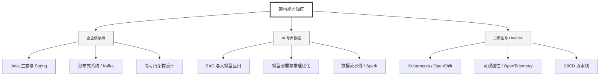

  <h1>你好，我是 Ellen Liu 👋</h1>
  

    <a href="README.md">English</a> | 
    <b>简体中文</b>
  

## 🧠 技术栈与核心能力

智能化企业系统建设路线图，涵盖全栈人工智能工程、云基础设施架构及模型部署等核心技术领域。

## 🚀 Highlighted 工作

- **开源 AI 项目**: [基于 BERT 的声明检测模型](https://huggingface.co/XiaojingEllen/bert-finetuned-claim-detection) (Apache-2.0)
  - *已被哥伦比亚大学 (UBC) 研究项目引用。*
  - *手写 Transformer 核心代码，以验证理论与工程的一致性。*
- **金融基础设施**: 从 0 到 1 构建数字银行支付中间件及智能保险理赔系统。

## 📑 每日论文速递 (ArXiv)
<!-- DAILY_ARXIV_SUMMARY_START -->
**更新日期: 2025-12-13**

### 1. [异步推理：免训练交互式思维大语言模型](http://arxiv.org/abs/2512.10931v1)
- **摘要**: 许多先进的LLM被训练成在给出答案前先进行思考。推理能力能显著提升语言模型的能力与安全性，但也降低了其交互性：面对新的输入时，模型必须停止思考才能作出回应。现实应用场景（如语音助手或嵌入式助手）要求LLM智能体能够实时响应并适应新增信息，这与顺序交互模式存在矛盾。相比之下，人类可以异步地倾听、思考和行动：我们会在阅读问题时开始思考，并在组织答案时持续思考。本研究通过增强具备推理能力的LLM，使其无需额外训练即可实现类似异步运作。我们的方法利用旋转位置编码的特性，使原本设计用于顺序交互的LLM能够同步执行思考、倾听和生成输出的任务。我们在数学推理、常识推理和安全推理任务上评估了该方法，发现其能够实时生成准确的思考增强型答案，将首个非思考标记的生成时间从数分钟缩短至≤5秒，并将整体实时延迟降低了6至11倍。

### 2. [CompanionCast：面向社交共览体验的多智能体对话AI框架与空间音频技术](http://arxiv.org/abs/2512.10918v1)
- **摘要**: 社交临场感是共同观看内容获得愉悦体验的核心要素，然而现代媒体消费日益趋向个体化。本研究探讨多智能体对话式AI系统能否在不同类型内容中重现共享观看体验的动态交互。我们提出CompanionCast——一个通用框架，通过协调多个角色专精的AI智能体，使其能够基于多模态输入、语音合成与空间音频技术对视频内容作出响应。该框架的创新之处在于整合了"LLM即裁判"模块，可从相关性、真实性、参与度、多样性、人格一致性五个维度对对话进行迭代式评分与优化。我们以体育观看这一具有丰富动态性与深厚社交传统的领域进行验证：针对足球迷的初步研究表明，与单人观看相比，多智能体交互能显著提升感知社交临场感。本研究的贡献在于：（1）构建了面向多模态视频内容的多智能体对话协调通用框架；（2）设计了用于对话质量控制的新型评估者-智能体协作流程；（3）为AI媒介化共同观看提升社交临场感提供了探索性证据。我们进一步探讨了将该框架应用于娱乐、教育及协作观看等多元场景面临的挑战与未来发展方向。

### 3. [多模态大语言模型在情感计算分析中的应用：一项新兴方法机遇的当前证据](http://arxiv.org/abs/2512.10882v1)
- **摘要**: 情感在政治中占据核心地位，分析情感在政治传播中的作用具有悠久传统。随着研究越来越多地利用视听材料来分析情感表达，多模态生成式人工智能的出现预示着巨大进步。然而，我们尚缺乏关于多模态AI在情感分析中有效性的证据。本文通过评估当前多模态大语言模型（mLLMs）在两个互补的人工标注视频数据集中的情绪唤醒度分析能力，填补了这一空白。研究发现，在理想条件下，mLLMs的情绪唤醒度评分具有高度可靠性，且几乎未显示出人口统计学偏差迹象。然而，在对现实议会辩论中发言者的视频进行分析时，mLLMs的唤醒度评分未能兑现其潜力，可能对后续统计推断产生负面影响。因此，本研究强调了对新兴生成式AI方法在政治分析领域进行持续深入评估的必要性，并提供了一个可复现的适用框架。

<!-- DAILY_ARXIV_SUMMARY_END -->

## 🌐 保持联系

  
<i>期待与您探讨 AI 基础设施的未来！</i>

