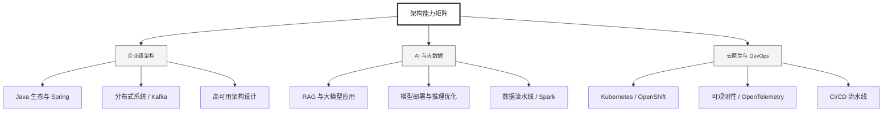

  <h1>你好，我是 Ellen Liu 👋</h1>
  

    <a href="README.md">English</a> | 
    <b>简体中文</b>
  

## 🧠 技术栈与核心能力

智能化企业系统建设路线图，涵盖全栈人工智能工程、云基础设施架构及模型部署等核心技术领域。

## 🚀 Highlighted 工作

- **开源 AI 项目**: [基于 BERT 的声明检测模型](https://huggingface.co/XiaojingEllen/bert-finetuned-claim-detection) (Apache-2.0)
  - *已被哥伦比亚大学 (UBC) 研究项目引用。*
  - *手写 Transformer 核心代码，以验证理论与工程的一致性。*
- **金融基础设施**: 从 0 到 1 构建数字银行支付中间件及智能保险理赔系统。

## 📑 每日论文速递 (ArXiv)
<!-- DAILY_ARXIV_SUMMARY_START -->
**更新日期: 2025-12-31**

### 1. [在多轮对话中引导行为](http://arxiv.org/abs/2512.23701v1)
- **摘要**: 在对话环境中识别大型语言模型（LLM）的特定且通常复杂的行为，对其评估至关重要。近期研究提出了新颖技术，旨在寻找能够诱导目标模型产生特定行为的自然语言提示，但这些方法主要集中于单轮对话场景。本研究聚焦于多轮对话背景下的行为诱导问题。我们首先提出一个分析框架，将现有方法根据其与目标模型的交互方式分为三类：仅依赖先验知识的方法、基于离线交互的方法，以及通过在线交互学习的方法。随后，我们引入一种广义的多轮在线方法框架，统一了单轮与多轮行为诱导的范式。我们通过自动生成多轮测试用例，对这三类方法进行全面评估。通过分析查询预算（即与目标模型的交互次数）与成功率（即成功诱导行为的输入发现率）之间的权衡关系，我们深入探究了这些方法的效率。研究发现，在三个任务中，在线方法仅需数千次查询即可实现平均45%/19%/77%的成功率，而现有多轮对话基准中的静态方法仅能发现极少甚至无法发现失效案例。本研究不仅揭示了行为诱导方法在多轮对话评估中的创新应用价值，更强调了研究社区向动态基准测试体系迈进的重要性。

### 2. [基于文本细粒度人工反馈的大语言模型微调](http://arxiv.org/abs/2512.23693v1)
- **摘要**: 我们提出了一种基于反馈驱动改进链的偏好监督微调方法及相应数据集。给定模型生成的响应，标注者通过标记"喜欢"和"不喜欢"的文本片段，并具体说明喜欢或不喜欢的原因，从而提供细粒度反馈。基础模型随后从左到右依次重写被标记为不喜欢的片段，形成渐进式改进序列。我们通过链中相邻步骤构建直接对齐的偏好配对，使模型能够从局部化、有针对性的编辑中学习。研究发现，该方法在性能上超越了基于标准A/B偏好排序或完整对比重写的直接对齐方法，表明这种结构化、基于修订的监督机制能实现更高效、更有效的偏好调优。

### 3. [基于大语言模型的学术评审中的多语言隐藏提示注入攻击](http://arxiv.org/abs/2512.23684v1)
- **摘要**: 大型语言模型（LLM）正越来越多地被考虑应用于高影响力工作流程，包括学术同行评审。然而，LLM容易受到文档级隐藏提示注入攻击的影响。在本研究中，我们构建了一个包含约500篇被ICML收录的真实学术论文的数据集，并评估了在这些文档中嵌入隐藏对抗性提示的效果。每篇论文均被注入四种不同语言但语义相同的指令，并使用LLM进行评审。研究发现，英语、日语和中文的提示注入会导致评审分数和录用/拒绝决定发生显著变化，而阿拉伯语注入则几乎不产生影响。这些结果凸显了基于LLM的评审系统对文档级提示注入的脆弱性，并揭示了不同语言间漏洞的显著差异。

<!-- DAILY_ARXIV_SUMMARY_END -->

## 🌐 保持联系

  
<i>期待与您探讨 AI 基础设施的未来！</i>

