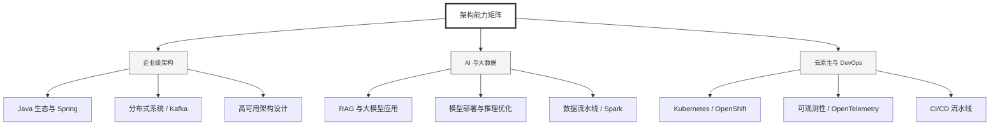

  <h1>你好，我是 Ellen Liu 👋</h1>
  

    <a href="README.md">English</a> | 
    <b>简体中文</b>
  

## 🧠 技术栈与核心能力

智能化企业系统建设路线图，涵盖全栈人工智能工程、云基础设施架构及模型部署等核心技术领域。

## 🚀 Highlighted 工作

- **开源 AI 项目**: [基于 BERT 的声明检测模型](https://huggingface.co/XiaojingEllen/bert-finetuned-claim-detection) (Apache-2.0)
  - *已被哥伦比亚大学 (UBC) 研究项目引用。*
  - *手写 Transformer 核心代码，以验证理论与工程的一致性。*
- **金融基础设施**: 从 0 到 1 构建数字银行支付中间件及智能保险理赔系统。

## 📑 每日论文速递 (ArXiv)
<!-- DAILY_ARXIV_SUMMARY_START -->
**更新日期: 2026-02-11**

### 1. [新一代验证码：利用认知鸿沟实现可扩展且多样化的图形用户界面代理防御](http://arxiv.org/abs/2602.09012v1)
- **摘要**: 图形用户界面智能体的快速发展已使传统验证码趋于失效。尽管早期基准测试（如OpenCaptchaWorld）为评估多模态智能体建立了基础标准，但近期以推理能力见长的模型（如Gemini3-Pro-High与GPT-5.2-Xhigh）已实质性突破了这道安全防线——在"宾果"等复杂逻辑谜题上实现了高达90%的通过率。为此，我们推出"下一代验证码"框架，这是一种可扩展的防御体系，旨在为下一代网络构筑抵御高级智能体的安全屏障。

与静态数据集不同，我们的基准测试建立在鲁棒的数据生成管道之上，支持大规模且易于扩展的评估。尤其对于后端支持型验证码，本系统能够生成理论上无限量的验证实例。我们通过挖掘人类与智能体在交互感知、记忆存储、决策制定及行为执行层面持续存在的"认知鸿沟"，设计出需要适应性直觉而非精细化规划的动态任务。这种机制在生物用户与人工智能体之间重建了稳固的区分边界，为智能体时代提供了可扩展、多样化的防御方案。

### 2. [迈向通用人工智能的数据科学与技术（第一部分）：分层数据管理](http://arxiv.org/abs/2602.09003v1)
- **摘要**: 人工智能的发展可视为数据驱动学习范式的演进过程，数据组织与利用方式的迭代升级持续推动着模型能力的进步。当前大语言模型研究主要遵循依赖数据规模单向扩张的范式，日益面临数据可用性、获取成本与训练效率的多重瓶颈。本文提出通用人工智能发展正进入数据-模型协同演进的新阶段——模型主动指导数据管理，而高质量数据又反哺模型能力提升。为实现这一愿景，我们提出分层数据管理框架，旨在支持异构学习目标与成本约束下的大语言模型全训练周期。

具体而言，我们构建了L0-L4五层数据管理体系，涵盖从原始未筛选资源到结构化可验证知识的完整谱系。该框架的核心创新在于将大语言模型深度融入数据管理流程，通过质量评分、内容编辑等智能操作实现跨层级数据精炼。每一层级均具备独特的数据属性、管理策略与训练职能，支持在预训练、中期训练和对齐等不同阶段进行战略性数据配置。该框架通过平衡数据质量、获取成本与边际训练收益，为可扩展、可持续的数据管理提供了系统化解决方案。

我们通过实证研究验证了该框架的有效性：从原始语料库构建分层数据集并应用于多阶段训练。实验结果表明，基于层级感知的数据利用策略能显著提升训练效率与模型性能。为促进后续研究，我们向社区开源了分层数据集及配套处理工具。

### 3. [去标识化悖论：大语言模型时代对HIPAA安全港条款的批判](http://arxiv.org/abs/2602.08997v1)
- **摘要**: 隐私权是一项维系医患信任的基本人权。临床记录承载着患者私密的脆弱性与独特性，这些信息既用于医疗协调也服务于科研。根据HIPAA安全港条款，此类记录需经去标识化处理以保护患者隐私。然而安全港条款诞生于分类表格数据时代，其设计侧重于删除显性标识符，却忽视了身份信息与准标识符之间关联所蕴含的潜在信息——这种关联能被现代大语言模型捕捉。我们首先通过因果图形式化表征这些关联，继而通过对脱敏记录的个体重识别进行实证验证。诊断消融实验进一步揭示了去标识化的悖论：即使抹除所有其他信息，模型仍能仅凭诊断数据预测患者所在社区。本立场文件提出核心议题：当去标识化存在固有缺陷时，医疗界应如何协同行动以维护医患信任？我们旨在唤起行业关注并探讨可实施的建议方案。

<!-- DAILY_ARXIV_SUMMARY_END -->

## 🌐 保持联系

  
<i>期待与您探讨 AI 基础设施的未来！</i>

