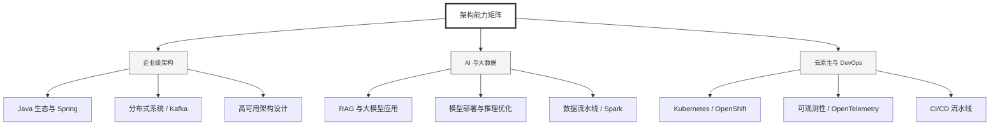

  <h1>你好，我是 Ellen Liu 👋</h1>
  

    <a href="README.md">English</a> | 
    <b>简体中文</b>
  

## 🧠 技术栈与核心能力

智能化企业系统建设路线图，涵盖全栈人工智能工程、云基础设施架构及模型部署等核心技术领域。

## 🚀 Highlighted 工作

- **开源 AI 项目**: [基于 BERT 的声明检测模型](https://huggingface.co/XiaojingEllen/bert-finetuned-claim-detection) (Apache-2.0)
  - *已被哥伦比亚大学 (UBC) 研究项目引用。*
  - *手写 Transformer 核心代码，以验证理论与工程的一致性。*
- **金融基础设施**: 从 0 到 1 构建数字银行支付中间件及智能保险理赔系统。

## 📑 每日论文速递 (ArXiv)
<!-- DAILY_ARXIV_SUMMARY_START -->
**更新日期: 2026-02-03**

### 1. [UPA：基于树搜索与选择的无监督提示代理](http://arxiv.org/abs/2601.23273v1)
- **摘要**: 提示智能体作为一种自动提示优化的新兴范式，近期展现出巨大潜力，它将提示优化问题构建为结构化提示空间上的序列决策过程。尽管这种形式化方法能够利用先进的规划算法，但现有方法通常依赖于监督式奖励信号，而这在实际场景中往往难以获取。本研究提出UPA（无监督提示智能体），通过不依赖监督反馈的方式实现结构化搜索与选择。具体而言，在搜索阶段，UPA基于大语言模型提供的细粒度、顺序无关的成对比较结果，通过迭代构建动态树结构来探索提示空间。由于这些局部比较结果本身不具备一致的全局标度，我们基于布拉德利-特里-卢斯模型构建了双阶段框架，将系统性提示探索与最终选择解耦：第一阶段通过路径级贝叶斯聚合对局部比较结果进行不确定性下的候选提示筛选，第二阶段通过全局锦标赛式比较推断潜在提示质量并确定最优提示。跨多任务的实验表明，UPA在各项任务中均持续优于现有提示优化方法，证明即使在完全无监督的场景下，智能体式优化方法仍能保持卓越性能。

### 2. [PaperBanana：为AI科学家自动化生成学术插图](http://arxiv.org/abs/2601.23265v1)
- **摘要**: 尽管基于语言模型的自主AI科学家发展迅猛，但生成可直接用于发表的插图仍是研究流程中劳动密集型的瓶颈环节。为减轻这一负担，我们推出PaperBanana——一个用于自动生成可发表级学术插图的智能体框架。该框架依托前沿视觉语言模型与图像生成模型，通过协调专业化智能体完成参考文献检索、内容与风格规划、图像渲染，并借助自我批判机制进行迭代优化。为系统评估框架性能，我们构建了PaperBananaBench评测集，包含从NeurIPS 2025出版物中精选的292个方法论图示测试案例，涵盖多元研究领域与插图风格。综合实验表明，PaperBanana在忠实度、简洁性、可读性与美学品质上均持续超越主流基线方法。我们进一步证明该方法能有效扩展至高质量统计图表的生成。总体而言，PaperBanana为自动化生成可发表级插图开辟了新路径。

### 3. [基于过程奖励的多智能体系统扩展](http://arxiv.org/abs/2601.23228v1)
- **摘要**: 尽管多智能体系统通过专业化分工在处理复杂任务方面展现出潜力，但同时对多个智能体进行微调仍面临两大核心挑战：（1）跨智能体的贡献分配问题，以及（2）昂贵多智能体推演过程的样本效率问题。本研究提出基于人工智能反馈的逐动作过程奖励微调方法（MAPPA）以应对这两项挑战。通过将奖励分配细化至单个智能体的具体动作而非仅针对任务完成结果，MAPPA能够在无需真实标注的情况下实现细粒度监督，同时从每次推演中提取最大化的训练信号。我们在数学竞赛题与工具增强型数据分析任务上验证了该方法。在未见过的数学问题上，MAPPA在AIME竞赛中提升5.0-17.5个百分点，在AMC竞赛中提升7.8-17.2个百分点。对于数据分析任务，该方法将成功率提高12.5个百分点，质量指标提升最高达30%，证明逐动作监督机制能够推动不同领域多智能体系统的性能提升。通过解决这些挑战，我们的研究为在最小化人工监督条件下扩展多智能体系统处理复杂长周期任务迈出了第一步。

<!-- DAILY_ARXIV_SUMMARY_END -->

## 🌐 保持联系

  
<i>期待与您探讨 AI 基础设施的未来！</i>

