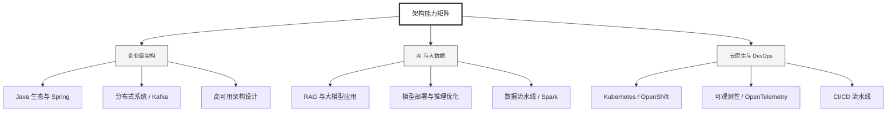

  <h1>你好，我是 Ellen Liu 👋</h1>
  

    <a href="README.md">English</a> | 
    <b>简体中文</b>
  

## 🧠 技术栈与核心能力

智能化企业系统建设路线图，涵盖全栈人工智能工程、云基础设施架构及模型部署等核心技术领域。

## 🚀 Highlighted 工作

- **开源 AI 项目**: [基于 BERT 的声明检测模型](https://huggingface.co/XiaojingEllen/bert-finetuned-claim-detection) (Apache-2.0)
  - *已被哥伦比亚大学 (UBC) 研究项目引用。*
  - *手写 Transformer 核心代码，以验证理论与工程的一致性。*
- **金融基础设施**: 从 0 到 1 构建数字银行支付中间件及智能保险理赔系统。

## 📑 每日论文速递 (ArXiv)
<!-- DAILY_ARXIV_SUMMARY_START -->
**更新日期: 2025-12-30**

### 1. [A2P-Vis：面向视觉洞察生成与报告的分析器至呈现器智能代理流程](http://arxiv.org/abs/2512.22101v1)
- **摘要**: 利用AI智能体实现端到端数据科学流程自动化，目前仍面临两大瓶颈：生成具有洞察力且多样化的可视化证据，以及将其整合为条理清晰的专业报告。我们提出A2P-Vis——一个由两部分构成的多智能体流程，能够将原始数据集转化为高质量的数据可视化报告。数据解析器负责统筹数据画像分析，提出多样化的可视化方向，生成并执行绘图代码，通过可读性检查器筛选低质量图表，同时提取候选洞察并自动从深度、准确性、特异性、深刻性和可操作性五个维度进行评分。随后，报告生成器对主题进行排序，基于评分最高的洞察撰写图表支撑的叙述内容，补充逻辑衔接的过渡语句，并对文档进行清晰度与一致性修订，最终形成条理分明、可直接发布的报告。这两个智能体协同工作，无需人工干预即可将原始数据转化为精编素材（图表+验证过的洞察）和可读性叙述文本。我们认为，通过将质量可控的解析器与叙述性生成器相结合，A2P-Vis实现了端到端的协同分析流程化，提升了自动化数据分析在实际应用中的价值。完整数据集报告详见：https://www.visagent.org/api/output/f2a3486d-2c3b-4825-98d4-5af25a819f56。

### 2. [推出TrGLUE与SentiTurca：土耳其语通用语言理解与情感分析综合基准](http://arxiv.org/abs/2512.22100v1)
- **摘要**: 评估各类模型架构（如Transformer、大语言模型及其他自然语言处理系统）的性能，需要能够从多维度衡量性能的综合基准测试。其中，自然语言理解能力的评估尤为关键，因其是衡量模型能力的根本标准。因此，建立能够从多角度全面评估分析自然语言理解能力的基准测试至关重要。尽管GLUE基准测试已为英语自然语言理解评估树立了标准，其他语言也相继开发了类似基准，如中文的CLUE、法语的FLUE和日语的JGLUE。然而，目前土耳其语尚缺乏可与之比肩的基准测试。为填补这一空白，我们推出了TrGLUE——一个涵盖多种土耳其语自然语言理解任务的综合基准测试。此外，我们还提出了专门用于情感分析的SentiTurca基准。为支持研究者，我们同时提供了基于Transformer模型的微调与评估代码，以促进这些基准的有效使用。TrGLUE包含精心构建的土耳其语原生语料库，其设计遵循GLUE式评估的领域划分与任务框架，标签通过半自动化流程获取：该流程融合了基于大语言模型的强标注、跨模型一致性校验及后续人工验证。这一设计优先保障语言自然度，最大限度减少直接翻译带来的失真，并形成了可扩展、可复现的工作流程。通过TrGLUE，我们旨在为土耳其语自然语言理解建立稳健的评估框架，为研究者提供宝贵资源，并为生成高质量半自动化数据集提供方法论洞见。

### 3. [统一学习动态与Transformer缩放定律中的泛化性](http://arxiv.org/abs/2512.22088v1)
- **摘要**: 缩放定律作为大语言模型发展的基石，其核心在于预测模型性能会随着计算资源的增加而提升。尽管这一规律已得到实证验证，但其理论基础至今仍不明确。本研究将基于Transformer的语言模型学习动态形式化为常微分方程系统，进而将其近似为核函数行为。与先前简化模型分析不同，我们严格分析了多层Transformer在任意数据分布的序列到序列数据上采用随机梯度下降训练的过程，这更贴近实际应用场景。

通过分析，我们刻画了泛化误差随计算资源与数据规模同步扩展时向不可约风险收敛的特性，特别是在优化过程中的表现。我们建立了具有明显相变特征的超额风险理论上界：在初始优化阶段，超额风险相对于计算成本$\mathsf{C}$呈指数级衰减；但当超过特定资源配置阈值后，系统进入统计阶段，此时泛化误差遵循$\Theta(\mathsf{C}^{-1/6})$的幂律衰减规律。

在这一统一框架之外，我们的理论还推导出模型规模、训练时间和数据集规模的独立缩放定律，阐明了每个变量如何单独主导泛化误差的上界。

<!-- DAILY_ARXIV_SUMMARY_END -->

## 🌐 保持联系

  
<i>期待与您探讨 AI 基础设施的未来！</i>

