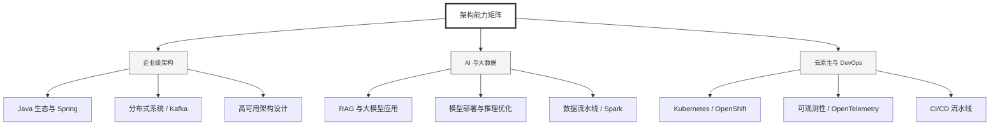

  <h1>你好，我是 Ellen Liu 👋</h1>
  

    <a href="README.md">English</a> | 
    <b>简体中文</b>
  

## 🧠 技术栈与核心能力

智能化企业系统建设路线图，涵盖全栈人工智能工程、云基础设施架构及模型部署等核心技术领域。

## 🚀 Highlighted 工作

- **开源 AI 项目**: [基于 BERT 的声明检测模型](https://huggingface.co/XiaojingEllen/bert-finetuned-claim-detection) (Apache-2.0)
  - *已被哥伦比亚大学 (UBC) 研究项目引用。*
  - *手写 Transformer 核心代码，以验证理论与工程的一致性。*
- **金融基础设施**: 从 0 到 1 构建数字银行支付中间件及智能保险理赔系统。

## 📑 每日论文速递 (ArXiv)
<!-- DAILY_ARXIV_SUMMARY_START -->
**更新日期: 2026-02-15**

### 1. [面向网络智能体的代理化测试时扩展](http://arxiv.org/abs/2602.12276v1)
- **摘要**: 测试时扩展已成为提升神经网络模型性能与可靠性的标准方法。然而，其在多步骤智能体任务中的行为机制尚未得到充分理解：微小的单步误差会在长周期任务中不断累积；我们发现，单纯均匀增加采样量的策略会产生收益递减效应。本研究提出CATTS——一种为多步骤智能体动态分配计算资源的简洁技术。我们首先对网页智能体的推理时扩展进行了实证研究，发现均匀增加单步计算量在长周期环境中会迅速达到性能饱和。随后我们探索了更强大的聚合策略，包括基于大语言模型的仲裁机制，该机制虽能超越简单投票法，但可能推翻高共识决策。研究表明，从智能体自身投票分布中提取的不确定性统计量（熵值及前两大选项得票差）与下游任务成功率存在相关性，可为动态计算分配提供实用信号。基于这些发现，我们提出了置信感知测试时扩展（CATTS），该技术仅当决策存在实质分歧时，才利用投票衍生的不确定性指标分配计算资源。在WebArena-Lite和GoBrowse基准测试中，CATTS较React方法实现了最高9.1%的性能提升，同时比均匀扩展策略减少高达2.3倍的令牌消耗，在提升效率的同时提供了可解释的决策规则。

### 2. [检测检索增强生成中压缩令牌表示的溢出问题](http://arxiv.org/abs/2602.12235v1)
- **摘要**: 高效的长上下文处理仍是当代大语言模型面临的关键挑战，尤其在资源受限环境中。软压缩架构通过将长令牌序列替换为更小的已学习压缩令牌集，有望扩展有效上下文长度。然而，可压缩性的极限——以及压缩何时开始抹除任务相关内容——仍未得到充分探索。本文提出将"令牌溢出"定义为压缩表征不再包含足够信息以回答给定查询的状态，并提出一种方法体系来刻画与检测该现象。在xRAG软压缩场景中，我们发现与查询无关的饱和统计量能可靠区分压缩与未压缩令牌表征，为识别压缩令牌提供了实用工具，但其溢出检测能力有限。基于查询与上下文xRAG表征的轻量级探测分类器在HotpotQA、SQuADv2和TriviaQA数据集上平均达到0.72的AUC-ROC值，表明融入查询信息可提升检测性能。这些成果实现了从查询无关诊断到查询感知检测的进阶，为建立低成本的大语言模型前级门控机制以缓解压缩引发的错误提供了可能。

### 3. [视觉推理基准：评估多模态大语言模型在小学教育真实课堂视觉问题上的表现](http://arxiv.org/abs/2602.12196v1)
- **摘要**: 人工智能模型在文本推理方面已取得顶尖成果，但其处理空间与关系结构的能力仍是关键瓶颈——这在高度依赖视觉元素的低年级数学领域尤为突出。本文提出视觉推理基准测试（VRB），这是一个旨在评估多模态大语言模型解决真实课堂视觉问题能力的新型数据集。该基准基于赞比亚和印度小学考试中的701道试题构建，涵盖类比推理、模式补全、空间匹配等多种任务类型。我们详细阐述了基准测试的方法论与开发过程，其设计刻意采用未经编辑、文字极简的图像，以检验模型能否满足基础教育中的实际需求。

研究发现，模型能力呈现"锯齿状边界"：在计数、比例换算等静态技能上表现较好，但在折叠、镜像、旋转等动态操作方面存在明显的"空间能力天花板"。这些缺陷可能导致模型在课堂视觉推理应用中产生风险，包括错误批改、不当引导以及固化学生的错误认知。因此，像VRB这样聚焦教育场景的基准测试，对于界定课堂多模态工具的功能边界具有至关重要的意义。

<!-- DAILY_ARXIV_SUMMARY_END -->

## 🌐 保持联系

  
<i>期待与您探讨 AI 基础设施的未来！</i>

