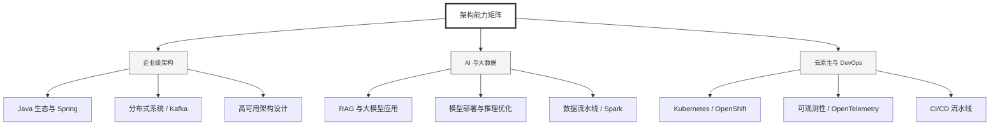

  <h1>你好，我是 Ellen Liu 👋</h1>
  

    <a href="README.md">English</a> | 
    <b>简体中文</b>
  

## 🧠 技术栈与核心能力

智能化企业系统建设路线图，涵盖全栈人工智能工程、云基础设施架构及模型部署等核心技术领域。

## 🚀 Highlighted 工作

- **开源 AI 项目**: [基于 BERT 的声明检测模型](https://huggingface.co/XiaojingEllen/bert-finetuned-claim-detection) (Apache-2.0)
  - *已被哥伦比亚大学 (UBC) 研究项目引用。*
  - *手写 Transformer 核心代码，以验证理论与工程的一致性。*
- **金融基础设施**: 从 0 到 1 构建数字银行支付中间件及智能保险理赔系统。

## 📑 每日论文速递 (ArXiv)
<!-- DAILY_ARXIV_SUMMARY_START -->
**更新日期: 2026-01-07**

### 1. [通过提示优化与学习集成实现鲁棒的人物感知毒性检测](http://arxiv.org/abs/2601.02337v1)
- **摘要**: 毒性检测本质上具有主观性，其判断标准受不同人口群体的多元视角和社会先验认知所塑造。尽管经济学和社会科学中采用的"多元主义"建模方法旨在捕捉不同情境下的观点差异，但当前大语言模型的提示技术在不同角色设定和基础模型间会产生迥异的结果。本研究对角色感知的毒性检测进行了系统性评估，结果表明：包括我们提出的自动提示优化策略在内，没有任何单一提示方法能在所有模型-角色组合中保持绝对优势。为利用互补性误差，我们探索了四种提示变体的集成策略，并提出一种轻量级元集成方法：基于四维提示预测向量的支持向量机集成模型。实验结果表明，所提出的支持向量机集成方法持续优于单一提示策略和传统多数投票技术，在不同角色设定中均实现了最优的综合性能。这项工作首次系统比较了角色条件提示在毒性检测中的应用，并为主观性自然语言处理任务中的多元评估提供了稳健的方法论。

### 2. [估算文本温度](http://arxiv.org/abs/2601.02320v1)
- **摘要**: 自回归语言模型在推理时通常使用温度参数来调整概率分布，控制生成文本的随机性。文本生成后，可通过最大似然估计法反推该参数值。基于此，我们提出一种针对任意文本（包括人类撰写的文本）估算其相对于特定语言模型温度值的流程。我们评估了多种中小型大语言模型的温度估计能力，最终选用表现最优的Qwen3 14B模型对主流语料库进行了温度值测算。

### 3. [大语言模型中的二次幂量化感知训练（PoT-QAT）](http://arxiv.org/abs/2601.02298v1)
- **摘要**: 在大型语言模型（LLMs）中，参数量在过去几年呈指数级增长，例如从GPT-2的15亿参数到GPT-3的1750亿参数，再到更高版本可能突破万亿规模。这给实际部署带来了巨大挑战，尤其在边缘设备上。与云计算不同，边缘设备的内存和计算能力极为有限，因此需要开发创新方法以实现此类应用。本研究探索了一种特殊的量化压缩方法，将权重值限制为仅二的幂次方（PoT）。该方法通过仅存储指数显著节省内存，更重要的是，它用低成本位移运算替代昂贵的乘法操作，大幅降低计算开销。为克服严格量化导致的性能损失，我们采用量化感知训练（QAT）通过额外训练提升模型表现。在GPT-2 124M模型上的实验表明，经过额外训练的PoT量化模型性能显著提升：困惑度改善66%，BERT分数与基线GPT-2相比仅损失1%。内存占用预计减少87.5%，推理速度较全精度模型预计提升3-10倍。

<!-- DAILY_ARXIV_SUMMARY_END -->

## 🌐 保持联系

  
<i>期待与您探讨 AI 基础设施的未来！</i>

