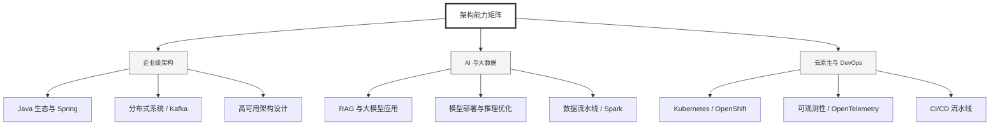

  <h1>你好，我是 Ellen Liu 👋</h1>
  

    <a href="README.md">English</a> | 
    <b>简体中文</b>
  

## 🧠 技术栈与核心能力

智能化企业系统建设路线图，涵盖全栈人工智能工程、云基础设施架构及模型部署等核心技术领域。

## 🚀 Highlighted 工作

- **开源 AI 项目**: [基于 BERT 的声明检测模型](https://huggingface.co/XiaojingEllen/bert-finetuned-claim-detection) (Apache-2.0)
  - *已被哥伦比亚大学 (UBC) 研究项目引用。*
  - *手写 Transformer 核心代码，以验证理论与工程的一致性。*
- **金融基础设施**: 从 0 到 1 构建数字银行支付中间件及智能保险理赔系统。

## 📑 每日论文速递 (ArXiv)
<!-- DAILY_ARXIV_SUMMARY_START -->
**更新日期: 2026-01-15**

### 1. [埃洛排名评审系统中大型语言模型智能体评审动态建模](http://arxiv.org/abs/2601.08829v1)
- **摘要**: 本研究基于真实会议论文投稿数据，探讨了Elo排名评审系统中大型语言模型（LLM）智能体评审员的动态交互机制。我们构建了具有不同角色特征的多位LLM评审员，在领域主席的协调下开展多轮评审互动。通过对比基准设置与引入Elo评分及评审记忆机制的实验条件，仿真结果揭示了若干重要发现：Elo机制的引入能提升领域主席决策的准确性，同时评审员会发展出适应性的评审策略——在不增加评审投入的情况下利用Elo系统的特性。相关代码已开源：https://github.com/hsiangwei0903/EloReview。

### 2. [渐近普适对齐：一种基于测试时缩放的新对齐框架](http://arxiv.org/abs/2601.08777v1)
- **摘要**: 使大型语言模型（LLM）能够服务于具有异质性且可能存在冲突偏好的用户，是实现个性化与可信人工智能的核心挑战。我们通过测试时扩展的形式化方法提出一种理想的通用对齐概念：针对每个提示，模型生成 $k\ge 1$ 个候选响应，用户从中选择其偏好项。我们引入 $(k,f(k))$-鲁棒对齐概念，要求 $k$ 输出模型相对于任意单输出模型的胜率达到 $f(k)$，并定义渐近通用对齐（U-对齐），要求当 $k\to\infty$ 时 $f(k)\to 1$。我们的核心结果刻画了最优收敛速率：存在一族单输出策略，其 $k$ 样本乘积策略能以 $f(k)=\frac{k}{k+1}$ 的速率实现 U-对齐，且任何方法在一般情况下都无法达到更快的收敛速率。

研究表明，包括基于人类反馈的纳什学习（NLHF）在内的主流后训练方法，可能从根本上未能充分利用测试时扩展的优势。尽管 NLHF 在 $k=1$ 时具有最优性，但从其所得策略（通常为确定性策略）中采样时，除任意小的松弛量外，无法保证胜率超过 $\tfrac{1}{2}$。这源于输出多样性的缺失：现有对齐方法可能坍缩至单一多数偏好响应，导致额外样本变得冗余。相比之下，我们的方法能保持输出多样性并实现最优测试时扩展速率。具体而言，我们提出一族对称多玩家对齐博弈，并证明 $(k+1)$-玩家对齐博弈的任意对称纳什均衡策略均可实现最优的 $(k,\frac{k}{k+1})$-鲁棒对齐。最后，我们为这些博弈中的自博弈学习动态提供了理论收敛保证，并将该框架扩展至同样生成多重响应的对手场景。

### 3. [奖励罕见：面向LLM创造性问题解决的独特性感知强化学习](http://arxiv.org/abs/2601.08763v1)
- **摘要**: 强化学习已成为大型语言模型后训练的核心范式，尤其在复杂推理任务中，但其常面临探索坍缩问题：策略过早集中于少数主导推理模式，虽能提升单次通过率（pass@1），却限制了推演层级的多样性及多次采样通过率（pass@k）的增益。我们认为这一缺陷源于对局部词元行为的正则化约束，而非对解决方案集合多样性的考量。为此，我们提出**独特性感知强化学习**——一种在推演层级显式奖励采用罕见高层策略的正确解决方案的目标函数。该方法基于大语言模型的评判器，将同一问题的不同推演结果按其高层解决策略聚类（忽略表面差异），并依据聚类规模对策略优势进行反向加权。由此，正确但新颖的策略将比冗余策略获得更高奖励。在数学、物理和医学推理基准测试中，本方法在大规模采样预算下持续提升pass@$k$指标，在保持pass@1不降低的同时提高了pass@$k$曲线下面积（AUC@$K$），并能维持探索过程，在大规模应用中发掘出更多样化的解决策略。

<!-- DAILY_ARXIV_SUMMARY_END -->

## 🌐 保持联系

  
<i>期待与您探讨 AI 基础设施的未来！</i>

