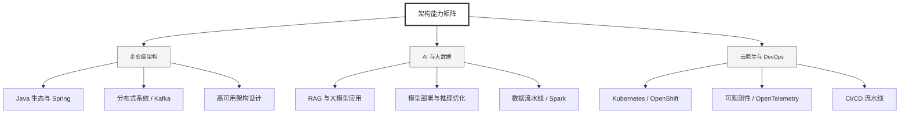

  <h1>你好，我是 Ellen Liu 👋</h1>
  

    <a href="README.md">English</a> | 
    <b>简体中文</b>
  

## 🧠 技术栈与核心能力

智能化企业系统建设路线图，涵盖全栈人工智能工程、云基础设施架构及模型部署等核心技术领域。

## 🚀 Highlighted 工作

- **开源 AI 项目**: [基于 BERT 的声明检测模型](https://huggingface.co/XiaojingEllen/bert-finetuned-claim-detection) (Apache-2.0)
  - *已被哥伦比亚大学 (UBC) 研究项目引用。*
  - *手写 Transformer 核心代码，以验证理论与工程的一致性。*
- **金融基础设施**: 从 0 到 1 构建数字银行支付中间件及智能保险理赔系统。

## 📑 每日论文速递 (ArXiv)
<!-- DAILY_ARXIV_SUMMARY_START -->
**更新日期: 2026-01-23**

### 1. [在对抗性情感攻击下利用大型语言模型进行鲁棒假新闻检测](http://arxiv.org/abs/2601.15277v1)
- **摘要**: 虚假信息和假新闻已成为紧迫的社会挑战，亟需可靠的自动化检测方法。先前研究已强调情感在假新闻检测中的重要性——或通过分析假新闻关联的情感特征，或利用情感与情绪特征进行分类。然而，这带来了新的安全漏洞：攻击者可能通过操纵情感特征来规避检测器，尤其是在大语言模型（LLMs）兴起的背景下。虽有少数研究探讨了LLMs生成的对抗样本，但主要聚焦于新闻发布者的写作风格等文体特征，情感操纵这一关键漏洞仍未被充分探索。本文研究了最先进的假新闻检测器在情感操纵下的鲁棒性，提出了AdSent框架——一种能确保对原始新闻与情感篡改新闻保持一致性真伪判定的鲁棒检测系统。具体而言，我们（1）利用LLMs构建了可控的情感对抗攻击方法；（2）系统分析了情感偏移对检测性能的影响，发现情感改变会显著削弱检测模型性能，模型普遍存在将中性新闻偏向判定为真实、非中性新闻偏向判定为虚假的系统性偏差；（3）提出了一种新颖的情感无关训练策略以增强模型对抗此类扰动的鲁棒性。在三个基准数据集上的大量实验表明，AdSent在检测精度与鲁棒性上均显著优于现有基线方法，并能有效泛化至未见数据集及对抗场景。

### 2. [大语言模型在法律应用中的评估：挑战、方法与未来方向](http://arxiv.org/abs/2601.15267v1)
- **摘要**: 大型语言模型正日益融入法律应用领域，涵盖司法决策支持、法律实务辅助及面向公众的法律服务。尽管这类模型在处理法律知识与任务方面展现出巨大潜力，但其在实际法律场景中的部署引发了超越表层准确性的深层关切，涉及法律推理过程的严谨性以及公平性、可靠性等可信度问题。因此，对大型语言模型在法律任务中的表现进行系统性评估，已成为其负责任应用的关键前提。

本综述立足于真实法律实践，系统梳理了评估法律领域大型语言模型面临的核心挑战。我们深入剖析了评估模型在法律领域表现的主要难点，包括结果正确性、推理可靠性及可信度三大维度。基于这些挑战，本文从任务设计、数据集构建和评估指标三个层面，对现有评估方法与基准测试进行了系统性梳理与分类。进一步地，我们探讨了当前方法应对这些挑战的有效程度，指出其局限性，并展望未来研究方向，以构建更贴近现实、更具可靠性且深植于法律实践的大型语言模型评估框架。

### 3. [脚本与格式对大型语言模型数学能力的影响](http://arxiv.org/abs/2601.15251v1)
- **摘要**: 大型语言模型（LLM）在基础算术方面已展现出令人瞩目的熟练度，在标准数值任务上达到了媲美人类的水平。然而，当数值表达方式偏离其训练语料库中的主流规范时，这些模型的表现却鲜少受到关注。本研究系统考察了多种数字书写系统与格式下的数值推理能力。我们发现，当数值输入以训练数据中较少出现的书写形式或格式呈现时，即使底层数学推理逻辑完全相同，LLM的准确率仍会大幅下降。进一步研究表明，采用针对性提示策略——如少样本提示和显式数字映射——能显著缩小这种性能差距。这些发现揭示了多语言数值推理中一个被忽视的挑战，并为可靠地运用LLM解析、处理和生成不同数字书写系统与格式的数值提供了切实可行的解决方案。

<!-- DAILY_ARXIV_SUMMARY_END -->

## 🌐 保持联系

  
<i>期待与您探讨 AI 基础设施的未来！</i>

