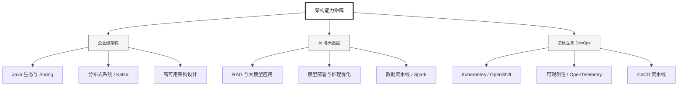

  <h1>你好，我是 Ellen Liu 👋</h1>
  

    <a href="README.md">English</a> | 
    <b>简体中文</b>
  

## 🧠 技术栈与核心能力

智能化企业系统建设路线图，涵盖全栈人工智能工程、云基础设施架构及模型部署等核心技术领域。

## 🚀 Highlighted 工作

- **开源 AI 项目**: [基于 BERT 的声明检测模型](https://huggingface.co/XiaojingEllen/bert-finetuned-claim-detection) (Apache-2.0)
  - *已被哥伦比亚大学 (UBC) 研究项目引用。*
  - *手写 Transformer 核心代码，以验证理论与工程的一致性。*
- **金融基础设施**: 从 0 到 1 构建数字银行支付中间件及智能保险理赔系统。

## 📑 每日论文速递 (ArXiv)
<!-- DAILY_ARXIV_SUMMARY_START -->
**更新日期: 2026-01-19**

### 1. [MatchTIR：通过二分图匹配实现工具集成推理的细粒度监督](http://arxiv.org/abs/2601.10712v1)
- **摘要**: 工具集成推理（TIR）通过将推理步骤与外部工具交互交织，赋能大语言模型处理复杂任务。然而，现有的强化学习方法通常依赖结果级或轨迹级奖励，对轨迹中的所有步骤赋予统一的优势评估。这种粗粒度的信用分配机制无法区分有效工具调用与冗余或错误调用，尤其在长视野多轮交互场景中更为突出。为此，我们提出MatchTIR框架，通过基于二分图匹配的轮次级奖励分配与双层级优势估计机制，实现细粒度监督。具体而言，我们将信用分配建模为预测轨迹与真实轨迹间的二分图匹配问题，运用两种分配策略生成密集的轮次级奖励。此外，为平衡局部步骤精度与全局任务成功率，我们设计了融合轮次级与轨迹级信号的双层级优势估计方案，为每个交互轮次分配差异化优势值。在三个基准测试上的大量实验证明了MatchTIR的优越性。值得注意的是，我们的40亿参数模型在多数任务中超越了80亿参数的竞品模型，尤其在长视野多轮任务中表现突出。代码已开源：https://github.com/quchangle1/MatchTIR。

### 2. [将智能体记忆根植于情境意图](http://arxiv.org/abs/2601.10702v1)
- **摘要**: 在长周期、目标导向的交互中部署大语言模型仍面临挑战，因为相似的实体和事实会在不同的潜在目标与约束条件下重复出现，导致记忆系统检索到上下文不匹配的证据。我们提出STITCH（上下文历史中的结构化意图追踪）——一种智能记忆系统，它通过结构化检索线索（即上下文意图）为每个轨迹步骤建立索引，并通过匹配当前步骤的意图来检索历史。上下文意图提供紧凑的信号，能够消除重复提及的歧义并减少干扰，具体包括：（1）定义主题片段的当前潜在目标；（2）动作类型；（3）锚定关键属性的显著实体类型。在推理过程中，STITCH根据意图兼容性对记忆片段进行筛选和优先级排序，从而抑制语义相似但上下文不兼容的历史信息。

为评估该系统，我们提出了CAME-Bench——一个面向现实、动态、目标导向轨迹的上下文感知检索基准测试。在CAME-Bench和LongMemEval上的实验表明，STITCH实现了最先进的性能，比最强基线高出35.6%，且随着轨迹长度增加，优势进一步扩大。我们的分析显示，意图索引显著降低了检索噪声，为鲁棒的长周期推理提供了意图感知记忆支持。

### 3. [LIBERTy：基于结构反事实的LLM概念解释基准因果框架](http://arxiv.org/abs/2601.10700v1)
- **摘要**: 基于概念的解释方法能够量化高级概念（如性别或经验）如何影响模型行为，这对高风险领域的决策者至关重要。近期研究通过将这类解释与基于反事实估计的参考因果效应进行比较，来评估其忠实度。实践中，现有基准依赖于成本高昂的人工撰写反事实文本，这仅是一种不完美的替代方案。为解决这一问题，我们提出了一个构建包含结构化反事实对数据集的框架：LIBERTy（基于大语言模型的可解释性干预基准与参考目标）。该框架以明确定义的文本生成结构化因果模型为基础，通过对概念进行干预，使干预效应沿因果模型传递，直至大语言模型生成反事实文本。我们发布了三个数据集（疾病检测、简历筛选和工作场所暴力预测）及一种新的评估指标——顺序忠实度。基于这些资源，我们对五种模型中的多种方法进行了评估，发现基于概念的解释方法仍有巨大改进空间。LIBERTy还能系统分析模型对干预的敏感性：我们发现专有大语言模型对人口统计概念的敏感性显著降低，这很可能源于训练后的缓解措施。总体而言，LIBERTy为开发忠实可靠的可解释性方法提供了亟需的基准框架。

<!-- DAILY_ARXIV_SUMMARY_END -->

## 🌐 保持联系

  
<i>期待与您探讨 AI 基础设施的未来！</i>

