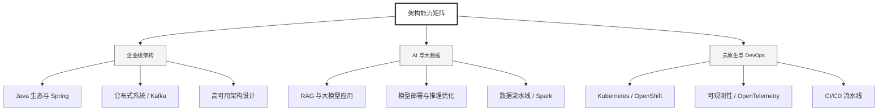

  <h1>你好，我是 Ellen Liu 👋</h1>
  

    <a href="README.md">English</a> | 
    <b>简体中文</b>
  

## 🧠 技术栈与核心能力

智能化企业系统建设路线图，涵盖全栈人工智能工程、云基础设施架构及模型部署等核心技术领域。

## 🚀 Highlighted 工作

- **开源 AI 项目**: [基于 BERT 的声明检测模型](https://huggingface.co/XiaojingEllen/bert-finetuned-claim-detection) (Apache-2.0)
  - *已被哥伦比亚大学 (UBC) 研究项目引用。*
  - *手写 Transformer 核心代码，以验证理论与工程的一致性。*
- **金融基础设施**: 从 0 到 1 构建数字银行支付中间件及智能保险理赔系统。

## 📑 每日论文速递 (ArXiv)
<!-- DAILY_ARXIV_SUMMARY_START -->
**更新日期: 2026-01-29**

### 1. [Oncotimia评估：一款基于大语言模型的肿瘤多学科会诊支持系统](http://arxiv.org/abs/2601.19899v1)
- **摘要**: 多学科肿瘤诊疗会议在肿瘤学决策中发挥着核心作用，但其依赖人工处理流程，且需整合大量异构临床信息，导致文档记录负担沉重。本研究提出ONCOTIMIA——一个模块化、安全的临床工具，旨在将生成式人工智能整合至肿瘤诊疗工作流，并通过大型语言模型评估其在肺癌多学科会议表单自动填写中的应用。该系统融合多层数据湖、混合关系型与向量存储、检索增强生成技术及规则驱动的自适应表单模型，能将非结构化临床文档转化为标准化、结构化的肿瘤诊疗会议记录。

我们通过AWS Bedrock平台部署六种大型语言模型，对十例肺癌病例进行测试，同时评估表单填写准确性与端到端延迟。结果显示各模型均表现优异，最优配置实现了80%的正确字段填充率，且多数模型响应时间符合临床可接受标准。规模更大、版本更新的模型展现出最佳准确度，且未产生过高延迟。这些发现为大型语言模型辅助的自动填表技术提供了实证依据，证明其在多学科肺癌诊疗工作流中具备技术可行性与操作适用性，有望在保障数据质量的同时显著减轻文档记录负担。

### 2. [后层归一化回归：稳定、高效且深度](http://arxiv.org/abs/2601.19895v1)
- **摘要**: 大语言模型（LLM）的扩展正面临瓶颈。增加模型宽度带来的收益逐渐递减，而扩展上下文长度也未能提升其根本表达能力。相比之下，深度扩展理论上具有更优的表达潜力，但当前Transformer架构在极端深度下难以实现稳定训练。我们重新审视了后层归一化（Post-LN）结构——该结构因在大规模训练中的不稳定性，已被前层归一化（Pre-LN）取代成为现代LLM的主流方案。研究发现，Post-LN的核心缺陷源于其类ResNet的残差连接路径，这会导致深层网络中的梯度消失问题。

我们提出Keel架构：一种采用高速公路式连接替代传统残差路径的Post-LN Transformer。这种改进能保持残差分支的梯度流动，防止信号从顶层向底层传递时逐渐消失。与现有方法不同，Keel无需特殊初始化或复杂优化技巧即可实现极端深度下的稳定训练。实验表明，Keel能在超过1000层的深度下稳健训练，并在困惑度与深度扩展特性上持续优于Pre-LN。这些发现证明，当Post-LN与高速公路式连接结合时，能为构建深度可扩展的LLM提供简单有效的基座，为未来无限深度架构的探索开辟了新的可能性。

### 3. [识别与迁移推理关键神经元：通过激活导向提升大语言模型推理可靠性](http://arxiv.org/abs/2601.19847v1)
- **摘要**: 尽管近期的大型语言模型（LLMs）展现出强大的推理能力，但在处理复杂任务时，要获得可靠性能通常需要依赖训练后优化或计算成本高昂的采样策略，这限制了其实际应用效率。本研究首先发现，LLMs中一小部分神经元与推理正确性存在显著预测相关性。基于这一观察，我们提出AdaRAS（自适应推理激活导向）——一种轻量级测试时框架，通过选择性干预神经元激活来提升推理可靠性。AdaRAS采用极性感知均值差异准则识别推理关键神经元（RCNs），并在推理过程中自适应调整其激活状态，从而增强错误推理路径的修正，同时避免对已正确推理产生负面影响。在10个数学与编程基准测试上的实验表明，该方法能持续提升性能，其中在AIME-24和AIME-25数据集上实现超过13%的性能增益。此外，AdaRAS展现出优异的跨数据集迁移能力和对更强模型的扩展性，其表现优于需要额外训练或采样成本的训练后优化方法。

<!-- DAILY_ARXIV_SUMMARY_END -->

## 🌐 保持联系

  
<i>期待与您探讨 AI 基础设施的未来！</i>

