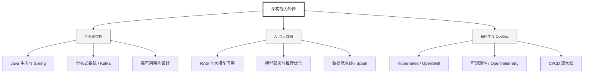

  <h1>你好，我是 Ellen Liu 👋</h1>
  

    <a href="README.md">English</a> | 
    <b>简体中文</b>
  

## 🧠 技术栈与核心能力

智能化企业系统建设路线图，涵盖全栈人工智能工程、云基础设施架构及模型部署等核心技术领域。

## 🚀 Highlighted 工作

- **开源 AI 项目**: [基于 BERT 的声明检测模型](https://huggingface.co/XiaojingEllen/bert-finetuned-claim-detection) (Apache-2.0)
  - *已被哥伦比亚大学 (UBC) 研究项目引用。*
  - *手写 Transformer 核心代码，以验证理论与工程的一致性。*
- **金融基础设施**: 从 0 到 1 构建数字银行支付中间件及智能保险理赔系统。

## 📑 每日论文速递 (ArXiv)
<!-- DAILY_ARXIV_SUMMARY_START -->
**更新日期: 2025-12-16**

### 1. [SUMFORU：基于大语言模型的评论摘要框架，助力个性化购买决策支持](http://arxiv.org/abs/2512.11755v1)
- **摘要**: 在线商品评论蕴含丰富但嘈杂的信息，这些信息常令用户应接不暇，阻碍其做出有效决策。现有基于大语言模型的摘要生成方法仍较为笼统，未能考虑个体偏好，限制了其实用价值。为此，我们提出SUMFORU——一种可调控的评论摘要框架，通过将输出内容与显式用户画像对齐，以支持个性化购买决策。我们的方法构建了基于亚马逊2023年评论数据集的高质量数据流水线，并结合两阶段对齐流程：（1）通过非对称知识蒸馏实现基于用户画像的监督微调；（2）利用偏好估计器进行基于人工智能反馈的强化学习，以捕捉细粒度、与画像相关的信号。我们通过基于规则、基于大语言模型以及以人为中心的指标对模型进行全面评估，结果表明其在一致性、事实依据和偏好对齐方面均取得持续改进。该框架在所有评估场景中均表现最优，并能有效泛化至未见过的商品类别。我们的研究成果彰显了可调控的多元化对齐技术在构建新一代个性化决策支持系统中的广阔前景。

### 2. [从信号到转向：模块化语音转语音流水线中的交互摩擦](http://arxiv.org/abs/2512.11724v1)
- **摘要**: 尽管语音AI系统已具备出色的生成能力，其交互过程仍常出现对话断裂感。本文研究了模块化语音到语音检索增强生成（S2S-RAG）流程中产生的交互摩擦。通过分析一个典型的生产系统，我们超越简单的延迟指标，识别出三种反复出现的对话断裂模式：（1）时序错位——系统延迟违背用户对对话节奏的预期；（2）表达扁平化——副语言线索的缺失导致机械且不恰当的回应；（3）修复僵化——架构层面的信息闸门阻碍用户实时纠正错误。通过系统级分析，我们证明这些摩擦点不应被简单视为缺陷或故障，而是模块化设计优先控制性而非流畅性的结构性结果。本文最终指出，构建自然的语音AI本质上是一项基础设施设计挑战，需要从优化孤立组件转向精心编排组件间的衔接关系。

### 3. [推测解码的极限速度：基于分支随机游走的最优下界](http://arxiv.org/abs/2512.11718v1)
- **摘要**: 推测生成已成为一种前景广阔的技术，它通过并行验证多个候选标记来加速大语言模型的推理过程。然而，关于该方法可达到的加速上限，其理论基础仍不明确。本研究首次建立了确定性推测生成算法运行时间的"紧致"下界。通过将标记生成过程与分支随机游走建立类比，我们得以分析最优候选树选择问题。在基本假设下，我们证明了每个推测迭代周期成功预测标记数的期望值满足 $\mathbb{E}[X] \leq (μ+ μ_{(2)})\log(P )/μ^2 + O(1)$ 的上界，其中 $P$ 表示验证器容量，$μ$ 为验证器输出分布期望熵，$μ_{(2)}$ 为期望二阶对数矩。该结果为并行标记生成的极限提供了新的理论洞见，可为未来推测解码系统的设计提供指导。基于Llama模型的实证评估验证了理论预测，证实了该边界在实际场景中的紧致性。

<!-- DAILY_ARXIV_SUMMARY_END -->

## 🌐 保持联系

  
<i>期待与您探讨 AI 基础设施的未来！</i>

