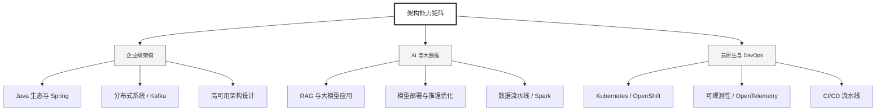

  <h1>你好，我是 Ellen Liu 👋</h1>
  

    <a href="README.md">English</a> | 
    <b>简体中文</b>
  

## 🧠 技术栈与核心能力

智能化企业系统建设路线图，涵盖全栈人工智能工程、云基础设施架构及模型部署等核心技术领域。

## 🚀 Highlighted 工作

- **开源 AI 项目**: [基于 BERT 的声明检测模型](https://huggingface.co/XiaojingEllen/bert-finetuned-claim-detection) (Apache-2.0)
  - *已被哥伦比亚大学 (UBC) 研究项目引用。*
  - *手写 Transformer 核心代码，以验证理论与工程的一致性。*
- **金融基础设施**: 从 0 到 1 构建数字银行支付中间件及智能保险理赔系统。

## 📑 每日论文速递 (ArXiv)
<!-- DAILY_ARXIV_SUMMARY_START -->
**更新日期: 2025-12-18**

### 1. [TimeLens：基于多模态大语言模型重新思考视频时序定位](http://arxiv.org/abs/2512.14698v1)
- **摘要**: 本文并未提出全新方法，而是为视频时序定位这一视频理解核心能力建立了一个简洁、渐进但至关重要的基准。尽管多模态大语言模型在各类视频理解任务中表现出色，但针对视频时序定位的优化方案仍待深入探索。本文提出TimeLens框架，从数据质量与算法设计两个核心维度系统性地研究如何构建具备强大视频时序定位能力的多模态大语言模型。我们首先揭示了现有视频时序定位基准数据集存在的严重质量问题，并推出TimeLens-Bench——该基准集包含三个经严格质量标准重新标注的流行数据集。分析表明，相较于传统基准，模型评估排名发生显著变化，证实了既往评估标准不可靠性。针对训练数据噪声问题，我们通过自动化重标注流程构建了TimeLens-100K大规模高质量训练数据集。

基于高质量数据基础，我们深入探索算法设计原则，获得一系列具有启发性的洞见与高效实用的方案。这些创新包括：用于时间表征的交错文本编码方案、采用可验证奖励机制的无思维强化学习训练范式，以及精心设计的强化学习训练方案。这些研究成果最终凝聚为TimeLens模型系列——该系列多模态大语言模型在开源模型中实现了最先进的视频时序定位性能，甚至超越了GPT-5与Gemini-2.5-Flash等专有模型。所有代码、数据及模型均将开源以促进后续研究。

### 2. [口语对话摘要：面向口语对话摘要的情感丰富对话数据集](http://arxiv.org/abs/2512.14687v1)
- **摘要**: 当前音频语言模型已能处理长对话，但情感感知或口语对话摘要的研究因缺乏关联语音、摘要与副语言特征的数据而受限。我们推出首个对齐原始对话音频、事实摘要、情感化摘要及话轮级说话人年龄、性别、情感标签的语料库——Spoken DialogSum。该数据集通过两阶段构建：首先由大语言模型重写DialogSum脚本，添加Switchboard风格的填充词与反馈词，并为每句话标注情感、音高和语速；随后通过富有表现力的文本转语音引擎，依据带标签脚本合成与副语言特征对齐的语音。Spoken DialogSum包含13,460段情感多元的对话，每段均配有事实摘要与情感聚焦摘要。数据集已发布于https://fatfat-emosum.github.io/EmoDialog-Sum-Audio-Samples/。基线实验表明，相较于级联式ASR-LLM系统，端到端音频语言模型将情感摘要的ROUGE-L指标相对提升28%，印证了端到端语音建模的价值。

### 3. [迈向尼泊尔语大语言模型：利用尼泊尔语BPE分词器实现高效GPT训练](http://arxiv.org/abs/2512.14585v1)
- **摘要**: 尼泊尔语是一种低资源语言，使用者超过3200万人，因其复杂的语法、黏着性形态以及高质量语料库的稀缺性，在自然语言处理领域持续面临挑战。目前大多数研究集中于基础编码器架构，这些方法仍难以满足尼泊尔语特定文本生成的需求。本研究提出了一种基于GPT-2的尼泊尔语模型，采用受GPT-3启发的多种训练策略，包括优化学习率调度、批量缩放和架构改进。通过专门在尼泊尔语文本上训练定制的16k字节对编码分词器，实现了更稳定的分词效果和优化的输入表示。模型预训练数据整合了10.75GB清洗后的尼泊尔语BERT语料库及额外爬取的尼泊尔新闻文章。通过集成FlashAttention技术有效降低了内存消耗并稳定了训练过程。经过两个训练周期后，模型训练损失降至3.168177，验证损失为3.081982，最终困惑度达到21.80，证明其能够生成连贯的尼泊尔语新闻风格文本。

<!-- DAILY_ARXIV_SUMMARY_END -->

## 🌐 保持联系

  
<i>期待与您探讨 AI 基础设施的未来！</i>

