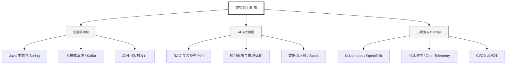

  <h1>你好，我是 Ellen Liu 👋</h1>
  

    <a href="README.md">English</a> | 
    <b>简体中文</b>
  

## 🧠 技术栈与核心能力

智能化企业系统建设路线图，涵盖全栈人工智能工程、云基础设施架构及模型部署等核心技术领域。

## 🚀 Highlighted 工作

- **开源 AI 项目**: [基于 BERT 的声明检测模型](https://huggingface.co/XiaojingEllen/bert-finetuned-claim-detection) (Apache-2.0)
  - *已被哥伦比亚大学 (UBC) 研究项目引用。*
  - *手写 Transformer 核心代码，以验证理论与工程的一致性。*
- **金融基础设施**: 从 0 到 1 构建数字银行支付中间件及智能保险理赔系统。

## 📑 每日论文速递 (ArXiv)
<!-- DAILY_ARXIV_SUMMARY_START -->
**更新日期: 2026-02-10**

### 1. [学习大型语言模型激活的生成元模型](http://arxiv.org/abs/2602.06964v1)
- **摘要**: 现有分析神经网络激活的方法，如主成分分析和稀疏自编码器，都依赖于较强的结构假设。生成模型提供了另一种可能：它们无需此类假设即可揭示结构，并可作为先验知识提升干预保真度。我们通过在一百亿个残差流激活数据上训练扩散模型来探索这一方向，构建了学习网络内部状态分布的"元模型"。研究发现，扩散损失随计算量增加而平稳下降，并能可靠预测下游任务效用。特别值得注意的是，将元模型习得的先验知识应用于导向干预时能提升生成流畅度，且损失越低增益越显著。此外，元模型的神经元逐渐将概念分离至独立单元，其稀疏探测分数随损失下降呈现规律性变化。这些结果表明，生成式元模型为无需严格结构假设的可解释性研究提供了可扩展路径。项目页面：https://generative-latent-prior.github.io。

### 2. [DAWN：面向扩散大语言模型的依赖感知快速推理](http://arxiv.org/abs/2602.06953v1)
- **摘要**: 扩散大语言模型（dLLMs）在文本生成领域展现出独特优势，这主要得益于其固有的并行解码能力。然而，受限于质量与速度的权衡，现有推理方案往往采用保守的并行策略，导致大量效率潜力未被充分挖掘。核心挑战在于：并行解码假设每个位置可独立填充，但实际语义层面中词元常存在耦合关系——某一位置的正确选择会制约其他位置的有效选项。若忽略这种词元间依赖关系，并行策略将导致输出质量下降。

基于这一洞见，我们提出DAWN：一种无需重新训练、具备依赖感知能力的解码方法，旨在实现快速dLLM推理。DAWN通过提取词元依赖关系，并依据两个关键原理展开：(1) 依赖于已确定位置的待预测位置具有更高可靠性；(2) 同时解码强耦合的未确定位置易引发错误。基于这些发现，DAWN利用依赖图在每轮迭代中筛选更可靠的解码位置，在几乎不损失生成质量的前提下实现高度并行化。跨模型与数据集的广泛实验表明，DAWN在保持生成质量的同时，推理速度较基线方法提升1.80-8.06倍。代码已发布于https://github.com/lizhuo-luo/DAWN。

### 3. [Halluverse-M^3：面向大型语言模型幻觉问题的多任务多语言基准测试集](http://arxiv.org/abs/2602.06920v1)
- **摘要**: 大型语言模型中的幻觉问题依然是一个持续存在的挑战，尤其在需要保持事实一致性的多语言生成场景中更为突出。尽管当前模型在英语基准测试中表现优异，但其在不同语言、任务及幻觉类型中的行为模式尚未得到充分理解。本研究提出Halluverse-M^3数据集，旨在实现对多语言、多生成任务、多幻觉类别的系统性分析。该数据集涵盖英语、阿拉伯语、印地语和土耳其语四种语言，支持问答与对话摘要两项生成任务，并明确区分实体级、关系级和句子级三类幻觉。通过受控编辑流程构建幻觉输出，并由人工标注者验证，确保原始内容与幻觉生成间的清晰对应关系。

基于该数据集，我们对多种当代开源与专有语言模型进行了细粒度幻觉检测评估。结果显示：问答任务始终比对话摘要更易处理，而句子级幻觉即使对最强模型仍具挑战性；英语场景性能最优，低资源语言性能下降，其中印地语的检测准确率最低。总体而言，Halluverse-M^3为多语言多任务场景下的幻觉研究提供了真实且具有挑战性的基准。我们已公开该数据集以支持未来关于幻觉检测与缓解的研究\footnote{https://huggingface.co/datasets/sabdalja/HalluVerse-M3}。

<!-- DAILY_ARXIV_SUMMARY_END -->

## 🌐 保持联系

  
<i>期待与您探讨 AI 基础设施的未来！</i>

