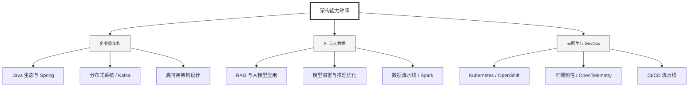

  <h1>你好，我是 Ellen Liu 👋</h1>
  

    <a href="README.md">English</a> | 
    <b>简体中文</b>
  

## 🧠 技术栈与核心能力

智能化企业系统建设路线图，涵盖全栈人工智能工程、云基础设施架构及模型部署等核心技术领域。

## 🚀 Highlighted 工作

- **开源 AI 项目**: [基于 BERT 的声明检测模型](https://huggingface.co/XiaojingEllen/bert-finetuned-claim-detection) (Apache-2.0)
  - *已被哥伦比亚大学 (UBC) 研究项目引用。*
  - *手写 Transformer 核心代码，以验证理论与工程的一致性。*
- **金融基础设施**: 从 0 到 1 构建数字银行支付中间件及智能保险理赔系统。

## 📑 每日论文速递 (ArXiv)
<!-- DAILY_ARXIV_SUMMARY_START -->
**更新日期: 2026-02-12**

### 1. [量子审计：评估大语言模型在量子计算领域的推理极限](http://arxiv.org/abs/2602.10092v1)
- **摘要**: 语言模型已成为量子计算教育与研究的实用工具，从技术论文总结到理论概念阐释，再到解答领域最新进展问题。虽然现有基准测试能评估量子代码生成与电路设计能力，但模型对量子计算概念的理解尚未得到系统化衡量。Quantum-Audit基准通过涵盖量子计算核心主题的2700道题目填补了这一空白。我们对26个主流机构的模型进行了评估，该基准包含1000道专家撰写题、1000道经专家验证的LLM从研究论文中提取题，以及700道附加题（含350道开放式问题与350道含错误前提的问题，用于测试模型能否纠正错误假设）。人类参与者得分区间为23%-86%，专家平均分为74%。表现最佳的模型超越了专家平均水平，其中Claude Opus 4.5准确率达84%，但顶尖模型在专家撰写题上的准确率较LLM生成题平均下降12个百分点。在高级主题上模型表现进一步下滑，安全类问题准确率降至73%。此外，模型常会接受并强化题目中嵌入的错误前提而非识别它们，在这类关键推理任务中准确率低于66%。

### 2. [智能体世界模型：为智能体强化学习打造的无限合成环境](http://arxiv.org/abs/2602.10090v1)
- **摘要**: 近年来，大语言模型（LLM）的突破性进展使得自主智能体能够执行需要与工具及环境进行多轮交互的复杂任务。然而，由于缺乏多样化且可靠的环境资源，此类智能体训练的规模化发展受到限制。本文提出"智能体世界模型"（Agent World Model, AWM）——一个完全合成的环境生成流程。通过该流程，我们成功构建了涵盖日常场景的1000个环境，智能体可在其中与丰富工具集（平均每个环境配备35种工具）进行交互，并获得高质量的观测数据。值得注意的是，这些环境由代码驱动并依托数据库支持，相比LLM模拟的环境能提供更可靠、更一致的状态转换。此外，与从现实环境收集轨迹数据相比，该方案能实现更高效的智能体交互。

为验证该资源的有效性，我们针对多轮工具使用型智能体开展了大规模强化学习训练。得益于完全可执行的环境与可访问的数据库状态，我们还能设计出可靠的奖励函数。在三个基准测试上的实验表明：仅在合成环境中进行训练（而非针对特定基准环境），即可实现强大的分布外泛化能力。项目代码已发布于https://github.com/Snowflake-Labs/agent-world-model。

### 3. [提升科学图表分析能力的智能代理](http://arxiv.org/abs/2602.10081v1)
- **摘要**: 在科学研究中，分析工作需准确解读复杂的多模态知识，整合不同来源的证据，并基于领域特定知识进行推理。然而，当前人工智能系统难以稳定展现此类能力。科学图表因其复杂多变的特性，结合异构结构与长上下文需求，构成了科学图表分析的根本障碍。为量化这些挑战，我们提出AnaBench——一个包含九大科学领域$63,178$个实例的大规模基准测试集，并沿七个复杂度维度进行系统分类。

为应对这些挑战，我们提出Anagent多智能体框架，通过四个专业智能体增强科学图表分析能力：规划器将任务分解为可执行的子任务，专家通过定向工具执行检索任务相关信息，求解器综合信息生成连贯分析，评审器通过五维质量评估进行迭代优化。我们进一步开发模块化训练策略，结合监督微调与专业化强化学习，在保持高效协作的同时优化个体能力。

在170个子领域的综合评估中，Anagent实现了显著性能提升：在免训练场景下最高提升$\uparrow 13.43\%$，经微调后最高提升$\uparrow 42.12\%$。实验表明，面向任务的推理与上下文感知的问题解决能力是实现高质量科学图表分析的关键。项目主页：https://xhguo7.github.io/Anagent/。

<!-- DAILY_ARXIV_SUMMARY_END -->

## 🌐 保持联系

  
<i>期待与您探讨 AI 基础设施的未来！</i>

