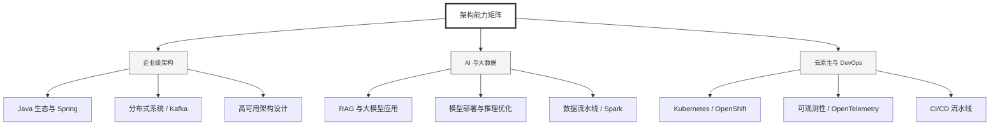

  <h1>你好，我是 Ellen Liu 👋</h1>
  

    <a href="README.md">English</a> | 
    <b>简体中文</b>
  

## 🧠 技术栈与核心能力

智能化企业系统建设路线图，涵盖全栈人工智能工程、云基础设施架构及模型部署等核心技术领域。

## 🚀 Highlighted 工作

- **开源 AI 项目**: [基于 BERT 的声明检测模型](https://huggingface.co/XiaojingEllen/bert-finetuned-claim-detection) (Apache-2.0)
  - *已被哥伦比亚大学 (UBC) 研究项目引用。*
  - *手写 Transformer 核心代码，以验证理论与工程的一致性。*
- **金融基础设施**: 从 0 到 1 构建数字银行支付中间件及智能保险理赔系统。

## 📑 每日论文速递 (ArXiv)
<!-- DAILY_ARXIV_SUMMARY_START -->
**更新日期: 2025-12-23**

### 1. [ShareChat：一个真实环境下的聊天机器人对话数据集](http://arxiv.org/abs/2512.17843v1)
- **摘要**: 尽管大型语言模型（LLM）已发展为具有独特界面设计和功能差异的独立平台，现有公共数据集仍将其视为通用文本生成器，剥离了直接影响用户交互的界面语境。为弥补这一缺陷，我们推出ShareChat——一个大规模跨平台语料库，涵盖从ChatGPT、Claude、Gemini、Perplexity和Grok五大主流平台公开分享的URL中收集的142,808段对话、超66万轮交互。该数据集的核心价值在于保留了标准日志中常被抹除的原生平台功能痕迹，包括推理链条、来源链接和代码片段，同时覆盖2023年4月至2025年10月期间101种语言的使用记录。相较于既有数据集，ShareChat还具备显著延长的上下文窗口与更深的交互层级。我们通过三项代表性分析展示了该数据集的多维应用潜力：（1）通过对话完整性分析衡量用户意图满足度；（2）评估内容生成中的来源引用行为；（3）开展时序分析追踪使用模式的演变轨迹。这项研究为学界理解真实场景下用户与LLM聊天机器人的交互模式提供了关键且及时的资源。

### 2. [DEER：一个全面可靠的深度研究专家报告基准](http://arxiv.org/abs/2512.17776v1)
- **摘要**: 随着大语言模型（LLM）的不断发展，深度研究系统已能通过多步推理与基于证据的综合分析生成专家级报告，但对此类报告的评估仍面临挑战。现有基准往往缺乏针对专家报告的系统性评价标准，依赖大语言模型作为评判者的评估方法难以捕捉需要专家判断的问题，而来源验证通常仅覆盖报告中明确引用的有限陈述，无法全面检验报告整体的事实可靠性。为此，我们推出DEER基准，专门用于评估专家级深度研究报告。该基准包含横跨13个领域的50项报告撰写任务，并建立了一套基于专家经验的评估体系（涵盖7个维度、25个子维度），细化为130项精细化评分标准。DEER进一步提供任务专属的专家指导，帮助大语言模型评判者更一致地评估专家级报告质量。为补充基于评分标准的评估方式，我们提出一种文档级事实核查架构，可提取并验证报告中所有主张（包括引用与未引用的内容），并对外部证据质量进行量化。DEER基准与人类专家判断高度吻合，并能生成可解释的系统优势与薄弱环节诊断结果。

### 3. [当黄金标准未必标准：评估用户生成内容翻译的挑战](http://arxiv.org/abs/2512.17738v1)
- **摘要**: 用户生成内容（UGC）的特点是频繁使用非标准语言，从拼写错误到表情达意的选择，如俚语、字符重复和表情符号。这使得评估UGC翻译尤为困难：何为"良好"翻译，取决于输出所需的标准程度。为探究这一问题，我们考察了四个UGC数据集的人工翻译指南，并归纳出十二种非标准现象和五种翻译处理方式（规范化、复制、转移、省略、审查）。分析显示，不同数据集对UGC的处理方式存在显著差异，导致参考译文呈现出标准程度的连续谱系。通过对大语言模型（LLMs）的案例研究，我们发现翻译评分对包含明确UGC翻译指令的提示高度敏感，且当这些指令与数据集指南一致时，评分会有所提升。我们认为，在需要保留UGC风格的情况下，公平的评估要求模型和指标都能理解翻译指南。最后，我们呼吁在数据集创建过程中制定清晰指南，并开发可控、能感知指南的UGC翻译评估框架。

<!-- DAILY_ARXIV_SUMMARY_END -->

## 🌐 保持联系

  
<i>期待与您探讨 AI 基础设施的未来！</i>

