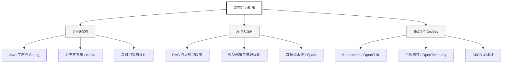

  <h1>你好，我是 Ellen Liu 👋</h1>
  

    <a href="README.md">English</a> | 
    <b>简体中文</b>
  

## 🧠 技术栈与核心能力

智能化企业系统建设路线图，涵盖全栈人工智能工程、云基础设施架构及模型部署等核心技术领域。

## 🚀 Highlighted 工作

- **开源 AI 项目**: [基于 BERT 的声明检测模型](https://huggingface.co/XiaojingEllen/bert-finetuned-claim-detection) (Apache-2.0)
  - *已被哥伦比亚大学 (UBC) 研究项目引用。*
  - *手写 Transformer 核心代码，以验证理论与工程的一致性。*
- **金融基础设施**: 从 0 到 1 构建数字银行支付中间件及智能保险理赔系统。

## 📑 每日论文速递 (ArXiv)
<!-- DAILY_ARXIV_SUMMARY_START -->
**更新日期: 2026-01-13**

### 1. [AdaFuse：基于测试时缩放的自适应集成解码方法用于大语言模型](http://arxiv.org/abs/2601.06022v1)
- **摘要**: 大型语言模型（LLMs）因预训练数据、模型架构和解码行为的差异而展现出互补优势。推理时集成提供了一种无需重新训练即可整合这些能力的实用方法。然而，现有集成方法存在根本性局限：多数依赖固定的融合粒度，缺乏生成过程中动态调整所需的灵活性，且无法适应不同任务的生成特性差异。为应对这些挑战，我们提出AdaFuse——一种自适应集成解码框架，能够在生成过程中动态选择语义恰当的融合单元。该框架摒弃固定粒度策略，基于解码上下文实时调整融合行为，并以词汇作为对齐的基本构建单元。具体而言，我们引入基于不确定性的准则来决定每个解码步骤是否应用集成：在置信度高的解码状态下，模型直接继续生成；在置信度较低时，AdaFuse会启动多样性感知的缩放策略，探索替代候选续写方案以指导集成决策。这种设计建立了自适应集成与测试时缩放之间的协同交互机制——集成决策引导定向探索，而生成的多样性反过来增强集成质量。在开放域问答、算术推理和机器翻译任务上的实验表明，AdaFuse始终优于现有集成基线方法，平均相对提升达到6.88%。代码已开源：https://github.com/CCM0111/AdaFuse。

### 2. [证据链构建：基于引证感知评分准则奖励的深度搜索智能体鲁棒强化学习](http://arxiv.org/abs/2601.06021v1)
- **摘要**: 强化学习（RL）已成为提升基于大语言模型的深度搜索智能体的关键技术。然而，现有方法主要依赖二元结果奖励，难以全面评估智能体推理过程的完整性与事实准确性，且常导致捷径利用和幻觉生成等不良行为。为突破这些局限，我们提出**引用感知的细粒度奖励框架（CaRR）**，该框架针对深度搜索智能体设计，强调推理的全面性、事实依据与证据链的连贯性。CaRR将复杂问题分解为可验证的单步评估准则，要求智能体通过显式识别隐含实体、提供正确引用支撑，并构建连接预测答案的完整证据链来满足这些准则。我们进一步提出**引用感知的群体相对策略优化（C-GRPO）**，该方法结合CaRR与结果奖励来训练鲁棒的深度搜索智能体。实验表明，在多个深度搜索基准测试中，C-GRPO始终优于基于标准结果奖励的强化学习基线方法。分析结果验证了C-GRPO能有效抑制捷径利用行为，促进全面且基于证据的推理，并在开放式深度研究任务中展现出强大的泛化能力。相关代码与数据已发布于https://github.com/THUDM/CaRR。

### 3. [别让缓存失效：长程智能体任务中提示缓存的评估研究](http://arxiv.org/abs/2601.06007v1)
- **摘要**: 近期大型语言模型（LLM）智能体的进展已能支持需要大量工具调用的复杂多轮自主任务，这类对话可能涉及数十次API调用，且上下文窗口持续扩大。尽管主流LLM服务商已提供提示缓存功能以降低成本和延迟，但研究领域对自主任务场景下该功能的效益探索仍显不足。据我们所知，尚无研究量化此类成本节约效果，或针对多轮自主任务的缓存策略进行比较。

本研究对三大主流LLM服务商（OpenAI、Anthropic和Google）的提示缓存机制展开全面评估，并比较三种缓存策略：完整上下文缓存、仅系统提示缓存以及排除动态工具结果的缓存。我们在DeepResearchBench基准测试平台上开展实验——该平台通过智能体自主执行真实网络搜索工具调用来回答复杂研究问题，实现了多轮自主任务评估。实验采用包含1万词元的系统提示，在超过500次智能体会话中同时测量API成本和首词元生成时间（TTFT）。

结果显示：提示缓存可使API成本降低45-80%，并将首词元生成时间缩短13-31%（效果因服务商而异）。研究发现，采用策略性提示缓存区块控制——例如将动态内容置于系统提示末尾、避免动态传统函数调用、排除动态工具结果——相比简单的完整上下文缓存能带来更稳定的效益，后者反而可能增加延迟。我们的分析揭示了不同服务商缓存行为的细微差异，并为生产级自主系统中实施提示缓存提供了实用指导。

<!-- DAILY_ARXIV_SUMMARY_END -->

## 🌐 保持联系

  
<i>期待与您探讨 AI 基础设施的未来！</i>

